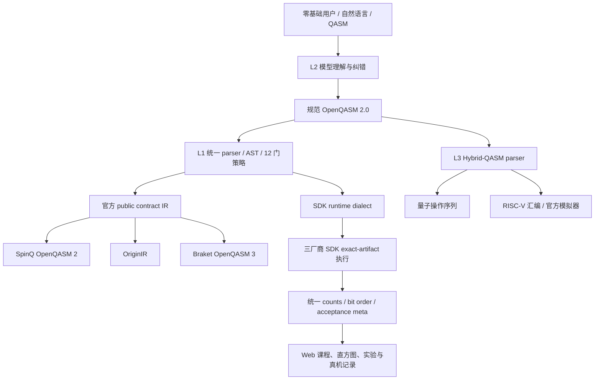

# LoomQ：让第一次来的人成为量子计算的使用者

**建议评委阅读顺序：** 本 README → [`starter_kit/evidence/README.md`](starter_kit/evidence/README.md) → [`HARDENING_DESIGN.md`](starter_kit/docs/HARDENING_DESIGN.md) → 启动 Web → `python scripts/verify_all.py`。

## 前台演示视频

[▶ 点击播放 LoomQ 前台完整演示（MP4，约 34 MiB）](video.mp4)

---

> 正式评测根目录：[`starter_kit/`](starter_kit/)
>
> 评分依据：[`LoomQ-赛题手册.pdf`](LoomQ-赛题手册.pdf) / [`problem_statement.md`](problem_statement.md)

本项目完成 L1 通用中间层、L2 自然语言智能体与零基础 Web 平台、L3 Hybrid-QASM 编译器，并实现两平台真机证据、自定义量子 RISC-V 扩展和新手视觉叙事。本文按手册 **100 分基础分 + 12 分 Bonus** 的顺序列出完成情况、实现索引、证据和复现命令。

## 1. 总览

| 模块               | 手册分值 | 本项目完成情况                                                    | 最短核验入口                                                                                                                                                    |
| ------------------ | -------: | ----------------------------------------------------------------- | --------------------------------------------------------------------------------------------------------------------------------------------------------------- |
| L1 通用中间层      |       45 | 三平台、12 门、8 电路族验证；SpinQ 与 OriginQ 两份真机证据        | [`adapter.py`](starter_kit/adapter.py) · [`HARDENING_DESIGN.md`](starter_kit/docs/HARDENING_DESIGN.md) · [`evidence/README.md`](starter_kit/evidence/README.md) |
| L2 智能体          |       30 | 生成、修复、选后端三类任务；真实模型调用；零基础 Web 入口与可视化 | [`loomq/l2.py`](starter_kit/loomq/l2.py) · [`L2_IMPLEMENTATION.md`](starter_kit/docs/L2_IMPLEMENTATION.md) · [`l2_app.py`](starter_kit/l2_app.py)               |
| L3 混合编译        |       15 | Hybrid-QASM 真正解析、量子操作抽取、RISC-V 代码生成与差分 oracle  | [`loomq/hybrid.py`](starter_kit/loomq/hybrid.py) · [`L3_IMPLEMENTATION.md`](starter_kit/docs/L3_IMPLEMENTATION.md)                                              |
| 工程与产品化       |       10 | 精确依赖、容器、统一验证入口、架构文档、可审计 pipeline           | [`starter_kit/README.md`](starter_kit/README.md) · [`architecture.md`](starter_kit/docs/architecture.md)                                                        |
| 自定义量子 RISC-V  |       +8 | custom-0 编码规格、兼容模拟器扩展、端到端测试三项齐全             | [`L3_RISCV_EXTENSION.md`](starter_kit/docs/L3_RISCV_EXTENSION.md)                                                                                               |
| 新手引导与视觉叙事 |       +4 | 概念解释、结果可视化、错误恢复与无障碍四项均有实现                | [第 8 节](#8-新手引导与视觉叙事-bonus4)                                                                                                                         |
| **覆盖目标**       |  **112** | **申报覆盖全部评分项**                                            | `cd starter_kit && python scripts/verify_all.py`                                                                                                                |

## 2. 最快启动与评分路径

### 2.1 干净 Linux 环境：构建并运行统一验证

```bash
docker build -t loomq-submission ./starter_kit
docker run --rm loomq-submission python scripts/verify_all.py
```

该命令覆盖公开 L1/L3、项目测试和八电路族 public IR 回环，并在三套 SDK 可用时执行 runtime parser 与原生本地验证；普通开发环境会把缺失 SDK 记为 skip，正式冻结必须使用第 7 节的 `--release` 零 skip 闸门。历史容器验证记录见 [`engineering-container-verification.md`](starter_kit/evidence/files/engineering-container-verification.md)；正式提交以最终归档 SHA 的实际构建为准。

### 2.2 Python 3.10 本地环境

```bash
cd starter_kit
python -m venv .venv
source .venv/bin/activate          # Windows: .venv\Scripts\activate
python -m pip install -r requirements.txt
python scripts/verify_all.py
```

### 2.3 启动零基础 Web 平台

```bash
cd starter_kit
cp .env.l2.example .env.l2.local
# 仅在本机填写 LOOMQ_LLM_BASE_URL / API_KEY / MODEL；该文件已被 Git 忽略
python l2_app.py --host 127.0.0.1 --port 8765
```

浏览器打开 <http://127.0.0.1:8765>。Windows 也可以使用：

```powershell
cd starter_kit
.\l2.cmd start
.\l2.cmd status
```

### 2.4 分 Level 核验

```bash
cd starter_kit

python evaluator.py --level l1 --target spinq,originq,braket
python evaluator.py --level l2     # 需要 LOOMQ_LLM_* 环境变量
python evaluator.py --level l3

# 定向验证
python scripts/verify_vendor_ir.py --require-native
python -m unittest tests.test_l2_agent tests.test_l2_learning tests.test_l2_experience
python -m unittest tests.test_l3_hybrid tests.test_l3_reference_oracle
python -m unittest tests.test_l3_bonus_contract
```

## 3. 系统架构：一个合同，三层能力



公开入口 [`starter_kit/adapter.py`](starter_kit/adapter.py) ；parser、门策略、双方言 emitter、runner、诊断、L2 规划、能力表和 L3 编译彼此分离。完整设计见：

- [`docs/architecture.md`](starter_kit/docs/architecture.md)
- [`docs/HARDENING_DESIGN.md`](starter_kit/docs/HARDENING_DESIGN.md)
- [`docs/L1_IMPLEMENTATION.md`](starter_kit/docs/L1_IMPLEMENTATION.md)
- [`docs/L2_IMPLEMENTATION.md`](starter_kit/docs/L2_IMPLEMENTATION.md)
- [`docs/L3_IMPLEMENTATION.md`](starter_kit/docs/L3_IMPLEMENTATION.md)

## 4. L1 通用中间层（45 分）

### 4.1 语义等价性（35 分）

手册要求三平台、8 个电路族、8192 shots、Hellinger Fidelity ≥ 0.97。本项目实现：

- 三目标：`spinq`、`originq`、`braket`；
- 唯一门策略覆盖全部 12 门：`h, x, s, sdg, t, tdg, rz, ry, cx, cu1, swap, ccx`；
- 8 个透明本地代理族：Bell、GHZ-3、GHZ-5、QFT-4、Grover-3、Random ×3；
- public contract IR 与 SDK runtime dialect 分离，避免为厂商兼容破坏官方 `transpile()` 合同；
- 三 runner 执行 pipeline 生成的确切 runtime artifact，并在 `meta` 记录 public/runtime SHA-256；
- 统一输出 `c[n-1]...c[0]`，`bit_order` 固定为 `"little"`；
- Hellinger acceptance threshold、bit-order probe、fallback 原因和 pipeline trace 进入机器可读 `meta`；
- release 模式禁止 SDK 缺失、reference fallback、语义拒绝和测试 skip。

手册评分阶梯完整对应如下：

| 档位         | 手册条件                                       | 本项目对应                                                       |
| ------------ | ---------------------------------------------- | ---------------------------------------------------------------- |
| 入门 12 分   | 同一中间层在至少两个模拟器后端跑通全部公开电路 | 同一 parser/AST/pipeline 覆盖三个模拟器；公开 Bell、GHZ-3 均通过 |
| 进阶至 35 分 | 第三平台和隐藏电路按覆盖度线性计分             | 三平台全部接通；用同族代理、固定随机集和独立 oracle 预检隐藏变体 |
| 真机 +10     | 每个平台 +5，最多两个平台                      | SpinQ 与 OriginQ 两套可追溯证据                                  |
| 满分 45 分   | 三平台 + 8 电路全过 + 两平台真机               | 软件与证据均已覆盖，等待组织方私有种子和控制台复核               |

官方 8 个 case 为 Bell、GHZ-3、GHZ-5、QFT-4、Grover-3、Random-Circuit ×3；其中 Bell 与 GHZ-3 公开，其余由组织方按私有种子生成并在隔离子进程运行。

核心索引：

| 能力                         | 实现 / 验证                                                                                                                                                                                        |
| ---------------------------- | -------------------------------------------------------------------------------------------------------------------------------------------------------------------------------------------------- |
| OpenQASM 2 parser / AST      | [`loomq/qasm.py`](starter_kit/loomq/qasm.py)                                                                                                                                                       |
| 12 门唯一政策                | [`loomq/gate_policy.py`](starter_kit/loomq/gate_policy.py)                                                                                                                                         |
| 双 artifact pipeline         | [`loomq/pipeline.py`](starter_kit/loomq/pipeline.py)                                                                                                                                               |
| 三目标 transpiler            | [`loomq/transpilers/`](starter_kit/loomq/transpilers/)                                                                                                                                             |
| 三 SDK exact-artifact runner | [`loomq/backends.py`](starter_kit/loomq/backends.py)                                                                                                                                               |
| statevector 与理想分布       | [`loomq/simulator.py`](starter_kit/loomq/simulator.py)                                                                                                                                             |
| fidelity / bit order 诊断    | [`loomq/diagnostics.py`](starter_kit/loomq/diagnostics.py)                                                                                                                                         |
| 8 电路族与 vendor 验证       | [`loomq/verification.py`](starter_kit/loomq/verification.py)                                                                                                                                       |
| 合同、随机、原生 SDK 测试    | [`tests/test_l1_contract.py`](starter_kit/tests/test_l1_contract.py) · [`test_l1_property.py`](starter_kit/tests/test_l1_property.py) · [`test_l1_native.py`](starter_kit/tests/test_l1_native.py) |

可复核的本地记录：

- 公开 Bell/GHZ-3 × 三目标：6/6；
- 八族 × 三目标：24 个 public round-trip；
- 八族 × 三目标：24 个 vendor parser；
- 八族 × 三目标：24 个 exact-artifact vendor execution；
- 既有 Python 3.10 原生压力记录：201/201，最低观测 fidelity 0.980806。

详细基线见 [`L1_VERIFICATION_REPORT.md`](starter_kit/docs/L1_VERIFICATION_REPORT.md)。

### 4.2 两平台真机证据（10 分）

每个平台按手册提交实际执行 artifact、原始响应、标准化结果、Top-K、job ID、timestamp 和 shots。

| 平台                                | Job ID                             | 时间                           | Shots | Top-K               | 证据                                                                                                                                                                                                                      |
| ----------------------------------- | ---------------------------------- | ------------------------------ | ----: | ------------------- | ------------------------------------------------------------------------------------------------------------------------------------------------------------------------------------------------------------------------- |
| SpinQ Cloud `gemini_vp` 真机        | `G-260807-0011`                    | `2026-08-07T09:37:30.832+0000` |  1024 | `11, 00`，命中 Bell | [`executed.qasm`](starter_kit/evidence/files/spinq-bell-executed.qasm) · [`raw`](starter_kit/evidence/files/spinq-bell-raw-result.json) · [`normalized`](starter_kit/evidence/files/spinq-bell-result.json)               |
| Origin Quantum `WK_C180_2` 悟空真机 | `E03FE919C438D14649B3C227CB6979D8` | `2026-08-07T12:13:30.819000Z`  |  1024 | `00, 11`，命中 Bell | [`executed.originir`](starter_kit/evidence/files/originq-bell-executed.originir) · [`raw`](starter_kit/evidence/files/originq-bell-raw-result.json) · [`normalized`](starter_kit/evidence/files/originq-bell-result.json) |

两条证据均在赛程窗口内，标准化 JSON 包含 artifact/raw SHA-256；平台可追溯性由评委按控制台复核。人工证据总入口：[`starter_kit/evidence/README.md`](starter_kit/evidence/README.md)。

## 5. L2 说人话的智能体（30 分）

### 5.1 黑盒 Prompt 注入（20 分）

手册规定客观分为“私有变体通过率 × 20”，使用 DeepSeek `deepseek-v4-flash`、2 个私有固定种子、12 个 case、每例 120 秒，且每例至少一次有效模型调用。纯 Prompt 文档、截图、人工操作第三方聊天产品或只做关键词查表均不能替代 `agent_chat()`。本项目的正式入口始终先调用环境注入的 OpenAI-compatible 模型，再验证模型 plan：

```text
prompt
  -> 至少一次 LOOMQ_LLM_* 模型调用
  -> 结构化 plan
  -> 模型生成的 QASM / 约束
  -> L1 parser + simulator 或能力表
  -> 通过则返回；失败则把确定性错误反馈给模型重试
```

| 手册任务   | 本项目完成情况                                                                              | 索引                                                                                                                                |
| ---------- | ------------------------------------------------------------------------------------------- | ----------------------------------------------------------------------------------------------------------------------------------- |
| 意图生成   | 模型生成完整 QASM；语法、测量、目标分布与 Fidelity ≥ 0.97 闭环验证                          | [`loomq/l2.py`](starter_kit/loomq/l2.py) · [`loomq/synthesis.py`](starter_kit/loomq/synthesis.py)                                   |
| 代码纠错   | 保持用户声明目标；错误 QASM/语义会触发最多三次模型修复，修复结果同样按 Fidelity ≥ 0.97 验证 | [`tests/test_l2_agent.py`](starter_kit/tests/test_l2_agent.py)                                                                      |
| 智能选后端 | 模型抽取约束，代码只从官方能力表筛选规范 ID；冲突时诚实报告无解                             | [`loomq/capabilities.py`](starter_kit/loomq/capabilities.py) · [`backend_capabilities.json`](starter_kit/backend_capabilities.json) |

配置来自：

- `LOOMQ_LLM_BASE_URL`
- `LOOMQ_LLM_API_KEY`
- `LOOMQ_LLM_MODEL`

协议、模型、thinking、temperature、stream 和 120 秒规则见 [`l2_policy.json`](starter_kit/l2_policy.json)。复现：

```bash
cd starter_kit
python tests/live_l2_deepseek_harness.py \
  --live --env-file .env.l2.local --suite baseline24
```

### 5.2 平权叙事与交互体验（10 分）

该 10 分只有在正式客观分达到 12/20 后才计入。本项目提供的是可现场运行的真实入口；截图和录屏只辅助说明。

入口：

```bash
cd starter_kit
python l2_app.py --host 127.0.0.1 --port 8765
```

建议评委现场体验：

1. **生成**：“生成一个 3 比特 GHZ 态并进行全测量”——查看模型 QASM、L1 校验和 1024-shot 直方图；
2. **修复**：修复 `H q[0]; CX q[0] q[1]`，保持 Bell 意图——观察错误反馈、模型重试和结果；
3. **选型**：“15 比特、免费、零排队、无需账号”——核对规范后端 ID、约束理由和无解处理。

该 Web 入口与官方评测共用 `adapter.agent_chat()`，没有另一条“演示专用得分路径”。用户也可以绕过模型直接验证已有 QASM；这一路径明确标记为代码工具，不冒充 L2 模型 case。

## 6. L3 Hybrid-QASM × RISC-V（15 分）

手册随机生成不同分支、常量和测量位数的 Hybrid-QASM，并穷举每个 case 的全部测量组合；只有全部寄存器终态和量子操作语义均正确才得满分 15 分，该项没有主观分。本项目实现真正的解析与编译：

- 接受一个可位于任意语句边界的 `classical { ... }`；
- 支持整数、`r1..r9`、`c[k]`、`+ - == !=`、顺序赋值和嵌套 `if/else`；
- `c[k] -> x(10+k)`，`rN -> xN`；
- 返回保持源顺序与语义的量子操作列表；
- 输出仅使用官方 `riscv_emulator.py` 支持的 `li, add, sub, addi, beq, bne, j`；
- production compiler 与源级测试 oracle 分离；
- 固定种子生成 corpus 比较 source interpreter 与编译后官方模拟器。

索引：

| 内容                        | 路径                                                                                                                                              |
| --------------------------- | ------------------------------------------------------------------------------------------------------------------------------------------------- |
| production parser / codegen | [`loomq/hybrid.py`](starter_kit/loomq/hybrid.py)                                                                                                  |
| 独立源级 oracle             | [`loomq/hybrid_oracle.py`](starter_kit/loomq/hybrid_oracle.py)                                                                                    |
| 生成式 corpus               | [`loomq/hybrid_stress.py`](starter_kit/loomq/hybrid_stress.py)                                                                                    |
| 官方模拟器                  | [`riscv_emulator.py`](starter_kit/riscv_emulator.py)                                                                                              |
| 差分和边界测试              | [`tests/test_l3_hybrid.py`](starter_kit/tests/test_l3_hybrid.py) · [`test_l3_reference_oracle.py`](starter_kit/tests/test_l3_reference_oracle.py) |

核验：

```bash
cd starter_kit
python evaluator.py --level l3
python -m unittest tests.test_l3_hybrid tests.test_l3_reference_oracle
```

## 7. 工程与产品化（10 分）

### 7.1 可复现性

- [`Dockerfile`](starter_kit/Dockerfile)：Python 3.10 Linux 构建根；
- [`requirements.txt`](starter_kit/requirements.txt)：所有直接依赖使用精确 `==`；
- [`requirements-lock.txt`](starter_kit/requirements-lock.txt)：Python 3.10 Windows 原生 SDK 环境的可审计传递依赖快照，不冒充 Linux 通用 lock；
- [`scripts/verify_all.py`](starter_kit/scripts/verify_all.py)：统一验证入口；
- `--release`：三 SDK 必须存在、0 fallback、0 skip，并离线验证真实模型 campaign 报告；
- [`prepare_submission.py`](starter_kit/prepare_submission.py)：检查工作树、远端 SHA、fork 所有者和必需文件。

### 7.2 代码质量与审计边界

- 公开 API 与内部实现分离；
- L1 public IR、SDK runtime IR 和执行 artifact 分别有 SHA；
- L2 模型理解与确定性验证分离；
- L3 production compiler 与测试 oracle 分离；
- 真机证据保存 raw 与 normalized 两层，不以截图替代；
- 密钥、Token、Cookie、用户信息和 live report 不进入提交。

### 7.3 必答题：让谁第一次用上量子计算？

本项目服务的是**没有量子物理、线性代数、OpenQASM 或厂商 SDK 背景的第一次学习者**：中学生与通识课学生、产品经理、设计师、文科教师、跨界创作者，以及“会写软件但从未接触量子”的开发者。尤其是过去被公式、黑话、平台账号和精英化叙事默认挡在门外的人，他们不应该先证明自己“足够懂量子”，才有资格使用量子计算。

LoomQ 把门槛拆成四步：

```text
先看见现象
  -> 预测并运行本地实验
  -> 用自然语言生成或修复自己的电路
  -> 在知情确认后选择是否进入真实量子硬件
```

用户受惠的是完成一次可验证的行动：提出想观察的现象、得到可执行电路、看懂 shots/counts、比较理想与真机差异，并保留继续探索的能力。

## 8. 新手引导与视觉叙事 Bonus（+4）

手册的四个主观子项均有对应实现：

| 子项               | 本项目实现与证据                                                                                                                                   |
| ------------------ | -------------------------------------------------------------------------------------------------------------------------------------------------- |
| 零基础首次运行指南 | 本 README 快速启动；[`QUANTUM_101.md`](starter_kit/QUANTUM_101.md)；首页从经典 bit 开始，不要求预先理解 ket 或矩阵                                 |
| 量子概念解释       | 六节原创微课程与至少两种对照电路；[`curriculum/lessons.json`](starter_kit/curriculum/lessons.json)；路径、shots、Bell、相位、GHZ、噪声六类分步图解 |
| 结果可视化         | 状态概率、1024-shot counts、直方图、预测对比，以及只读的两平台真机 Bell 证据                                                                       |
| 错误恢复或无障碍   | 保留用户输入、确定性错误反馈与模型重试；skip link、ARIA 状态、直方图朗读、reduced-motion、深浅主题、移动端 compact 模式                            |

产品实现：

- [`web/index.html`](starter_kit/web/index.html)、[`web/app.js`](starter_kit/web/app.js)、[`web/styles.css`](starter_kit/web/styles.css)
- [`learning.py`](starter_kit/learning.py) 与 [`curriculum/lessons.json`](starter_kit/curriculum/lessons.json)
- [`motion/remotion/`](starter_kit/motion/remotion/)：浏览器内分步教学动画
- [`motion/hyperframes/`](starter_kit/motion/hyperframes/)：seek-safe 时间线与运动/对比度审计
- [`docs/L2_IMPLEMENTATION.md`](starter_kit/docs/L2_IMPLEMENTATION.md)：体验、安全和浏览器验收边界

## 9. 自定义量子 RISC-V Bonus（+8）

手册要求三项同时齐备：

| 必需项               | 本项目提交                                                                                                                                              |
| -------------------- | ------------------------------------------------------------------------------------------------------------------------------------------------------- |
| ① 指令编码规格       | [`docs/L3_RISCV_EXTENSION.md`](starter_kit/docs/L3_RISCV_EXTENSION.md)：RISC-V `custom-0` / opcode `0x0b`，gate、measure、Q7.15 parameter 字段          |
| ② 官方模拟器兼容扩展 | [`loomq/riscv_quantum_extension.py`](starter_kit/loomq/riscv_quantum_extension.py)：保留经典指令语义，增加 12 门、测量坍缩和 `x(10+cbit)` 写回          |
| ③ 端到端测试         | [`tests/test_l3_bonus_contract.py`](starter_kit/tests/test_l3_bonus_contract.py)：编码往返、全部门、参数、Bell 测量驱动经典分支、与官方经典模拟器一致性 |

```bash
cd starter_kit
python -m unittest tests.test_l3_bonus_contract
```

官方 [`riscv_emulator.py`](starter_kit/riscv_emulator.py) 保持不变，正式 L3 仍只使用官方模拟器；Bonus 扩展是独立兼容 fork，不污染基础 15 分路径。

## 10. 前端平台的设计宗旨

### 10.1 六节微课程

| 课程现象        | 用户真正掌握的能力           |
| --------------- | ---------------------------- |
| 路径分裂        | 区分测量前状态与单次测量结果 |
| 重复 shots 投票 | 读懂概率、counts 和统计涨落  |
| Bell 成对结果   | 看见相关性，而非背诵“纠缠”   |
| 相位抵消        | 理解概率相同不代表状态相同   |
| GHZ 关联传播    | 从两比特推广到多比特         |
| 理想与真机噪声  | 不把模拟器图表冒充真实硬件   |

每课包含预测、至少两个对照电路、shots 控件、分步状态、概率和 L1 counts。课程 catalog 不把隐藏 QASM 暴露给浏览器，结果必须来自同一 L1 语义路径。

### 10.2 安全、同意与可访问性

- 默认本地、免费、无账号；
- 未安装或未配置的硬件不会伪装成可选环境；
- 真机提交必须二次确认；
- 任务历史不保存凭据；
- 失败信息经过脱敏，不回显 SDK exception 中的秘密；
- 支持键盘、ARIA、reduced motion、移动端和深浅主题。

## 11. 评分项到文件的完整索引

| 手册要求                       | 实现                                                                                                                                             | 测试 / 证据                                                                                                                                                                  |
| ------------------------------ | ------------------------------------------------------------------------------------------------------------------------------------------------ | ---------------------------------------------------------------------------------------------------------------------------------------------------------------------------- |
| L1 12 门、三目标、IR 合同      | [`qasm.py`](starter_kit/loomq/qasm.py) · [`gate_policy.py`](starter_kit/loomq/gate_policy.py) · [`transpilers/`](starter_kit/loomq/transpilers/) | [`test_qasm_parser.py`](starter_kit/tests/test_qasm_parser.py) · [`test_l1_contract.py`](starter_kit/tests/test_l1_contract.py)                                              |
| L1 8 族、8192、Fidelity ≥0.97  | [`verification.py`](starter_kit/loomq/verification.py) · [`diagnostics.py`](starter_kit/loomq/diagnostics.py)                                    | [`test_official_family_verification.py`](starter_kit/tests/test_official_family_verification.py) · [`L1_VERIFICATION_REPORT.md`](starter_kit/docs/L1_VERIFICATION_REPORT.md) |
| L1 真机 +10                    | 硬件提交脚本与统一 transpile 路径                                                                                                                | [`evidence/README.md`](starter_kit/evidence/README.md) · [`evidence/files/`](starter_kit/evidence/files/)                                                                    |
| L2 生成 / 修复 / 选型          | [`loomq/l2.py`](starter_kit/loomq/l2.py) · [`capabilities.py`](starter_kit/loomq/capabilities.py)                                                | [`test_l2_agent.py`](starter_kit/tests/test_l2_agent.py) · [`test_l2_synthesis_capabilities.py`](starter_kit/tests/test_l2_synthesis_capabilities.py)                        |
| L2 12 case / 120 秒 / 模型调用 | [`l2_policy.json`](starter_kit/l2_policy.json) · [`llm_client.py`](starter_kit/llm_client.py)                                                    | [`live_l2_deepseek_harness.py`](starter_kit/tests/live_l2_deepseek_harness.py)                                                                                               |
| L2 交互体验                    | [`l2_app.py`](starter_kit/l2_app.py) · [`web/`](starter_kit/web/) · [`learning.py`](starter_kit/learning.py)                                     | [`test_l2_learning.py`](starter_kit/tests/test_l2_learning.py) · [`test_l2_experience.py`](starter_kit/tests/test_l2_experience.py)                                          |
| L3 随机 Hybrid-QASM            | [`hybrid.py`](starter_kit/loomq/hybrid.py) · [`hybrid_oracle.py`](starter_kit/loomq/hybrid_oracle.py)                                            | [`test_l3_hybrid.py`](starter_kit/tests/test_l3_hybrid.py) · [`test_l3_reference_oracle.py`](starter_kit/tests/test_l3_reference_oracle.py)                                  |
| 工程 / 架构 / 复现             | [`Dockerfile`](starter_kit/Dockerfile) · [`scripts/verify_all.py`](starter_kit/scripts/verify_all.py) · [`docs/`](starter_kit/docs/)             | [`engineering-container-verification.md`](starter_kit/evidence/files/engineering-container-verification.md)                                                                  |
| RISC-V +8                      | [`L3_RISCV_EXTENSION.md`](starter_kit/docs/L3_RISCV_EXTENSION.md) · [`riscv_quantum_extension.py`](starter_kit/loomq/riscv_quantum_extension.py) | [`test_l3_bonus_contract.py`](starter_kit/tests/test_l3_bonus_contract.py)                                                                                                   |
| 视觉叙事 +4                    | [`QUANTUM_101.md`](starter_kit/QUANTUM_101.md) · [`curriculum/`](starter_kit/curriculum/) · [`motion/`](starter_kit/motion/)                     | [`L2_IMPLEMENTATION.md`](starter_kit/docs/L2_IMPLEMENTATION.md) · 现场运行                                                                                                   |
