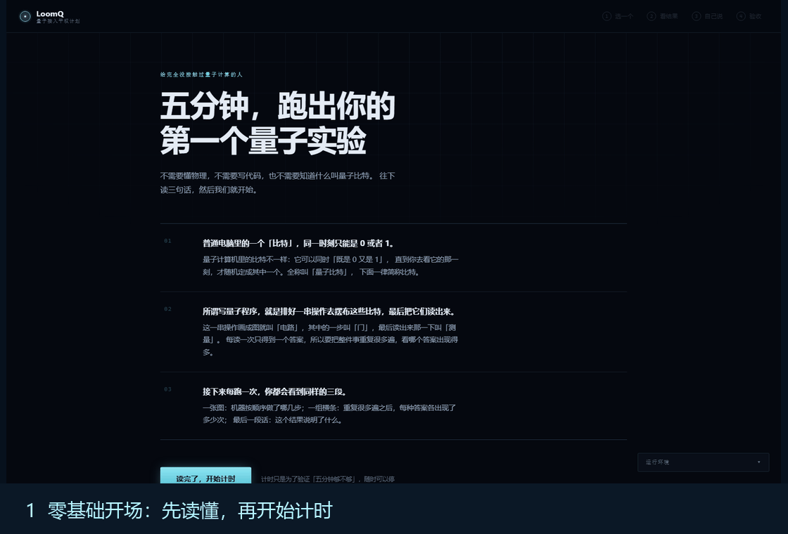

# LoomQ 人工评分证据

这份文件是人工评分材料的统一入口。请直接编辑它，只填写要申报的项目。截图、原始结果或图表统一放在 `starter_kit/evidence/files/`，也可以引用 `starter_kit/` 中已有的代码和文档。

证据包是可选的。没有申报某项人工分时，留空即可，不影响自动评分。

## 评委快速核对



上图由仓库中已经归档的真实页面截图生成；生成脚本为 `tools/build_evidence_gif.py`，没有补画界面或结果。

如果只看一分钟，按下面顺序即可复现本次提交的主线：

1. `start.ps1 --port 8898` 启动网页；首页三个现成示例不需要模型或量子 SDK。
2. 在“现在换你说”输入“让三个比特全部纠缠起来”，页面生成 QASM、电路图、测量分布和人话解释。
3. 选择真机后，平台会先显示同一电路的模拟结果；真机返回后自动替换，并标出噪声差异。
4. 陌生用户实测记录见 [`stranger-five-minute-test.md`](stranger-five-minute-test.md)：网安专业、没学过量子力学，3 分 15 秒完成，原理题 3/3。
5. 真机原始文件、QASM、位序校准和可复现命令都在本目录的 `files/` 与下方 L1 小节中。

这份顺序对应项目真正的使用路径：先看懂，再用自然语言生成，最后送到真机；遇到模型或真机暂时不可用时，页面会保留同一电路的模拟结果，不会把用户卡在空白页。

## 提交前填写

把要申报项目的方框改成 `[x]`，并填写对应内容：

- [x] L1 真机 —— 量旋云 gemini_vp 与 triangulum_vp 两个平台均已实跑
- [x] L2 交互体验
- [x] 工程与产品化
- [x] 自定义量子 RISC-V Bonus —— 三项交付物齐备，见本文末节
- [x] 新手引导与视觉叙事 Bonus

## L1 真机

每个有效真机平台计 5 分，最多两个平台。模拟器不计真机分。两个平台都是真机（NMR），
不是云模拟器——账号可见的 `simulator` 平台我们刻意没用。

```text
平台名称：量旋云 SpinQ Cloud —— Gemini（gemini_vp，2 比特 NMR 真机）
平台 job ID：G-260808-0002
运行时间：2026-08-08 11:15:00 (UTC+8)
shots：1024
实际执行的 QASM：starter_kit/evidence/files/spinq-cloud-gemini-bell-circuit.qasm
平台原始返回：starter_kit/evidence/files/spinq-cloud-raw-payloads.json（按编号从平台 API 取回）
统一 Schema 结果：starter_kit/evidence/files/spinq-cloud-gemini-bell-result.json
```

```text
平台名称：量旋云 SpinQ Cloud —— Triangulum（triangulum_vp，3 比特 NMR 真机）
平台 job ID：S-260808-0002
运行时间：2026-08-08 11:17:48 (UTC+8)
shots：1024
实际执行的 QASM：starter_kit/evidence/files/spinq-cloud-triangulum-ghz3-circuit.qasm
平台原始返回：starter_kit/evidence/files/spinq-cloud-raw-payloads.json（按编号从平台 API 取回）
统一 Schema 结果：starter_kit/evidence/files/spinq-cloud-triangulum-ghz3-result.json
```

### 2026-08-23 补跑

Python 3.10 环境修好、当前机器的新公钥登记后，又从本仓库重新提交了一次 Bell 电路：

```text
平台：量旋云 Gemini（gemini_vp，2 比特 NMR 真机）
任务编号：G-260823-0002
时间：2026-08-22 18:01:15Z（北京时间 2026-08-23 02:01:15）
shots：1024
结果：00=440、11=402、10=129、01=53
输入电路：starter_kit/evidence/files/final-bell-circuit.qasm
统一结果：starter_kit/evidence/files/final-bell-result.json
```

这次结果里 `00` 和 `11` 仍是两个主峰，`10`、`01` 是真机噪声，不把真机结果写成理想模拟器的 50/50。

复现命令（需 `LOOMQ_SPINQ_USERNAME` 与 `LOOMQ_SPINQ_KEYFILE` 两个环境变量，凭据不入库）：

```text
python tools/run_spinq_cloud.py platforms    # 看哪些真机在线，不提交任务
python tools/run_spinq_cloud.py calibrate --qubits 2
python tools/run_spinq_cloud.py run --qasm starter_kit/circuits/bell.qasm --platform gemini_vp
python tools/fetch_spinq_raw.py              # 按编号取回原始返回并核对申报文件
```

### 溯源性已按编号实测复核

`python tools/fetch_spinq_raw.py` 会重新登录平台、按编号逐个取回任务结果。
四个编号（含两个位序标定探针）**全部取回成功**，平台原样返回了计数。

**申报的 result.json 是归一化之后的，不是原始载荷，这里说清楚为什么。**
两者在本题里无法统一——官方 `validate_schema` 要求 `bit_order == "little"`
且 counts 总和**严格等于** shots，而真机的实际情况是：

| 冲突点 | 平台实际返回 | Schema 要求 |
|---|---|---|
| 位序 | 原生位串以 q[0] 为最左字符 | 最右字符须为 c[0] |
| 总数 | `S-260808-0001/0002` 只返回 **1023** 次 | 严格等于 shots=1024 |

所以交付文件必然经过两道变换：位序整串反转（依据
`spinq-cloud-bitorder-calibration.json` 的实测标定）、按最大余数法补足到 shots。
照抄原始载荷会 schema 非法、整个 case 判 0。

**因此两份都交，并给出可复算的对照。** `spinq-cloud-raw-payloads.json` 存平台原始返回，
`fetch_spinq_raw.py` 自动核对"申报文件是否等于原始载荷走一遍归一化"——实测逐位一致。
评委按编号复核时会看到位串是反的、`000` 差 1，预先把这个变换摊开讲，
比让人自己发现要好。

**关于控制台任务页截图：** 网页控制台的「我的实验 → 查看实验结果」两个页签
（未结束/已结束）都显示 0 条，猜测该列表只收录网页电路设计器创建的实验，
不含 SDK 提交的任务。但这不影响溯源——平台 API 按编号查得到，
上面那条命令可随时复现。这四个编号是平台分配的 task_code，
不是我们自己生成的。

**真机与模拟器的差距是真实的，我们照实报。** 按官方 `evaluator.py` 的口径
（`1 − Hellinger 距离`，注意它比 Qiskit 的 `hellinger_fidelity` 更严）：

| 平台 | 电路 | 保真度 | 理想态占比 |
| --- | --- | --- | --- |
| gemini_vp | Bell | 0.7743 | 90.14% |
| triangulum_vp | GHZ-3 | 0.6233 | 73.63% |

同样两个电路在本地模拟器上是 1.0000 与 0.9895。这个落差不是 bug，是 NMR 真机的退相干与
读出误差——恰恰是"第一次在真实量子机上做实验"该看到的东西，CLI 里也会如实解释而不是粉饰。

**接真机需要改中间层的三处，都是从 spinqit 0.2.4 源码确认的，不是试出来的：**

1. **云端拒绝显式 measure。** `SpinQCloudBackend.assemble` 见到 MEASURE 节点直接抛
   `CircuitOperationValidationError`，测量由平台在电路末尾自动完成。所以提交前要在 IR 层
   摘掉全部 Measure（`backends._measure_free_qasm`），但保留 creg 声明——编译器要靠它
   确定 `ir.dag['cnum']`。
2. **结果位宽按 n_qubits 而非 n_clbits。** 部分测量只在 `sqc_25_vp` 与 `simulator` 上支持，
   其余平台一律返回全部比特。
3. **官方 `execute()` 会无限期阻塞**（内部 `hanging=True, timeout=None`，每 5 秒轮询）。
   我们改为自己 `submit_task` + `get_task_result`，好处是能设超时，且**超时也保留 task_code**
   ——真机证据要的就是这个可溯源编号，任务还在排队时不该把它丢掉。

**位序是独立标定的，没有沿用模拟器结论。** 见
`evidence/files/spinq-cloud-bitorder-calibration.json`：真机的自动测量是另一条代码路径，
映射由平台决定而非我们的 measure 语句，所以必须重新标。用非对称探针（只对 q[0] 施加 x）
在 2 比特与 3 比特各标一次，主峰分别落在 `10` 与 `100`，即原生位串以 q[0] 为最左字符，
与大赛约定相反。两个位宽结论一致，排除了"自动测量整体错位"这个竞争解释。
公开的 bell/ghz3 在这里没有鉴别力——它们回文对称，整串反转后分布不变。

## L2 交互体验

```text
启动界面或 CLI 的命令：
  Windows        双击 start.ps1
  macOS / Linux  ./start.sh
  （起本地服务并自动打开浏览器。零依赖：不装任何量子 SDK、不配模型、
    不联网也能完整跑通，内置参考模拟器与三个现成示例始终可用。）

  仍保留纯终端入口：cd starter_kit && python -m loomq.cli [--demo]

测试入口或页面地址：http://127.0.0.1:8898/ （本地服务，不需要部署）

适合现场体验的 3 个用户任务：
1. 点开首页读三句话，点「读完了，开始计时」，再点第一张卡片 —— 做出两比特
   贝尔态。页面给出 SVG 电路图（鼠标停在门上有一句人话解释它在做什么）、
   结果分布条和一段解释：只有 00 和 11 各一半，中间的 01、10 一次都不出现，
   这就是「纠缠」。页面右上角的计时器就是「五分钟」这条判据的秒表。
2. 在「现在换你说」里用中文描述需求，例如「让三个比特全都纠缠起来」——
   智能体生成电路、自我验证、跑出结果。模型服务未配置时页面会说清楚
   缺什么、下一步能做什么，并引导回内置示例，不会报错退出。
3. 点「送到真机上跑」，把同一个电路送到量旋云的 NMR 真机。**一秒内先给出
   模拟器算的同一个电路的结果**，真机在后台排队（约一百秒），回来之后这一屏
   自动换成真机数据。回来的结果里会冒出理想情况下概率为零的位串，页面用虚线
   标出理想值、实心条画实测值，并解释这些偏差从何而来。
   最后三道验收题检验「是否理解其科学原理」，答完可导出完成凭证。

截图：evidence/files/webui/ 共 10 张，覆盖开场、选例、结果、提问、
      真机排队、真机对照、验收、凭证与手机端。
      08-hardware.png 是真机结果，对应任务编号 G-260813-0006（2026-08-13）。
      10-pending.png 是真机排队期间那一屏：模拟结果已经摆在屏上，顶部青色块
      写明"这份是普通电脑先算的，真机还在排队"并带一个走秒的计数。
      09-fallback.png 是真机全部离线时拍的（2026-08-12 实测，五个平台在线台数
      全为 0）——这一张同样是产品行为的证据：回退到模拟器之后，页面会用橙色块
      讲清为什么没跑成真机，并把主按钮从「送到真机上跑」换成「换我自己说一个」，
      不让用户反复点同一个按钮撞同一堵墙。
```

**为什么补了网页入口。** 原先只有 CLI。但让一个零基础的人先装 Python、
再在终端里敲 `python -m loomq.cli`，这件事本身就跟「零门槛」的主张相冲突——
终端本身就是门槛。实测还发现 Windows 控制台默认按 GBK 输出，开场引导整屏乱码
（已在 `cli._ensure_utf8_output()` 修掉），而这类问题在浏览器里根本不存在。

网页入口不引入任何新依赖，只用标准库 `http.server`，因为 requirements.txt 里
braket / spinqit / pyqpanda 三家的版本约束已经互相咬得很紧，为了一个界面
引入 Flask 或 FastAPI，风险远大于收益。

```text
python ../tools/selftest_web.py    # 74 项离线自测，不联网、不用模型、不碰真机
```

**客观分前置条件已实测满足。** 题面规定这 10 分交互分只在 L2 客观分 ≥ 12 时才计入。
用 `l2_policy.json` 指定的正式模型 `deepseek-v4-flash`（temperature 0、thinking 关闭，
与官方一致）实测，24 个对标用例全部通过，折算客观分 ≈ 20/20，连续三轮稳定：

```text
python tools/selftest_l2_live.py            # 24 个对标用例，需 LOOMQ_LLM_* 环境变量
python tools/selftest_l2_live.py --stretch  # 另加 12 个刻意超纲的进阶用例
```

判定口径与官方对齐，不是自己放水：抽 QASM 用的是官方 `evaluator.py` 里同一个正则，
电路由纯标准库的 `refsim` 无噪声精确模拟后比 Hellinger 保真度、阈值同为 0.97，
选后端的正确答案集由 `backend_capabilities.json` 按约束现算而非写死在测试里。

之所以要自建这套压测，是因为公开的 `evaluator.py --level l2` 只有 1 个用例，
且只校验"回复里能抽出可解析的 QASM"，不校验电路对不对——它全绿并不能说明任何问题。

交互设计上有四点是刻意为之，便于现场核验：

1. **永远能跑起来。** 未安装量子 SDK 时自动回落到内置参考模拟器（纯标准库精确模拟），
   未配置模型服务时回落到内置示例库，流程完整不中断。
2. **先看懂再动手。** 首屏用三句话讲清量子比特、测量与分布，不堆术语。
3. **错误可恢复。** 所有失败路径都给出下一步动作，不打印堆栈；
   `--backend refsim` 是任何环境下都成立的兜底方案。
4. **真机就在同一个入口里。** `--backend spinq_cloud` 让零基础用户输入一个数字
   就能把电路送上真实量子计算机——专项奖标准写的是"在真实量子机上完成第一个实验"，
   所以真机必须是产品功能，而不只是我们内部的验证脚本。

**真机路径的交互有三处是被实测逼出来的，不是设想的：**

- **不能默默卡住，而且光证明"还活着"不够。** 真机排队加执行约一百秒。
  `backends.run_spinq_cloud` 接受一个 `progress` 回调，CLI 与网页都用它逐条报出
  "已连上哪个平台、任务编号是多少、大概要等多久"。但实测把这套做法打穿了：
  提交完成之后到结果回来之间，后端一句进度也吐不出来，页面只剩一个走秒的计数
  ——被试等到三四十秒就判定"真机这里不行"，从来没等到过结果。秒表能证明页面
  还活着，证明不了等下去有意义。**现在排队期间先把同一个电路的模拟结果整屏摆
  出来**（`web._preview`），等待从"空耗"变成"等真机回来做对照"；真机回来后整屏
  替换，并给出偏差解释。这样"跑出人生第一个实验"这件事也不再被排队时间绑架：
  哪怕真机最终没回来，用户也已经完整看过一次结果页。见 `10-pending.png`。
  同理，`?job=<编号>` 在任务仍在排队时也能接回去继续等——排队途中刷新一下页面
  就把任务丢了，这在两分钟的等待里太容易发生。
- **真机装不下就说清为什么。** 账号可见的真机是 2 / 3 / 5 / 8 比特四台（另有一个
  云模拟器，我们刻意没用），电路大过在线机器时请求必然失败。这时不报错退出，
  而是说明"真机现在还很小，这不是你的电路有问题"，再回落到模拟器——
  顺便把"模拟器为什么仍然重要"这件事讲明白了。
- **真机会整片下线，回退必须当面交代。** 2026-08-12 晚实测：五个平台在线台数
  **全部为 0**，而同一份凭据两天前还跑通过（`G-260810-0012`）。回退到模拟器是对的，
  但如果只把原因写进运行日志，跑完日志一消失，用户看到的就是一个和普通模拟器结果
  长得一模一样的页面，只会以为是自己按错了。所以原因跟着结果一起返回、显示在结果页
  顶部（见 `09-fallback.png`），后续按钮也随之改写。谁主动要过真机，谁就有权知道
  为什么没跑成。
- **结构性解释必须来自理想分布，不能从真机数据里猜。** 见下节。

## 工程与产品化

正式环境复现矩阵与已知边界见 [`formal-repro.md`](formal-repro.md)。陌生用户专项奖实测按 [`stranger-five-minute-protocol.md`](stranger-five-minute-protocol.md) 执行，实际结果填写 [`stranger-five-minute-test.md`](stranger-five-minute-test.md)；当前仓库已有的是作者本人自测，不能冒充陌生被试证据。

```text
干净环境中的构建和启动命令：
  Python 3.10 环境下：
    pip install -r starter_kit/requirements.txt
    cd starter_kit && python evaluator.py --level l1 --target spinq,braket,originq
  已实测通过：6/6 case PASS（三个平台各两个公开电路）。
  requirements.txt 为全量精确锁定（79 行 ==），
  并在干净的 3.10 venv 里 dry-run 验证过依赖可解。
  完整步骤见仓库根目录 RUNBOOK.md（九个步骤，每步都有明确通过判据）
  最小验证（无需任何第三方依赖，也不需要 API key，全部约 20 秒）：
    python tools/selftest_transpile.py     # 转译层，37 项断言
    python tools/selftest_decompose.py     # 门分解数值验证，22 项断言
    python tools/selftest_agent.py         # L2 Agent，42 项断言，用本地假端点
    python tools/selftest_explain.py       # 结果解释文案，35 项断言
    python tools/selftest_hybrid.py        # L3 混合编译，随机程序穷举注入差分
    python tools/selftest_quantum_ext.py   # 量子 RISC-V 扩展，七组端到端测试
    python tools/gen_circuits.py           # 生成隐藏电路回归集 + 灵敏度检验
    python tools/run_regression.py         # 回归集比对理想分布
    python tools/check_hardware_evidence.py  # 按官方三条标准核验真机证据
    cd starter_kit && python -m loomq.cli --demo

架构说明：见 PLAN.md 第三节。分层为
  qasm2_parser  OpenQASM 2.0 → 统一 IR
  ir            Circuit / Gate / Measure，唯一的内部数据结构
  emitters      统一 IR → 各后端原生表示（门名映射集中在此，加后端只加一张表）
  decompose     gate_identities.md 的门分解
  backends      真实 SDK 执行层，惰性导入
  counts        位序与统一结果 Schema 归一化
  refsim        纯标准库参考态矢模拟器，供离线验证与 Agent 自验
  agent         L2 智能体
  visualize     电路图 / 直方图 / 人话解释
  cli           零基础用户入口

  十个模块里只有 backends 和 agent 需要外部依赖，其余全部纯标准库。
  这是"永远能跑起来"的结构性保证，也让上面那六条验证命令在任何机器上都成立。

跨平台一致性的实测证据：
  自造的 6 个隐藏电路（GHZ-5 / QFT-4 / Grover-3 / Random×3，覆盖全部 12 门）
  在 spinq / braket / originq 三个后端上，与参考模拟器精确算出的理想分布相比，
  18 个组合保真度全部 >= 0.987（官方阈值 0.97），命令：
    python tools/run_regression.py --target spinq,braket,originq
  这比只跑公开的 bell/ghz3 强得多——后两者分布回文对称，位序写反了也照样 PASS。

"通用中间层"是否名副其实，接第三个平台时得到了检验（可现场问询）：
  接 originq 只改了两个地方——emitters.py 的 OriginIR 门名表与语法，
  以及 backends.py 里那一个 run_originq 函数。IR、解析器、分解、
  位序归一化、可视化、CLI、Agent 一行未动。这是架构解耦的直接证据，
  不是三套硬编码分支。
  过程中暴露三处"契约允许但 SDK 不接受"的写法，都只在真跑时现形：
    RY(1.5708) q[0]      -> 报 no viable alternative，要写 RY q[0],(1.5708)
    CU1 q[0],q[1],(θ)    -> 报 CU1 undefined，要写 CR
    SDAG q[0]            -> 报 SDAG undefined，要用 DAGGER/S/ENDDAGGER 块
  前两处契约明写两种写法都接受，故统一用能真跑的那种。
  第三处 DAGGER 是结构而非门名、不在契约允许清单里，所以 emit_originir 加了
  executable 参数：判定输出仍发 SDAG/TDAG，只有执行路径发 DAGGER 块——
  与 braket「判定发 stdgates、执行发方言」同一个模式。

  顺带用实测关掉了一个此前只能存疑的问题：OriginIR 的 CR 究竟是 cu1 还是 crz。
  tools/probe_originir.py 用一个能区分二者的电路比对（bell/ghz 完全区分不开），
  与 cu1 保真度 0.9988、与 crz 只有 0.7233，CR 就是 cu1 语义 diag(1,1,1,e^{iθ})。
  QFT-4 在 originq 上 0.9953 也印证了这一点：若 CR 是 crz，它会掉到 0.72 附近。

  位序同样逐个实测标定，未沿用别家结论：originq 原生位序与大赛约定一致，
  而 spinq/braket/真机都相反。假定"同类平台约定相同"在这里就会出错。

L3 混合编译的两处非平凡设计（可现场问询）：

  **一、怎么知道扛得住隐藏随机用例。** 题面说评测会按文法随机生成用例、
  穷举注入所有测量值组合、比对参考解释器。所以我们把这套判定方式在本地
  复刻了一遍：`tools/selftest_hybrid.py` 自己随机生成程序，自己写一份
  AST 参考解释器，穷举注入 2^n 组测量值，逐一比对"解释器算出的终态"与
  "生成的汇编在**官方** riscv_emulator.py 上跑出的终态"。
  实测 800 组随机程序、数千次注入全过。
  同错风险是真实的——解释器和代码生成出自同一双手。两条防线：一是两条路径
  结构上差得远（树求值 vs 寄存器分配加分支跳转），二是 8 个固定用例的期望值
  **全部手算**，不来自任何一条路径，即便两边一起错这些也会红。

  公开自测在这里没有鉴别力，且我们被它坑过一次：`evaluator.py --level l3`
  只有一个用例，单测量位、只用 `==`、只赋常量。它全绿之后我们才发现
  **题面自己给的那段示例编译不过**——示例在 `classical {` 后面跟了 `//` 注释，
  而公开用例恰好没有注释，词法器漏掉注释处理也能过。

  **二、表达式归一化成仿射式，同时解决两个边界问题。** 经典块只有 `+` 和 `-`，
  没有乘除，所以任何表达式——无论套多少层括号与一元负号——本质都是
  `常数 + Σ(±寄存器)`。先归一化再生成代码，而不是按 AST 递归。
  这不是锦上添花，两个边界都是加压测试里真栽过的：
    - 测量位映射到 x10+k，位数一多就向上吃掉临时寄存器区。
      按 AST 递归时 18 位还行、20 位直接报寄存器不够。
    - 深嵌套把指令数顶到 1311 条，而官方模拟器 max_steps 只有 1000。
  两者根因相同——临时寄存器消耗随嵌套深度线性增长。归一化后同时活跃的
  临时寄存器降到 1 个，与嵌套深度无关，20 个测量位也够用；常数在编译期
  折叠掉，最长指令数从 1311 降到 658、常规用例从 231 降到 132。
  比较也顺带简化：`lhs == rhs` 归一成 `lhs - rhs`，直接跟硬连线为零的 x0 比。
  两个边界都已固化成回归用例（第六组）。

  题面的文法只有示例加一段自然语言，若干边界没写：嵌套 if、括号、无 else 的 if、
  多个 classical 块、寄存器间运算。**一律支持超集**——递归下降天然支持嵌套与括号，
  多写几行而已，而支持得比要求多只会更安全，反过来则直接丢分。

L2 自验闭环的一处非平凡设计（可现场问询）：
  "生成 → 自验 → 不对就重试"这个推荐方案有个反直觉的失效模式——自验基准取错时，
  它不修错，而是把对的改成错的。实测抓到过：用户要"测量只能是 01 或 10"的两比特
  纠缠态，模型给出的电路和它声明的分布都对，但把 target_family 标成了 "bell"。
  旧实现把 "bell" 硬解释为 00/11，据此否决正确电路，再把"你应该落在 00/11"喂回去，
  模型照办，第二轮交出真正错误的答案。
  根因是族名只能定到"族"、定不到唯一成员：贝尔态有四个，Φ± 测得 00/11，Ψ± 测得 01/10。
  但简单改成"信模型声明的分布"会拆掉防伪造守卫，而这两种情形在代码视野里结构同形，
  唯一的区分依据是用户原话。所以 classify_verification 返回三态而不是布尔值，
  冲突时不擅自判决，改为带着用户原始请求和 refsim 精确算出的实际分布做一次定向裁决
  ——问"这个分布是否满足用户要求"，而不是"你的标签对不对"。
  见 loomq/agent.py 的 classify_verification / adjudicate_label_conflict，
  以及 tools/selftest_agent.py 里"标签冲突·救回 / 标签冲突·否决"两组用例。

真机解释逻辑的一处非平凡设计（可现场问询）：
  真机第一次跑出来最扎眼的现象是"不该出现的结果出现了"，讲不清这一点，
  用户会以为自己做错了——而专项奖标准要求的正是"理解其科学原理"。
  最初的实现完全数据驱动：把"概率达到最高峰一半以上"的结果认定为主峰，
  其余算噪声。它在第一次真机运行（任务 G-260808-0003，45%/44%）上表现正常。
  第二次运行（任务 G-260808-0004）打穿了它：同一个贝尔态电路跑出 59%/29%，
  29% 差一点没够到一半线，于是 11 被误判成噪声，界面既丢掉了"这就是纠缠"这句话，
  又反过来宣称"40% 落在 00 之外"。真机批次间波动就是这么大。
  根因不是阈值没调好，而是**光看一个带噪声的分布，原理上就推不出哪些结果是信号**，
  调阈值只是把失败推到下一次。所以改为不猜：用 refsim 精确算出该电路的理想分布，
  结构性解释讲理想的（电路本该做什么），偏差解释讲实测的（真机差在哪、差多少）。
  界面把两份分布并列显示，反而成了最好的教具。
  `explain_distribution` 里保留的主峰识别也同步改成"清晰可分才下结论"
  （切点处前一名须达后一名 3 倍），证据不足时宁可少说一句。
  见 loomq/visualize.py 的 explain_hardware_noise，以及
  tools/selftest_explain.py 里用那组真实坏批次数据钉住的回归用例。

目标用户和使用场景：
  有明确问题意识、具备基本计算机使用能力，但没有量子物理背景的人——
  尤其是跨界创作者、教育工作者、以及被"黑话高墙"挡在门外的女性开发者。
  场景是：想验证一个想法值不值得深入，但不愿先花三个月学量子力学。

完整使用流程：RUNBOOK.md + `python -m loomq.cli --demo` 的输出即是完整演示
```

**必答题：你的工具让哪一类原本进不来的人，第一次能用上量子计算？**

答：**能把想法说清楚、但不掌握任何量子平台方言的人。**

今天的门槛不在于智力，而在于"入场费"：想跑一个量子电路，你得先选平台、注册账号、
学它专属的 SDK 与指令集，而三家平台的方言互不相通。这笔入场费筛掉的不是不聪明的人，
是没有科班背景、没有实验室资源、没有师兄带路的人。

LoomQ 把这笔入场费拆成两半各自消灭：中间层消灭"必须学会某家方言"，
智能体消灭"必须先会写 QASM"。剩下的只需要用中文说出你想做什么。

## 自定义量子 RISC-V Bonus

题面要求三者齐备方计分，逐项对应：

```text
① 指令编码规格文档：docs/quantum-riscv-extension.md
   opcode 取 RISC-V 保留的 custom-0 (0x0B)，沿用 R-type 字段划分不改数据通路。
   funct3 选操作类别（q.gate / q.gatep / q.meas / q.init），
   funct7 选具体门（正是赛题第三节那 12 个白名单门，与 L1 同一张表）。
   文档第 5 节给出 4 条指令的逐位编码，并由测试逐条核对。

② 对官方模拟器的扩展实现：tools/riscv_quantum_emulator.py
   官方 starter_kit/riscv_emulator.py 的 fork，改动集中在三处，
   文件头注释里逐条列明。经典 7 条指令语义一字未改。

③ 可运行的端到端测试：tools/selftest_quantum_ext.py
   七组测试，命令：python tools/selftest_quantum_ext.py
   最小演示：python tools/riscv_quantum_emulator.py
```

**这套扩展不是给 L3 加个装饰，它解决一个 L3 主体解决不了的问题。**
L3 的产物是两份互不相识的东西——一个量子操作序列，一份经典汇编，
评测时也分开验证。但真实混合程序里两者有数据依赖：测量结果要立刻决定
后续经典分支。把量子操作编码成自定义指令后，两者进入**同一条指令流、
在同一台机器上顺序执行**：`q.meas` 把塌缩结果直接写进通用寄存器，
下一条 `beq` 立刻就能用它跳转。

现场可直接跑的判据（`python tools/riscv_quantum_emulator.py`）：
Bell 态电路连跑五个种子，两个测量位**恒相等**，经典段算出的 `x1` 恒为 1。
测量塌缩若写错，q[1] 会独立抽样，约一半的次数就会不等。
纠缠关联就这样被同一台机器上的经典分支验证出来。

**做真编码而不是只加助记符。** 题面说的是"设计 custom opcode 编码"，
所以模拟器**先把指令编码成 32 位机器码、再解码执行**，而不是直接跑文本 token。
解码器还会校验"按规格应为 0 的字段确实为 0"——宁可报错也不要把垃圾位
静默执行成别的指令。测试里有 8 条非法机器码，逐条确认被拒。

**fork 没动坏原语义，这一点有凭据不靠声明。** `selftest_quantum_ext.py` 第四组
用 L3 的随机程序生成器造 400 组程序，逐条比对本 fork 与官方
`riscv_emulator.py` 的寄存器终态，全部相同；官方文件自带的那段 demo
（期望 `x3=16`）也一字不差地过。

**量子语义与 L1 判定同源。** 门的酉变换直接调用 `loomq.refsim._apply_gate`，
不另写一套，所以不存在"扩展模拟器算得和参考模拟器不一样"的风险。
第五组测试拿 refsim 当基准比对末态，用的都是**非对称**电路
（门作用在高位比特、cx 反向控制、swap、ccx），因为对称电路把比特下标
放错位置也照样通过——这一组真正验证的是编解码把字段放对了，而非门矩阵本身。

**过程中被测试照出来的一个真 bug：** 三条错误路径的诊断信息用了 `%03b`，
但 Python 的 `%` 运算符不支持 `%b`，格式化自身抛 `ValueError`。
也就是说这些错误路径原本会崩在格式化上，给出一句看不懂的 `ValueError`，
而不是我想给的那句诊断。专门测错误路径才照得出来。

已知边界照实列在规格文档第 8 节，包括 5 位比特下标上限 32、
定点角度精度 π/2^16、不支持用经典值反向控制"门的选择"（只支持控制门的**参数**）。

## 新手引导与视觉叙事 Bonus

```text
零基础首次运行指南：
  网页入口 starter_kit/loomq/webui/ —— 开场三句话讲清量子比特、测量与分布，
  然后是一条明确的五步路径：选一个 → 看结果 → 自己说 → 真机 → 验收。
  每一步跑完都给出下一步做什么，不让人停在原地。
  终端入口 starter_kit/loomq/cli.py 的首屏引导同样内容。
  以及仓库根目录 RUNBOOK.md 与一键启动脚本 start.ps1 / start.sh。

量子概念解释：
  starter_kit/loomq/visualize.py 的 explain_distribution()
  ——完全由数据驱动，按结果的集中度与结构自动生成人话解释，
  例如两比特只出现 00/11 时会指出「中间那些结果一次都没出现，这就是纠缠」。
  弧度也会被翻译成 pi/2 这种可读写法（_pretty_angle）。
  网页版另有每个门的悬停释义（web.GATE_HINT），例如 cx 是
  「受控非门：控制位是 1 时才翻转目标位，纠缠就是这么来的」。

结果可视化：
  网页版 starter_kit/loomq/webui/app.js
  - drawCircuit()：SVG 线路图。控制点画实心圆、目标画 ⊕、交换画 ×、
    测量画橙色 M 并标出对应经典位，多比特门用竖线连接。
    列布局在后端算（web.layout_circuit），与终端版共用同一套排布规则。
  - drawBars()：结果分布条。真机模式下同一根轨道上叠加两层——
    实心条是真机实测，虚线刻度是理想值，偏差一眼可见。
  - drawCert()：完成凭证，写明用时、实验名、运行后端与验收得分，可导出 PNG。
  终端版 starter_kit/loomq/visualize.py 的 circuit_diagram() / histogram() /
  bitstring_legend() 保持不变，字符集按终端编码自动降级为纯 ASCII。

理解验收（对应「并理解其科学原理」这条判据）：
  网页最后三道单选题，覆盖纠缠、为何要重复测量、真机噪声从何而来。
  答错不拦路，但每题都给出解析。这三题的作答连同用时一起写进完成凭证，
  是这条判据唯一可留存的证据。实测记录模板见 evidence/five-minute-test.md。

错误恢复或无障碍引导：
  - 后端不可用时自动回落到内置参考模拟器并说明原因，流程不中断
  - 真机排队、连不上或整片离线时回落到模拟器，并在结果页当面讲清原因、
    改写后续按钮，不让用户反复点同一个按钮撞同一堵墙（见 09-fallback.png）
  - 模型服务未配置时明确指出缺什么、下一步能做什么，并引导回内置示例
  - 电路解析失败时给出具体原因和下一步动作，不打印堆栈
  - Agent 自验未通过时如实告知，但仍交付电路，不让用户空手而归
  - 长句按显示宽度折行（中文按 2 计），中英混排表格按显示宽度对齐
  - 网页端 360 / 412 / 1600 三个宽度实测无横向溢出（用注入式探针量
    `documentElement.scrollWidth`，不靠肉眼看截图）；prefers-reduced-motion
    下关闭全部动画；结果条的宽度只由内联 CSS 变量决定，任何动画都不参与改宽度
    ——无头浏览器跑虚拟时钟时动画时钟不推进，凡是"从 0 长出来"的动画都会
    永远停在首帧，把真实数据盖成空条
```

## 提交规则

- 所有材料都要在截止前进入最终提交的 commit，工作人员不接受截止后补交。
- 外部视频可以用稳定只读链接，源码、原始结果和复现命令应保存在仓库中。
- 整个 fork commit 的归档包不得超过 100 MiB。
- 不要提交 API Key、Token、Cookie、个人身份信息或平台账户隐私。
- 如申报 L1 真机分，在最终提交 Issue 的 `Hardware evidence` 中填写 `starter_kit/evidence/README.md`。
