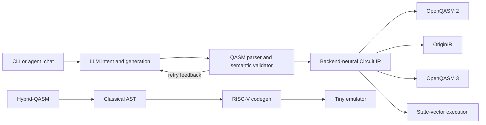

# LoomQ Contest Solution

## Judge quick path / 评委快速复现

From the fork root, one command completes a Bell experiment without installation, an account, network access, or an API key:

```bash
python3 starter_kit/loomq_cli.py --demo bell
```

If `starter_kit/` has already been extracted as the organizer's evaluation root, use `python3 loomq_cli.py --demo bell` instead. For the guided Agent, configure the injected `LOOMQ_LLM_*` environment and omit `--demo bell`. The opening screen supplies three copy-ready tasks plus `/help` and offline `/demo` recovery commands. All interaction is keyboard-operable, and the visualization always includes exact counts and percentages rather than relying on color.

## Five-minute first run

The primary user is a developer, student, or product builder who has never written QASM and wants to turn one sentence into a verified quantum experiment. No account, API key, package installation, or quantum physics background is needed for the first run (command shown from the fork root):

```bash
python3 starter_kit/loomq_cli.py --demo bell
```

The command prints the executable circuit, runs 1,024 shots, displays a color-independent ASCII probability histogram with exact values, explains why Bell measurements are random but correlated, and states the result bit order. Try the three-qubit version with `--demo ghz3`.

The first-run flow is intentionally layered:

1. **See it work offline**: no signup or configuration gate before the first successful experiment.
2. **Understand the evidence**: executable QASM, counts, percentages, histogram, and a plain-language interpretation appear together.
3. **Move to natural language**: the interactive screen offers generation, repair, and backend-selection tasks that can be copied verbatim.
4. **Recover without being stranded**: `/help` and `/demo bell` remain available if the model configuration or network is unavailable.

## Natural-language Agent

Set an OpenAI-compatible model configuration without putting credentials in files:

```bash
export LOOMQ_LLM_BASE_URL=https://api.deepseek.com
export LOOMQ_LLM_API_KEY=<YOUR_KEY>
export LOOMQ_LLM_MODEL=deepseek-v4-flash
python3 starter_kit/loomq_cli.py
```

The interactive entry point supports generation, repair, and backend selection. Three evaluation tasks are:

1. `生成一个 4 比特 GHZ 态并进行全测量。`
2. `我想制备 Bell 态，请修复：H q[0]; CX q[0] q[1]`
3. `我要运行 25 qubit 电路，要求本地、免费、无需账号且不排队，推荐后端。`

For a repeatable single request:

```bash
python3 starter_kit/loomq_cli.py --prompt "生成一个 3 比特 GHZ 态并进行全测量"
```

### What the user sees

- Generation or repair answers include the complete QASM. LoomQ extracts it, reports that local validation succeeded, executes it, and visualizes the measured distribution.
- Backend recommendations use the canonical ID and show the relevant qubit, queue, and cost capabilities. Impossible combinations are reported as incompatible instead of silently relaxing the user's requirements.
- Follow-ups such as `改成 5 比特` reuse the immediately previous turn while placing the new constraint first for validation; `/clear` visibly resets that context.
- Errors name the missing configuration or unsupported statement, never echo a credential, and always point back to a working offline command.

## Architecture



- `qasm_core.py`: whitelist parser, backend-neutral IR, three renderers, simulator, bit-order normalization.
- `agent_engine.py`: model call, QASM extraction, Bell/GHZ semantic validation, retry, machine-readable backend routing.
- `hybrid_compiler.py`: recursive-descent L3 parser and seven-instruction RISC-V code generator.
- `riscv_emulator.py`: official classical subset plus the documented custom-0 quantum extension.
- `loomq_cli.py`: offline onboarding, Agent entry point, execution, visualization, and plain-language results.

## Error recovery

- Missing `LOOMQ_LLM_*`: the CLI names the missing variables without printing any credential. The offline demos still work.
- Invalid model QASM: LoomQ parses and simulates it, sends the concrete failure back to the model once, and returns the corrected answer.
- Wrong backend ID: LoomQ checks it against `backend_capabilities.json` and requests a correction; a validated capability-table fallback remains available.
- Unsupported QASM: the parser reports the exact statement or gate instead of silently changing the circuit.
- Container/network issues: run the offline Bell demo first to separate local engine failures from model-service failures.

## From the first demo to real hardware

The same Bell experiment has already been executed on two independently traceable QPUs. Start with the zero-configuration CLI, then inspect `evidence/README.md` and its normalized result files: SpinQ job `G-260822-0014` and Origin Quantum job `DD891ACC37461FFCC199AC4FE14224D4` retain the submitted circuit, shots, timestamps, raw platform response, and dominant `00`/`11` outcomes.

Account holders can repeat the hardware path with `examples/spinq_cloud_submit.py` or `examples/originq_cloud_submit.py`. Both read credentials only from environment variables; credentials are never written into result files. Conversion errors fail closed—the tools never replace the user's requested circuit with a different experiment. Hardware account approval and queue time remain platform constraints, so the offline simulator path always stays available while a job is pending.

## Inclusivity and accessibility choices

- Chinese-first, bilingual CLI guidance; no prior QASM or physics vocabulary is assumed.
- Keyboard-only operation and plain ASCII output work in basic terminals and do not depend on a GUI, mouse, Unicode chart glyphs, or color perception.
- Every chart also exposes exact counts and percentages, so the information remains available to screen readers and copied logs.
- `QUANTUM_101.md` explains only the concepts required to understand the result; technical identifiers remain visible for users who want to continue into code.

## Verification

From the fork root:

```bash
python3 -m unittest discover -s tests -v
(cd starter_kit && python3 evaluator.py --level l1 --target spinq,originq,braket)
(cd starter_kit && python3 evaluator.py --level l3)
python3 -m unittest discover -s tests -p 'test_cli.py' -v
```

L2 additionally needs the injected `LOOMQ_LLM_*` environment. The tests use a local OpenAI-compatible HTTP service to verify that a real request occurs, invalid output is retried, and secrets are not exposed.

The clean-container path is:

```bash
docker build -t loomq-submission starter_kit
docker run --rm loomq-submission
```
