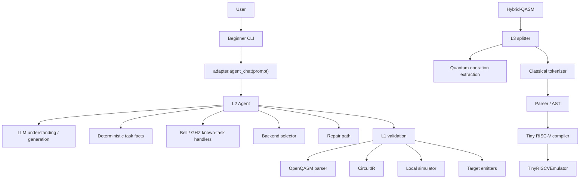

# LoomQ Beginner Assistant Architecture

This document describes the implementation architecture of the Jimmy658 LoomQ submission. The source code is the authority; this document summarizes the responsibilities, boundaries, and validation strategy that are implemented in the repository.

## Executive Overview

The architecture follows five principles:

1. Keep L1, L2, and L3 responsibilities separated.
2. Use LLMs for flexible language understanding, not as the sole source of correctness.
3. Reuse deterministic validation wherever possible.
4. Keep beginner UX outside the competition-core interfaces.
5. Keep the L3 compiler independent from L2.

The product story is simple: a first-time user may know "I want a five-qubit GHZ state" but not know OpenQASM syntax, gate sequencing, SDK differences, backend identifiers, or how to verify the output. LoomQ provides a path from intent to generated program to deterministic validation to a readable result.

## Overall Design



L3 is a separate compilation path. It is not downstream of the L2 runtime.

## L1: Circuit Translation and Local Execution

L1 is implemented in `starter_kit/adapter.py`.

Input:

- supported OpenQASM 2.0.

Internal representation:

- `GateOp`
- `MeasureOp`
- `CircuitIR`

Core responsibilities:

- parse the supported OpenQASM subset,
- normalize operations into `CircuitIR`,
- emit supported target representations,
- provide deterministic local simulation through `run()`,
- provide reusable validation infrastructure for L2 and L3.

Supported public targets in `adapter.py` are:

- `spinq`
- `originq`
- `braket`

The target emitters currently produce:

- SpinQ-style OpenQASM 2.0,
- Braket-style OpenQASM 3.0,
- OriginIR.

The local `run()` path uses the repository's internal state-vector simulator and returns local counts; it is not a cloud execution call.

## L2: Natural-Language Agent With Deterministic Validation

L2 is implemented in `starter_kit/l2_agent.py` and exposed through:

```python
adapter.agent_chat(prompt: str) -> str
```

The formal L2 path requires a successful model service call. The first LLM call is used mainly for task understanding and, for generic cases, possible QASM drafting. Deterministic code still decides what is accepted.

The flow is:

```text
user prompt
-> LLM task understanding / optional QASM generation
-> deterministic fact extraction
-> field-level intent merge
-> known-task handler, backend selector, or generic QASM path
-> L1 syntax/execution validation
-> semantic validation when available
-> one repair call at most when needed
-> formatted answer
```

LLMs are useful here for:

- flexible natural language,
- generic circuit drafting,
- repair suggestions for malformed QASM.

Deterministic Python is used for:

- explicit qubit counts,
- known Bell/GHZ circuit structure,
- backend constraints,
- canonical backend IDs,
- syntax/execution validation,
- semantic validation,
- retry boundaries.

Intent precedence is:

```text
explicit user facts
> model interpretation
> safe defaults
```

For example, when the user explicitly writes `五比特 GHZ`, deterministic extraction produces `5` even if a model response guesses a different qubit count. The GHZ generator then uses the explicit count.

## Backend Selection

Backend recommendation is deterministic. The capability source is:

```text
starter_kit/backend_capabilities.json
```

The LLM may help turn natural language into constraints, but it does not choose final backend IDs. Python filters the capability data.

Supported constraints include:

- minimum qubits,
- queue requirement,
- free-only,
- local-only,
- real hardware,
- no account.

The known backend IDs in the capability file include:

- `spinq_taurus_simulator`
- `spinq_cloud_qpu`
- `originq_local_simulator`
- `originq_wukong`
- `braket_local_simulator`
- `braket_cloud`

Boolean constraints are treated conservatively: for example, `real_hardware=true` is only accepted when the original prompt contains evidence such as "real hardware", "physical QPU", or equivalent Chinese wording.

## Validation

L2 validation has two layers.

Syntax / execution validation:

- parse with the L1 OpenQASM parser,
- reject unsupported structures and gate signatures,
- run through the L1 local simulator.

Semantic / intent validation:

- known Bell tasks are compared against the ideal `00` / `11` distribution,
- known GHZ-n tasks are compared against the ideal `00...0` / `11...1` distribution,
- syntactically valid QASM can still fail if it does not match the requested task.

The implementation uses a fidelity-style distribution comparison with local threshold:

```text
SEMANTIC_FIDELITY_THRESHOLD = 0.97
```

This threshold is a local validation choice in this submission, not a claim about hidden official evaluator thresholds.

## L3: Hybrid-QASM to Tiny RISC-V

L3 is implemented in `starter_kit/l3_hybrid_compiler.py` and exposed through:

```python
adapter.compile_hybrid(hybrid_qasm_str) -> tuple[list[str], str]
```

The pipeline is:

```text
Hybrid-QASM
-> lexical classical-block splitter
-> quantum operation extraction
-> classical tokenizer
-> parser / AST
-> tiny RISC-V compiler
```

The splitter removes exactly one `classical { ... }` block while preserving quantum operations before and after that block. It is aware of line comments and double-quoted strings when finding the `classical` keyword.

The classical AST includes:

- integer literals,
- register references,
- classical bit references,
- binary arithmetic with `+` and `-`,
- comparisons with `==` and `!=`,
- assignments,
- nested `if/else`,
- programs as ordered statement lists.

Register mapping:

```text
r1..r9 -> x1..x9
c[k]   -> x(10+k)
```

Generated instruction subset:

```text
li
add
sub
addi
beq
bne
j
```

Scratch registers are selected from unused RISC-V registers without overwriting `r1..r9` or mapped `c[k]` registers. Arithmetic conditions preserve live intermediate values before branch comparison. Nested and sequential `if/else` statements use unique labels.

## L3 Test Strategy

The local hardening strategy uses differential testing:

```text
classical source
-> tokenizer / parser / AST
-> reference interpreter
-> expected final r1..r9

versus

classical source
-> compiler
-> tiny RISC-V assembly
-> TinyRISCVEmulator
-> actual final x1..x9
```

The final register values are compared for each measurement assignment tested.

Most recent local differential coverage:

- 1206 generated programs,
- 30357 measurement combinations,
- PASS.

This is local randomized testing, not an official hidden-evaluator claim.

## Beginner CLI

`starter_kit/beginner_cli.py` is intentionally a UX wrapper.

It does not:

- reimplement Bell/GHZ generation,
- select backends itself,
- validate QASM itself,
- directly call L2 private functions.

It calls:

```python
adapter.agent_chat(prompt)
```

This keeps UX concerns separate from the competition-core logic.

The CLI menu supports:

1. generating a circuit,
2. repairing OpenQASM,
3. choosing a backend,
4. trying a quick example,
5. exiting.

## Security and Secrets

The CLI and L2 transport follow the repository's environment-variable contract:

- API key from `LOOMQ_LLM_API_KEY`, or hidden `getpass` input in the beginner CLI,
- interactive key insertion is process-only,
- no key is written to disk by the CLI,
- no key is printed intentionally,
- technical errors are sanitized for common API-key and authorization-header patterns.

These are implementation behaviors, not a general security certification.

## Error Handling

The beginner CLI presents user-friendly messages for common model/API failures:

- `401`: authentication problem,
- `402`: insufficient balance,
- `429`: rate limiting,
- `500`, `503`, `551`: temporary model-service failure.

Tracebacks are hidden by default. If `LOOMQ_DEBUG=1` is set, a sanitized traceback is printed for debugging.

## Design Tradeoffs

Why a CLI instead of a web application?

- no extra runtime dependencies,
- quick reproducibility for judges,
- direct exercise of the same public L2 interface.

Why deterministic Bell/GHZ handling?

- common known tasks can be generated structurally,
- semantic validation can be strong,
- explicit user facts do not depend solely on model guesses.

Why not implement a full classical language in L3?

- the implementation is aligned to the contest mini-language,
- a smaller compiler is easier to validate thoroughly,
- randomized differential testing can cover the supported space more meaningfully.

## Known Scope Limits

The project does not claim general-purpose quantum SDK coverage or real-hardware execution evidence. The L1 `run()` path is local simulation. L2 model-backed use requires a configured API/network path. L3 intentionally omits loops, multiplication, division, modulo, floating-point classical arithmetic, functions, `if` without `else`, multiple classical blocks, arbitrary parenthesized arithmetic, and direct negative integer literals.
