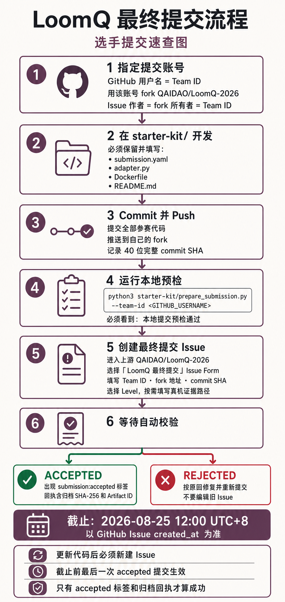

# LoomQ Beginner Assistant - Jimmy658 Submission

LoomQ Beginner Assistant is a layered quantum-programming toolkit for the LoomQ 2026 contest. It is designed for users who can describe the quantum task they want, but may not yet know OpenQASM syntax, backend identifiers, or the differences between quantum SDKs.

This submission combines cross-platform circuit translation, natural-language interaction, deterministic validation, Hybrid-QASM classical-control compilation, and a small beginner-facing CLI. The core idea is not "LLM output equals correct program": model output is checked by deterministic code, the L1 parser/simulator, and semantic validators for known tasks.

For implementation details, validation flow, and design rationale, see [ARCHITECTURE.md](ARCHITECTURE.md).

## Who Is This For?

The beginner interface is meant for students, researchers from non-quantum disciplines, and first-time quantum-programming users who know a desired task such as "generate a five-qubit GHZ state" but do not yet know:

- how to write the OpenQASM program,
- which gate sequence prepares the state,
- which backend ID to choose,
- which SDK dialect a platform expects,
- how to check that a generated circuit actually matches the intended task.

The tool lets them start from natural language, then uses deterministic program logic to validate or repair the result. It does not remove the need to learn quantum computing concepts; it lowers the first barrier to writing, running, and inspecting small contest-scope programs.

## Quick Start

From the repository root:

```bash
cd starter_kit
python beginner_cli.py
```

The CLI starts with this menu:

```text
1. Generate a quantum circuit
2. Repair OpenQASM
3. Choose a quantum backend
4. Try a quick example
5. Exit
```

The CLI requests an API key only when a live L2 request is first made and `LOOMQ_LLM_API_KEY` is missing. The key is read through hidden input and stored only in the current Python process.

## L2 Model Configuration

Live natural-language requests use the OpenAI-compatible chat-completions contract in `starter_kit/llm_client.py`.

| Variable | Purpose |
|---|---|
| `LOOMQ_LLM_API_KEY` | API credential for the current run |
| `LOOMQ_LLM_BASE_URL` | OpenAI-compatible API base URL |
| `LOOMQ_LLM_MODEL` | Model name |
| `LOOMQ_LLM_TIMEOUT_SECONDS` | Request timeout in seconds |
| `LOOMQ_LLM_MAX_OUTPUT_TOKENS` | Optional maximum output tokens |

`LOOMQ_LLM_BASE_URL` and `LOOMQ_LLM_MODEL` must come from the environment. The CLI does not invent these values, so organizer-injected configuration is preserved.

For local live testing, set the service configuration explicitly. Do not commit API keys. Use placeholder forms like:

```bash
export LOOMQ_LLM_BASE_URL=YOUR_MODEL_SERVICE_BASE_URL
export LOOMQ_LLM_MODEL=YOUR_MODEL_NAME
export LOOMQ_LLM_API_KEY=YOUR_API_KEY
```

## Beginner CLI

| Menu item | What it does |
|---|---|
| Generate a quantum circuit | Sends a natural-language circuit request through `adapter.agent_chat()`. |
| Repair OpenQASM | Wraps a pasted OpenQASM fragment in a repair prompt and validates the repaired circuit. |
| Choose a quantum backend | Converts user constraints into deterministic backend filtering. |
| Try a quick example | Runs a small built-in example such as Bell, GHZ, repair, or local-backend selection. |
| Exit | Leaves the CLI. |

## Examples

### Natural-Language GHZ Generation

Input:

```text
Generate a five-qubit GHZ state and measure all qubits.
```

Observed smoke-test style result:

- a 5-qubit OpenQASM 2.0 circuit,
- `GHZ-5 semantic validation passed; fidelity=1.0000`,
- local validation counts concentrated on the expected states:

```json
{"00000": 256, "11111": 256}
```

These are local validation results for this example, not a performance benchmark.

### Chinese Input

Input:

```text
生成一个五比特 GHZ 态，并测量所有量子比特。
```

Explicit Chinese qubit counts such as `五比特`, `五个量子比特`, `十比特`, and `十五比特` are extracted deterministically before defaults are applied.

### QASM Repair

Input fragment:

```qasm
OPENQASM 2.0;
include "qelib1.inc";
qreg q[2];
creg c[2];
H q[0];
CX q[0] q[1];
```

The L2 agent repairs malformed syntax into supported OpenQASM 2.0 and validates the resulting circuit locally.

### Backend Recommendation

Input:

```text
I need at least 15 qubits, zero queue, and a free backend.
```

Observed recommended backend IDs from `starter_kit/backend_capabilities.json`:

- `spinq_taurus_simulator`
- `originq_local_simulator`
- `braket_local_simulator`

## L1 / L2 / L3 Overview

| Level | Input | Core responsibility | Output |
|---|---|---|---|
| L1 | Supported OpenQASM 2.0 | Parse circuits, emit target formats, and run local simulation | SpinQ-style OpenQASM 2, Braket OpenQASM 3, OriginIR, or local counts |
| L2 | Natural-language prompt or broken QASM | Interpret intent, generate/repair QASM, select backends, and validate results | User-readable answer with QASM, backend IDs, validation, and counts |
| L3 | Hybrid-QASM with one `classical { ... }` block | Split quantum/classical code and compile the classical block to tiny RISC-V | `list[str]` quantum operations and RISC-V assembly text |

## Reliability Strategy

L2 is deliberately structured as:

```text
natural language
-> LLM task interpretation / generation
-> deterministic facts and constraints
-> L1 parser and local simulator
-> semantic validation for known tasks
-> at most one repair call when needed
```

The LLM is used for flexible language understanding, generic circuit drafting, and repair suggestions. Deterministic Python code remains responsible for explicit user facts, backend constraints, canonical backend IDs, retry boundaries, and validation.

Examples:

- an explicit GHZ size from the user overrides an incorrect model guess,
- backend IDs are selected from `backend_capabilities.json` rather than invented by the model,
- Bell and GHZ circuits are checked against expected measurement distributions, not only syntax.

## Testing

Run these offline/local checks from `starter_kit/`; they do not require a live API key:

```bash
python evaluator.py --level l1 --target spinq,originq,braket
python examples/l1_local_checks.py
python examples/l2_local_checks.py
python examples/beginner_cli_checks.py
python evaluator.py --level l3
python examples/l3_local_checks.py
```

Optional live L2 smoke test, requiring API/network configuration:

```bash
python examples/l2_real_api_smoke_test.py
```

## Verified Local Status

Latest verified local/public checks for this working tree:

| Check | Status |
|---|---|
| L1 official evaluator | 6 passed / 0 failed |
| L1 local checks | PASS |
| L2 local/mock checks | PASS |
| Beginner CLI checks | 19 PASS |
| L3 public evaluator | 1 passed / 0 failed |
| L3 local randomized differential | 1206 programs, 30357 measurement combinations, PASS |

The randomized differential test is a local hardening strategy, not an official hidden-evaluator result.

## Project Structure

```text
starter_kit/
  adapter.py
  llm_client.py
  l2_agent.py
  l3_hybrid_compiler.py
  beginner_cli.py
  backend_capabilities.json
  submission.yaml
  examples/
    l1_local_checks.py
    l2_local_checks.py
    l3_local_checks.py
    beginner_cli_checks.py
    l2_real_api_smoke_test.py
    l2_real_api_robustness_test.py
```

## Supported Scope and Limitations

L1 targets the contest OpenQASM 2.0 subset implemented in `adapter.py`: one `qreg`, one `creg`, measurement, and the supported gate whitelist.

L2 live model-backed requests require network/API access. Local/mock tests do not.

L3 intentionally targets the contest mini-language rather than a general C/OpenQASM classical compiler. It supports assignments, `if/else`, nested blocks, integer literals, `r1..r9`, `c[k]`, `+`, `-`, `==`, and `!=`. It intentionally does not support loops, multiplication, division, modulo, floating-point classical expressions, functions, `if` without `else`, multiple classical blocks, arbitrary parenthesized arithmetic, or negative integer literals as direct syntax.

---

# LoomQ · 量子接入平权计划：赛题发布包

> SheNicest 2026 夏季千人烈变黑客松 · 正式赛题（选手分发版）

## 包内容

| 文件 / 目录 | 说明 |
|---|---|
| `LoomQ-赛题手册.pdf` | 正式题面（Typst 排版，8 页），用于官网发布与现场分发 |
| `LoomQ-赛题.html` | 题面网页版（零依赖单文件：无 CDN、无外部字体、无框架），可直接作为活动官网赛题页部署 |
| `problem_statement.md` | 题面 Markdown 源，与 PDF 内容一致，便于线上阅读与检索 |
| `LoomQ-赛题.docx` | 题面 Word 版（由 Markdown 源生成，公式为 Word 原生对象），供组委会流转编辑 |
| `LoomQ-选手提交流程图.png` | 最终提交流程信息图，适合单独转发给选手 |
| `starter_kit/` | 选手工具包 v1.1.0：提交清单、人工评分证据模板、L2 环境协议、公开自测、容器基线、RISC-V 模拟器、公开电路与上手资料 |

## 最终提交流程图



## 人工评分需要提交什么

自动评分会直接运行 `starter_kit/` 中的程序。若要申报人工评分或 Bonus，只需填写 [`starter_kit/evidence/README.md`](starter_kit/evidence/README.md)。截图、原始结果或图表可以统一放入 `starter_kit/evidence/files/`。

| 评分项 | 选手需要说明什么 | 可附材料 |
|---|---|---|
| L1 真机，最高 10 分 | 平台、job ID、运行时间、shots、实际执行的 QASM 和原始结果路径 | 任务页截图 |
| L2 交互体验，最高 10 分 | 界面或 CLI 的启动方法，以及 3 个适合现场体验的用户任务 | 关键流程截图或演示视频 |
| 工程与产品复核，人工部分最高 5 分 | 构建和启动方法、主要模块、目标用户和完整使用流程 | 架构图、产品截图或已有项目文档 |
| 自定义量子 RISC-V，最高加 8 分 | 指令编码规格、模拟器实现位置和端到端测试命令 | 无需额外材料，三项齐全且测试通过即可 |
| 新手引导与视觉叙事，最高加 4 分 | 首次运行、概念解释、结果可视化、错误恢复或无障碍引导的位置 | 对应截图 |

已有项目 README 或文档可以直接引用，不必为了评分重复写一份。工作人员只核验截止时归档的 commit，不接受截止后补交。截图不能代替可追溯的 job ID、原始结果或可运行代码。不要提交 API Key、Token、Cookie 或个人隐私。完整归档不得超过 100 MiB，大视频请使用稳定只读链接。

## 常见问题

### 需要提前登记队伍名单吗？

不需要。每队指定一个 GitHub 提交账号，该账号的用户名就是本次比赛的 Team ID。fork 必须归该账号所有，最终提交 Issue 也必须由同一账号创建。

### 多人团队如何协作？

其他成员可以作为 fork 仓库的 collaborator、通过分支或 Pull Request 参与开发。只有最终提交动作需要由指定的 GitHub 提交账号完成。

### 正式提交的内容放在哪里？

统一放在 fork 的 `starter_kit/` 中。组委会只把该目录提取为正式评测根目录。

### 人工评分证据必须提交吗？

证据包本身是可选的。若要申报 L1 真机、L2 交互体验、工程与产品化或 Bonus，直接填写 [`starter_kit/evidence/README.md`](starter_kit/evidence/README.md) 即可。需要的附件统一放进 `starter_kit/evidence/files/`。未申报某项或未提交对应证据，只影响该项人工分，不影响自动评分。

### 提交前要运行什么？

在 fork 根目录运行：

```bash
python3 starter_kit/prepare_submission.py --team-id <GITHUB_USERNAME>
```

预检会确认工作区干净、HEAD 已推送、fork 所有者与 Team ID 一致，并输出可填写到 Issue Form 的仓库地址和 40 位 commit SHA。

### 如何确认提交成功？

最终提交 Issue 获得 `submission:accepted` 标签，并出现包含 commit、归档 SHA-256 和 Artifact ID 的自动回执，才算有效提交。仅创建 Issue 或通过本地预检不代表提交成功。

### 提交后还能更新吗？

可以。修改代码并 push 后重新创建一个最终提交 Issue，不要编辑旧 Issue。截止前最后一次通过校验的提交生效。

### 截止时间如何判定？

截止时间是 **2026-08-25 12:00 UTC+8**，以 GitHub 服务器记录的 Issue `created_at` 为准，不看 commit 时间或本地电脑时间。

### L2 会提前提供组委会 API 或 Key 吗？

不会。赛前可使用自己的 DeepSeek Key 或其他 OpenAI-compatible 服务调试，但代码必须读取 `LOOMQ_LLM_*` 环境变量。正式评测由组委会统一注入 DeepSeek 模型服务和调用预算。

### 可以依赖其他外部 API 吗？

不建议。正式评测环境不保证能够访问模型服务以外的外部网络地址。

### fork 或分支在截止后被删除怎么办？

每次有效提交都会即时归档为 GitHub Actions Artifact。组委会截止后从归档收集，不依赖 fork 在评分时仍然存在；选手仍应保留 fork 便于复核。
