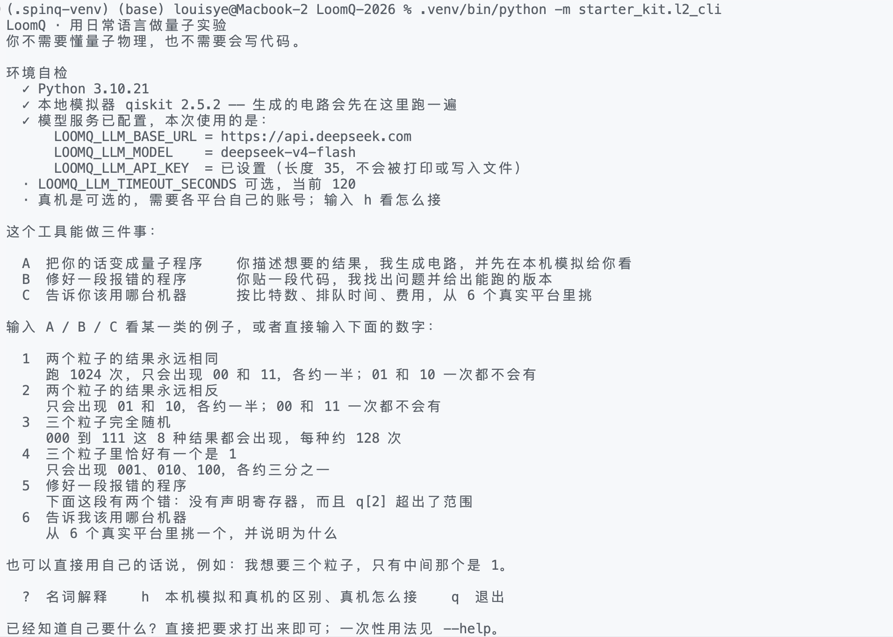
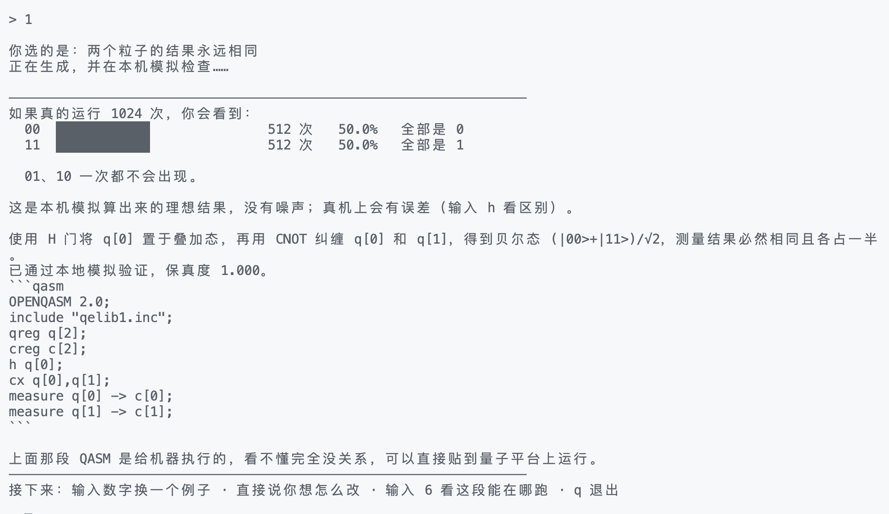
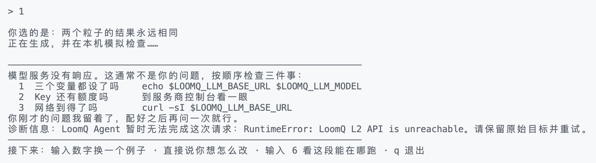

# LoomQ · 让不会写量子汇编的人也能做量子实验

> LouisYye 队参赛实现 · 基于 [QAIDAO/LoomQ-2026](https://github.com/QAIDAO/LoomQ-2026) 赛题
> 评测根目录为 [`starter_kit/`](starter_kit/) · 参赛 Level：L1 + L2 + L3 + Bonus

**这个项目让哪一类原本进不来的人，第一次能用上量子计算？**

会描述实验目标、但不会手写 QASM，也不了解各家量子云平台差异的**学生、教师和应用开发者**。
他们被三道门槛挡在外面：不会写量子汇编、不知道哪个平台能跑、看不懂返回的一堆数字。
LoomQ 把这三道门槛各拆掉一道——用日常语言描述你想看到的结果，我们生成电路、
**在本机模拟验证之后**再交给你，并告诉你这段电路能在哪台真机上跑、结果该怎么读。

关键的一点是：**模型只负责理解意图，所有判定都由本地确定性代码完成。**
语法、门集、目标分布、后端硬约束、编译正确性，没有一项由模型自己说了算。

---

## 60 秒上手

```bash
# 方式一：容器里跑公开自测（包含 SpinQ 隔离环境，一条命令）
cd starter_kit && docker build -t loomq . && docker run --rm loomq

# 方式二：本机跑面向新手的交互入口
python3 -m venv .venv && .venv/bin/pip install -r starter_kit/requirements.txt

export LOOMQ_LLM_BASE_URL=https://api.deepseek.com
export LOOMQ_LLM_API_KEY=<你自己的 Key>
export LOOMQ_LLM_MODEL=deepseek-v4-flash
.venv/bin/python -m starter_kit.l2_cli
```

依赖装在哪个 Python 里就用哪个 Python 启动；漏装时 CLI 会直接说缺什么、该敲哪条
命令，而不是抛一串 ImportError。

没有 Key 也能看：CLI 会先做环境自检，然后跑一段**完全不经过模型**的离线演示。
已经知道自己要什么的人可以跳过引导：
`--prompt "..."`、`--example 1..6`、`--qasm-only`（直接重定向成 .qasm 文件）、
`--check`、`--glossary`、`--hardware`。

<p align="center">
  <br>
  <em>开机自检会先告诉你缺什么，而不是等你问完再报错</em>
</p>

<p align="center">
  <br>
  <em>每个结果都翻译成人话，并明确指出"哪些结果一次都不会出现"</em>
</p>

<p align="center">
  <br>
  <em>出错时给的是可以照着敲的三步排查，而不是一串堆栈</em>
</p>

---

## 做了什么

| Level | 做到哪一步 | 入口 |
|---|---|---|
| **L1 通用中间层** | 一套 IR 打通 SpinQ / 本源 / Braket 三家，12 门白名单在三个后端全部有原生映射；公开自测 6/6 | [`adapter.py`](starter_kit/adapter.py) · [`emitters/`](starter_kit/emitters) · [`backend/`](starter_kit/backend) |
| **L1 真机** | **两个平台的真机结果**，job ID、原始返回、实际执行的 IR、任务截图齐全 | [`evidence/README.md`](starter_kit/evidence/README.md) |
| **L2 智能体** | 模型只输出结构化意图，本地做状态向量模拟 + 保真度判定；失败可重试，模型不可用时按已声明目标本地重建电路 | [`l2_agent.py`](starter_kit/l2_agent.py) · [`l2/`](starter_kit/l2) |
| **L2 交互入口** | 零物理背景可用的中文 CLI：环境自检、离线演示、结果直方图与人话解读、真机接入说明 | [`l2_cli.py`](starter_kit/l2_cli.py) |
| **L3 混合编译** | Hybrid-QASM 完整词法/语法分析 → RISC-V 指令下降；`c[k]` 映射 `x10+k`，支持嵌套 if/else 与任意长算术链 | [`l3_compiler.py`](starter_kit/l3_compiler.py) |
| **Bonus 量子 RISC-V** | `custom-0` 扩展：32 位编码规格 + 官方模拟器扩展实现 + 端到端测试 | [`QUANTUM_RISCV.md`](starter_kit/QUANTUM_RISCV.md) · [`riscv_emulator.py`](starter_kit/riscv_emulator.py) |

## 一次请求怎么流动

```
你的话 ──► l2_cli ──► l2_agent ──► 统一模型（只出结构化 JSON：目标态 + 候选电路）
                          │
                          ├─ schema/normalize   剥围栏、校验形状、转成共享 IR
                          ├─ 目标共识           独立再抽取一次目标，两票不一致时仲裁
                          ├─ simulate/verify    本机状态向量模拟，与目标分布比保真度
                          ├─ backends           按官方能力表做硬约束筛选，本地决定后端
                          └─ synthesize         全部失败时，按已声明目标本地重建电路
                          │
                          ▼
                  验证通过的 QASM ──► emitters ──► SpinQ / OriginIR / Braket QASM3
                                                       └──► 本机模拟器 或 真机
```

L3 与对话链路完全解耦：`l3_compiler.py` 分离量子部分与 `classical { }` 块，
后者经词法分析、语法树、寄存器分配后下降为 `li/add/sub/addi/beq/bne/j`。

## 我们怎么证明它是对的

不是"跑通了公开样例"，而是每一层都有独立的对照物：

- **L3：与参考解释器差分测试。** 按题面文法随机生成混合程序（嵌套分支、负数、
  经典块后仍有量子门），对每个程序**穷举所有测量值注入组合**，逐寄存器比对
  编译产物在官方 `riscv_emulator.py` 上的终态与参考解释器的结果。
- **L2：14 个私有变体自测。** 覆盖意图生成、代码纠错、智能选后端三类，
  重点打"真机 + 冲突约束"和"非内置目标态"这两类异常路径。判定全部在本地完成
  （模拟 + 保真度 + 后端 id 集合比对），不让模型给自己打分：
  [`tools/l2_selfcheck.py`](tools/l2_selfcheck.py)。最近一次 13/14。
- **L1：三平台 × 公开电路 + 两个平台真机。** 真机结果保留原始返回，可按 job ID 溯源。
- **单元测试：** `python3 -m pytest tests -q`
- **公开自测：** `python3 starter_kit/evaluator.py --level all --target spinq,originq,braket`

## 真机证据

| 平台 | Job ID | 结果 |
|---|---|---|
| 本源悟空 180（72 比特超导） | `FFA39889E42949045D8C2192EF616D50` | 1024 shots，00 与 11 合计 1023 次；剩下 1 次落在 10，即硬件噪声 |
| SpinQ Cloud（2 比特 NMR） | `G-260821-0001` | 投影概率 00 ≈ 0.442、11 ≈ 0.463，主峰符合预期 |

原始返回、实际执行的 QASM / OriginIR、任务页截图都在
[`starter_kit/evidence/`](starter_kit/evidence)，未做任何 mock。

## 想深入看

- [`starter_kit/ARCHITECTURE.md`](starter_kit/ARCHITECTURE.md) — 模块职责、确定性边界、AI 辅助开发说明
- [`starter_kit/QUANTUM_101.md`](starter_kit/QUANTUM_101.md) — 零基础的量子概念入门
- [`starter_kit/QUANTUM_RISCV.md`](starter_kit/QUANTUM_RISCV.md) — custom-0 扩展指令编码规格
- [`L2_设计方案.md`](L2_设计方案.md) · [`L2_代码评审.md`](L2_代码评审.md) — 设计决策与自我审查记录

**AI 辅助说明**：本项目使用 AI 辅助代码评审、测试设计和部分实现草拟；所有进入提交的
逻辑均由团队对照赛题契约逐项审阅，并由上述单元测试、分布验证、RISC-V 穷举差分与公开
evaluator 复核。运行时的 AI 仅用于 L2 的意图理解，评分关键的验证、选择、编译与模拟
路径都是可阅读、可重复测试的确定性代码。详见 `ARCHITECTURE.md`。

---
---

*以下为上游 `QAIDAO/LoomQ-2026` 赛题发布包的原始说明，随 fork 保留。*

# LoomQ · 量子接入平权计划：赛题发布包

> SheNicest 2026 夏季千人烈变黑客松 · 正式赛题（选手分发版）

## 包内容

| 文件 / 目录 | 说明 |
|---|---|
| `LoomQ-赛题手册.pdf` | 正式题面，用于官网发布与选手下载 |
| `LoomQ-赛题.html` | 题面网页版（零依赖单文件：无 CDN、无外部字体、无框架），可直接作为活动官网赛题页部署 |
| `problem_statement.md` | 题面 Markdown 源，与 PDF 内容一致，便于线上阅读与检索 |
| `LoomQ-赛题.docx` | 题面 Word 版（由 Markdown 源生成，公式为 Word 原生对象），供组委会流转编辑 |
| `LoomQ-选手提交流程图.png` | 最终提交流程信息图，适合单独转发给选手 |
| `starter_kit/` | 选手工具包 v1.1.0：提交清单、人工评分证据模板、L2 环境协议、公开自测、容器基线、RISC-V 模拟器、公开电路与上手资料 |

## 最终提交流程图


## 人工评分需要提交什么

自动评分会直接运行 `starter_kit/` 中的程序。若要申报人工评分或 Bonus，只需填写 [`starter_kit/evidence/README.md`](starter_kit/evidence/README.md)。截图、原始结果或图表可以统一放入 `starter_kit/evidence/files/`。

| 评分项 | 选手需要说明什么 | 可附材料 |
|---|---|---|
| L1 真机，最高 10 分 | 平台、job ID、运行时间、shots、实际执行的 QASM 和原始结果路径 | 任务页截图 |
| L2 交互体验，最高 10 分 | 界面或 CLI 的启动方法，以及 3 个用户体验任务 | 关键流程截图或演示视频 |
| 工程与产品复核，人工部分最高 5 分 | 构建和启动方法、主要模块、目标用户和完整使用流程 | 架构图、产品截图或已有项目文档 |
| 自定义量子 RISC-V，最高加 8 分 | 指令编码规格、模拟器实现位置和端到端测试命令 | 无需额外材料，三项齐全且测试通过即可 |
| 新手引导与视觉叙事，最高加 4 分 | 首次运行、概念解释、结果可视化、错误恢复或无障碍引导的位置 | 对应截图 |

已有项目 README 或文档可以直接引用，不必为了评分重复写一份。工作人员只核验截止时归档的 commit，不接受截止后补交。截图不能代替可追溯的 job ID、原始结果或可运行代码。不要提交 API Key、Token、Cookie 或个人隐私。完整归档不得超过 100 MiB，大视频请使用稳定只读链接。

## 常见问题

### 需要参加线下答辩吗？

不需要。这是线上比赛，不设置线下答辩、现场演示或到场环节。选手只需按提交流程在截止时间前完成线上提交；组委会将依据归档代码、自动评测结果和已提交的证据材料进行评分与复核。

### 需要提前登记队伍名单吗？

不需要。每队指定一个 GitHub 提交账号，该账号的用户名就是本次比赛的 Team ID。fork 必须归该账号所有，最终提交 Issue 也必须由同一账号创建。

### 多人团队如何协作？

其他成员可以作为 fork 仓库的 collaborator、通过分支或 Pull Request 参与开发。只有最终提交动作需要由指定的 GitHub 提交账号完成。

### 正式提交的内容放在哪里？

统一放在 fork 的 `starter_kit/` 中。组委会只把该目录提取为正式评测根目录。

### 人工评分证据必须提交吗？

证据包本身是可选的。若要申报 L1 真机、L2 交互体验、工程与产品化或 Bonus，直接填写 [`starter_kit/evidence/README.md`](starter_kit/evidence/README.md) 即可。需要的附件统一放进 `starter_kit/evidence/files/`。未申报某项或未提交对应证据，只影响该项人工分，不影响自动评分。

### 提交前要运行什么？

在 fork 根目录运行：

```bash
python3 starter_kit/prepare_submission.py --team-id <GITHUB_USERNAME>
```

预检会确认工作区干净、HEAD 已推送、fork 所有者与 Team ID 一致，并输出可填写到 Issue Form 的仓库地址和 40 位 commit SHA。

### 如何确认提交成功？

最终提交 Issue 获得 `submission:accepted` 标签，并出现包含 commit、归档 SHA-256 和 Artifact ID 的自动回执，才算有效提交。仅创建 Issue 或通过本地预检不代表提交成功。

### 提交后还能更新吗？

可以。修改代码并 push 后重新创建一个最终提交 Issue，不要编辑旧 Issue。截止前最后一次通过校验的提交生效。

### 截止时间如何判定？

截止时间是 **2026-08-25 12:00 UTC+8**，以 GitHub 服务器记录的 Issue `created_at` 为准，不看 commit 时间或本地电脑时间。

### L2 会提前提供组委会 API 或 Key 吗？

不会。赛前可使用自己的 DeepSeek Key 或其他 OpenAI-compatible 服务调试，但代码必须读取 `LOOMQ_LLM_*` 环境变量。正式评测由组委会统一注入 DeepSeek 模型服务和调用预算。

### 可以依赖其他外部 API 吗？

不建议。正式评测环境不保证能够访问模型服务以外的外部网络地址。

### fork 或分支在截止后被删除怎么办？

每次有效提交都会即时归档为 GitHub Actions Artifact。组委会截止后从归档收集，不依赖 fork 在评分时仍然存在；选手仍应保留 fork 便于复核。
