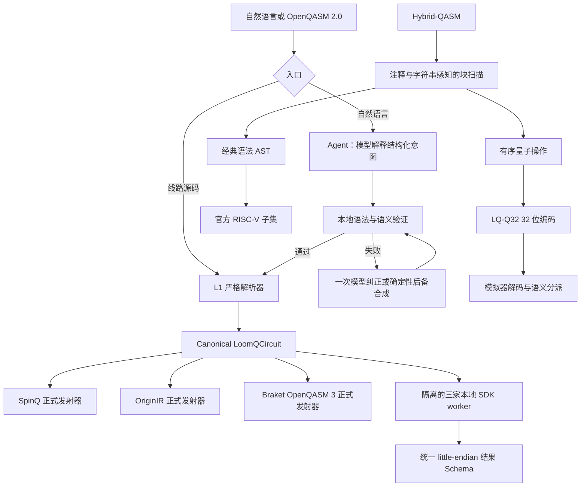

# LoomQ 参赛解法与系统架构

本文说明本仓库如何完成 LoomQ 竞赛的完整后端任务，以及各部分为什么采用当前设计。
它不是功能清单，而是从固定提交接口、隐藏评测风险和零基础用户体验出发形成的一套统一方案。

## 1. 我们解决的核心问题

不同量子平台使用不同的程序格式、SDK、测量位序、账号体系和硬件约束。直接把三家
平台分别硬编码成三个程序，可以跑通演示，却无法证明它们表达的是同一条线路，也很难
通过隐藏电路和随机用例。

LoomQ 因此把问题拆成四层：

| 竞赛部分 | 本项目的解法 | 主要输出 |
|---|---|---|
| 通用翻译与执行 | 严格解析一次，建立统一线路 IR，再按目标发射 | SpinQ OpenQASM 2、本源 OriginIR、Braket OpenQASM 3、统一 counts |
| 自然语言 Agent | 模型解释意图，确定性程序完成验证、纠错闭环和后端筛选 | 已验证 QASM 或规范后端 ID |
| Hybrid-QASM | 真正解析经典代码块，将量子流与经典控制流分离 | 有序量子操作 + 官方 RISC-V 汇编 |
| 自定义量子 RISC-V | 把量子操作编码进 RISC-V `custom-0` 指令空间并实际执行解码 | 32 位 `LQ-Q32` 指令字与语义执行轨迹 |

目标用户是会基本编程、但不了解量子平台“黑话”、QASM 方言和云端约束的人。用户可以
先用自然语言得到一条经过本地验证的线路，再查看统一 IR、目标 SDK 文本和模拟结果；
真机任务则保持为明确授权的独立步骤，避免误产生费用。

## 2. 端到端数据与控制流



这条链路有两个重要边界：

1. 模型可以解释、生成和建议修复，但不能绕过解析器、语义验证器或后端能力表。
2. 正式评测路径不依赖实时云服务；实时设备状态只服务于人工真机实验和证据收集。

## 3. 固定接口与统一适配层

评测器只调用 [`adapter.py`](adapter.py) 的四个接口：

```python
transpile(qasm_str, target)
run(qasm_str, target, shots)
agent_chat(prompt)
compile_hybrid(hybrid_qasm_str)
```

`adapter.py` 本身保持很薄，只做目标和值域检查，再把请求交给对应模块。这样固定提交契约
不会和平台 SDK、模型调用或编译器内部细节耦合，也便于评测器逐层替换输入。

## 4. 通用量子翻译器与执行器

### 4.1 只解析一次的规范 IR

L1 前端使用锁定版本的 Qiskit 严格解析 OpenQASM 2.0，随后执行 LoomQ 自己的子集验证：

- 只接受比赛规定的 12 个门；
- 检查参数数量、量子比特数量、索引范围和重复操作数；
- 把表达式求值为有限数值；
- 把整寄存器测量展开为显式的 `qubit -> classical bit` 映射；
- 保持原始指令顺序。

验证结果进入 [`loomq_l1/model.py`](loomq_l1/model.py) 中不可变的
`LoomQCircuit`。它只记录量子比特数、经典比特数，以及有序的 `Gate`/`Measure`
节点，不再保留供应商语法。这是三平台真正共享的中间表示，而不是三个硬编码分支。

### 4.2 正式输出与本地兼容输出分离

同一个 `LoomQCircuit` 由纯函数发射为三种竞赛规定格式：

| 目标 | 正式 `transpile()` 输出 | 关键映射 |
|---|---|---|
| SpinQ | 完整 OpenQASM 2.0 | 12 门保持标准名称 |
| Origin Quantum | OriginIR | `cx -> CNOT`、`ccx -> TOFFOLI`、显式 `MEASURE` |
| Amazon Braket | OpenQASM 3.0 | `cu1 -> cp`，测量写成 bit 赋值 |

正式 IR 合同与本地 SDK 的语法兼容性不是同一件事。例如锁定版本的 pyQPanda 本地解析器
要求把 `sdg`、`tdg` 改写为负角度 `RZ`，并用 `CR` 表示 `cu1`；Braket 本地解析器
使用 `si`、`ti`、`cnot`、`cphaseshift` 和 `ccnot`。因此项目保留两类发射配置：

- 正式发射器严格满足比赛 `target_ir_contract.md`；
- 本地 runner 发射器只处理锁定 SDK 的兼容拼写。

这种分离避免为了某个 SDK 版本修改正式答案，也避免把平台差异泄漏回规范 IR。

### 4.3 SDK 进程隔离与统一结果

SpinQit、pyQPanda 和 Amazon Braket 的依赖存在冲突，尤其是不同的 ANTLR 运行时要求。
三个 SDK 因此安装在 `.venv-spinq`、`.venv-originq`、`.venv-braket` 中。主进程把
规范线路转换为本地目标文本，通过 JSON 交给目标 worker 子进程，最后只接收统一结果。

所有平台结果都被规范化为同一个 Schema：

- `counts` 是非负整数并且总和等于 `shots`；
- key 的最右侧字符固定表示 `c[0]`；
- `bit_order` 固定为 `little`；
- 位串补齐到经典寄存器宽度；
- 时间使用 UTC ISO 8601；
- 错误和元数据不包含凭证。

隐藏电路因此只能改变输入线路，不能改变我们的解析、映射和结果规范化方法。

## 5. 经过本地验证的 Agent

### 5.1 模型负责理解，不负责裁决

`agent_chat()` 必须完成一次组委会注入模型服务的真实调用。模型配置只从
`LOOMQ_LLM_BASE_URL`、`LOOMQ_LLM_API_KEY`、`LOOMQ_LLM_MODEL` 等环境变量读取；
仓库不硬编码服务、模型名称或密钥。

模型只返回一个结构化 JSON，任务限定为：

1. `generate_qasm`：从自然语言生成完整线路；
2. `repair_qasm`：在保持明确目标的前提下修复线路；
3. `select_backend`：把自然语言条件解释成结构化约束。

对 QASM 任务，模型还必须声明目标纯态、期望测量分布或两者之一。这个声明不是直接
相信模型，而是为本地验证器提供可计算的验收条件。

### 5.2 调用、验证、纠正闭环

```text
用户 prompt
  -> 第一次真实模型调用
  -> 提取第一个符合 Schema 的 JSON
  -> QASM 严格解析 + 测量检查
  -> 纯态保真度或测量分布距离检查
  -> 通过：返回规范 QASM
  -> 失败：把确定性诊断交给模型，最多纠正一次
  -> 仍失败：尝试通用目标态合成或狭窄机械语法清理
  -> 对后备结果重新执行完整语义验证
```

验证不是“代码能解析就算正确”。纯态任务要求保真度至少 `0.97`；测量任务比较模型声明
的分布和本地无噪声精确分布。后备清理只处理大小写、分号、寄存器和门操作数逗号等
机械错误，不能擅自改变门顺序或用户意图。

对于不超过 10 个量子比特的稀疏纯态，确定性后备路径可以把模型声明的振幅通用合成为
`rz`、`ry`、`cx`，而不是按 Bell、GHZ 等状态名称建立答案表。这使实现可以应对隐藏
prompt 中的比特数、措辞和目标态变化。

### 5.3 后端选择：模型提取约束，代码作决定

模型不允许输出最终后端 ID。它只提取以下条件：最少量子比特数、平台/设备类型、排队、
费用、账号和优化目标。[`loomq_l2/backend.py`](loomq_l2/backend.py) 再读取随提交版本化的
`backend_capabilities.json`，完成 Schema 校验、硬约束过滤和稳定排序，并返回规范 ID。

这样做有三个原因：

- 模型不能编造后端容量、费用或账号事实；
- 相同能力快照和相同条件始终得到相同答案；
- 正式隐藏评测离线运行时不依赖厂商登录状态或临时队列。

“正式后端选择”和“真机实时状态”是两个不同问题。前者按比赛能力快照回答可重复的评分
问题；后者由 `scripts/backend_observations.py` 等只读工具在准备真实实验时刷新。实时数据
不会悄悄改变正式 `agent_chat()` 的答案。

### 5.4 面向初学者的本地入口

网页通过本机 Python 服务调用同一个 `agent_chat()`，模型密钥不会进入浏览器。服务只
监听回环地址、限制请求大小、校验 Host/Origin 和会话 token，并串行化模型请求。

界面把学习、12 门参考、三平台本地模拟、IR/SDK 翻译、Hybrid-QASM 编译和真机证据
放在同一工作区。Agent 返回的 QASM 可以直接送入本地模拟器，形成“提问—验证—运行—
理解结果”的完整新手流程。

## 6. Hybrid-QASM 到 RISC-V 汇编

L3 不是对示例文本做替换，而是一套小型编译器：

1. 注释和字符串感知的扫描器定位并移除唯一的 `classical { ... }` 块；
2. 剩余量子部分复用 L1 前端，得到同一个规范量子操作序列；
3. 专用 tokenizer 和递归下降解析器构建经典 AST；
4. AST 支持整数、`r1..r9`、`c[k]`、括号、负号、`+ - == !=`、赋值和 `if/else`；
5. 编译器只发射官方模拟器支持的 `li, add, sub, addi, beq, bne, j`。

寄存器映射固定为 `r1..r9 -> x1..x9`，测量位 `c[k] -> x10+k`。分支使用唯一标签，
量子指令在经典块前后都保持原有顺序。

### 6.1 汇编降级与寄存器压力

为了避免深表达式消耗大量临时寄存器，编译器先把加减表达式归一化为仿射形式：

```text
常数 + Σ(系数 × 源寄存器)
```

赋值会尽可能复用目标寄存器作为累加器；复杂比较只申请一个临时寄存器。临时寄存器先从
测量范围以上选择，再选择源程序从未使用的用户寄存器。如果全部 31 个可写寄存器都承载
活跃语言状态且表达式确实需要临时值，编译器会明确抛出 `HybridSyntaxError`，而不是覆盖
用户值。这一设计能覆盖最多 22 个测量位，并让随机深表达式仍然稳定编译。

评测时，官方模拟器会穷举注入测量组合。项目测试还用独立参考解释器做随机差分测试，
因此汇编正确性不依赖某个公开样例。

## 7. 自定义量子 RISC-V：LQ-Q32

官方 L3 接口已经返回文本量子流和经典汇编。Bonus 在此基础上增加可执行的 32 位量子
指令扩展 `LQ-Q32`，并保持官方接口不变。

### 7.1 指令设计

- 使用 RISC-V 保留的 `custom-0` 主操作码 `0x0B`；
- 无参数门和测量使用 QR 格式，门类型由 `funct7` 表示；
- `ry`、`rz`、`cu1` 使用 QI 格式，门类型由 `funct3` 表示；
- 量子比特和经典比特索引为 5 位，可寻址 `0..31`；
- 角度以有符号 Q3.9 弧度立即数保存，编码前规范到 `[-π, π]`；
- 非零保留字段、重复量子比特和未知 opcode/funct 会被拒绝。

### 7.2 它进入真实执行路径

```text
Hybrid-QASM
  -> compile_hybrid()
  -> 规范量子操作序列
  -> quantum_riscv.encode_program()
  -> 无符号 32 位指令字
  -> TinyRISCVEmulator.load_machine_code()
  -> decode_instruction()
  -> execute_machine_code()
  -> 有序语义轨迹或外部 dispatcher
```

因此 `LQ-Q32` 不是只写在文档中的助记符。测试固定核对代表性十六进制机器码，覆盖全部
12 门、测量、角度量化、非法编码拒绝和端到端执行。可选 dispatcher 还能把解码后的
操作交给其他模拟器；证据包中保存了 Kaggle Tesla P100 上的 GPU 状态向量闭环结果。

完整位布局见 [`QUANTUM_RISCV_EXTENSION.md`](QUANTUM_RISCV_EXTENSION.md)，编译器实现
说明见 [`L3_IMPLEMENTATION.md`](L3_IMPLEMENTATION.md)。

## 8. 真机接入、实时状态与证据边界

离线 `adapter.run()` 只运行本地模拟器，不会创建收费任务。真机接入位于独立的
`hardware/` 工具中，凭证只从本地环境变量读取，并要求显式确认参数后才提交。

本仓库保存了两类证据：

- 本源悟空 180 的 Bell 与 GHZ-3 成功任务，包括 job ID、实际 OriginIR、原始响应、
  规范化结果和任务页截图；
- SpinQ Cloud 的 Bell 任务和后续诊断任务，包括未筛选的异常结果以及实时设备状态记录。

我们不把“设备在线检查”写成“成功真机运行”，也不把模拟器结果写成 QPU 结果。准备新的
真机实验时，应先刷新设备在线状态、门集、容量、队列和价格/额度，再由账号所有者明确
批准提交。这条实时流程服务于安全实验；正式 L2 后端题仍使用固定能力快照。

## 9. 可复现性与验证策略

`scripts/setup.ps1` 从锁文件创建 Python 3.10 核心环境和三个隔离后端环境；
`scripts/start-ui.ps1` 会先运行三个真实本地 SDK 冒烟测试，再启动网站。新克隆不依赖
开发者机器中已有的虚拟环境。

测试分层覆盖：

- L1：严格语法、12 门三目标映射、测量位序、随机线路、目标 IR 和本地 SDK；
- L2：模型响应 Schema、真实调用约束、生成/修复语义验证、后端筛选和 36 案例开发评估；
- L3：解析边界、随机 AST/汇编差分、全部测量组合；
- Bonus：固定机器码、编解码往返、非法字段和完整量子 RISC-V 执行链；
- 产品：本地服务安全边界、前端入口、模拟/翻译/编译 API 和一键启动流程。

核心回归命令：

```powershell
.\.venv\Scripts\python.exe -m unittest discover -s tests
.\.venv\Scripts\python.exe starter_kit\evaluator.py --level l1 --target spinq,originq,braket
.\.venv\Scripts\python.exe starter_kit\evaluator.py --level l3
.\.venv\Scripts\python.exe -m starter_kit.quantum_riscv_e2e
```

## 10. 代码地图

| 模块 | 职责 |
|---|---|
| [`adapter.py`](adapter.py) | 四个固定评测入口 |
| [`loomq_l1/frontend.py`](loomq_l1/frontend.py) | OpenQASM 2 严格解析与白名单验证 |
| [`loomq_l1/model.py`](loomq_l1/model.py) | 统一不可变线路 IR |
| [`loomq_l1/emitters.py`](loomq_l1/emitters.py) | 三平台正式与本地兼容发射器 |
| [`loomq_l1/runner.py`](loomq_l1/runner.py) | 隔离 SDK 子进程调度 |
| [`loomq_l2/agent.py`](loomq_l2/agent.py) | 模型调用、结构解释、纠错状态流 |
| [`loomq_l2/qasm.py`](loomq_l2/qasm.py) | QASM 规范化、纯态/分布验证与通用合成 |
| [`loomq_l2/backend.py`](loomq_l2/backend.py) | 固定能力快照的确定性筛选和排序 |
| [`loomq_l3/compiler.py`](loomq_l3/compiler.py) | Hybrid-QASM 解析、AST 与 RISC-V 降级 |
| [`riscv_emulator.py`](riscv_emulator.py) | 官方经典子集及自定义机器码执行入口 |
| [`quantum_riscv.py`](quantum_riscv.py) | `LQ-Q32` 编码、解码和字段校验 |
| [`evidence/README.md`](evidence/README.md) | 真机、交互、工程与 Bonus 的统一证据入口 |

## 11. 设计取舍

- **没有使用 LangChain/LangGraph**：两次以内的显式状态流更容易满足时限、审计失败原因，
  也减少评测环境依赖。
- **不让 LLM 当裁判**：所有可客观计算的事实都由解析器、模拟器和版本化数据决定。
- **不让实时状态污染正式答案**：确保隐藏评测可复现；真机前仍单独执行实时只读检查。
- **不把三家 SDK 装进一个环境**：用进程边界解决依赖冲突和故障隔离。
- **不为公开样例打表**：共享 IR、通用纯态合成、随机差分测试和机器码往返都面向变体输入。

最终形成的不是“会回答量子问题的聊天框”，而是一条可以被解析、验证、翻译、执行和审计
的量子接入链路；自然语言只是这条链路最外层的低门槛入口。
