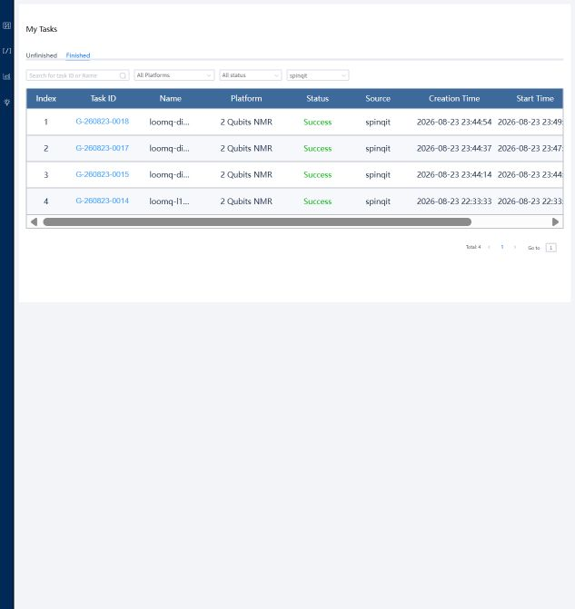

# SpinQ Gemini 真机诊断报告

> 评委快速结论：三个补充任务均由 SpinQ Cloud 标记为 `Success`，且均在真实的
> `gemini_vp`（2 Qubits NMR，`simulator=false`）上执行。正向和反向 CNOT
> 都产生了预期的 `11` 主导态，因此现有证据不支持“LoomQ 把 CNOT 操作数顺序
> 翻译反了”这一解释。异常已经出现在仅包含两个 X 门的基线任务中，故差异位于
> LoomQ 输出 QASM 之后的 SpinQ 特有执行链路。现有云接口不足以进一步判定具体
> 是云编译/调度、NMR 状态制备、校准、测量还是结果重建。

## 1. 为什么执行这些诊断

公开 Bell 线路在本源悟空 180 上得到理想支持态 `00`、`11` 合计概率
`0.9993843`，但同一源线路在 SpinQ `gemini_vp` 上仅得到 `0.67215403`。
为区分共享 OpenQASM→规范 IR 翻译问题和 SpinQ 特有问题，我们设计了三个不含
参数、随机门或复杂分解的确定性线路。

跨平台 Bell 原始对照见
[`files/comparisons/bell-cross-platform-comparison.json`](files/comparisons/bell-cross-platform-comparison.json)。

## 2. 平台与方法

| 项目 | 值 |
|---|---|
| 平台 | SpinQ Cloud `gemini_vp` |
| 设备 | 2 Qubits NMR |
| 执行类型 | 真机，`simulator=false` |
| shots | 每个任务 1000（MCP 固定值） |
| 提交日期 | 2026-08-23 |
| 提交方式 | SpinQ MCP `qasm_submit` |
| 结果来源 | SpinQ MCP 返回值与云端任务页状态 |

提交前能力快照保存在
[`files/spinq-diagnostics/spinq-diagnostics-gemini-preflight.json`](files/spinq-diagnostics/spinq-diagnostics-gemini-preflight.json)，
其中记录设备在线状态、门集合以及双向耦合关系。三个任务依次提交，每个线路只提交
一次，没有通过重复选择“最好看”的结果。

## 3. 结果总览

所有线路的理想输出均为 `11=1`。

| 诊断 | SpinQ job ID | 云端状态 | `P(00)` | `P(01)` | `P(10)` | `P(11)` | 判断 |
|---|---|---:|---:|---:|---:|---:|---|
| `X(q0); X(q1)` | `G-260823-0015` | Success | 0.250000 | 0.250000 | 0.250000 | 0.250000 | 异常 |
| `X(q0); CX(q0,q1)` | `G-260823-0017` | Success | 0.076923 | 0.122255 | 0.076923 | **0.723899** | `11` 主导 |
| `X(q1); CX(q1,q0)` | `G-260823-0018` | Success | 0.074922 | 0.179766 | 0.074922 | **0.670389** | `11` 主导 |

*图 1：2026-08-24 保存的 SpinQ Cloud 已完成任务列表。截图仅作直观辅助；下文的
任务记录和 SDK 原始结果是可复核的主要证据。*

### 3.1 X⊗X 基线

该任务不含 CNOT、H 门或叠加态。两个 X 门按 OpenQASM 2.0 语义应把 `|00⟩`
确定性变为 `|11⟩`，但平台返回四态各 `0.25`。这种偏差不是围绕理想
`P(11)=1` 的轻微有限 shots 波动。

- [实际提交 QASM](files/spinq-diagnostics/spinq-diag-xx-executed.qasm)
- [任务记录（内部任务 ID 61453）](files/spinq-diagnostics/spinq-diag-xx-task.json)
- [SDK 原始结果](files/spinq-diagnostics/spinq-diag-xx-sdk-result.json)
- [统一 Schema 规范化结果](files/spinq-diagnostics/spinq-diag-xx-normalized-result.json)
- [任务页截图](files/spinq-diagnostics/spinq-diag-xx-task.png)
- [登录后打开 SpinQ 任务页](https://cloud.spinq.cn/circuitDesign/taskResult/61453)

### 3.2 正向 X+CNOT

该任务把 `q0` 作为控制位、`q1` 作为目标位。结果以 `11` 为主，说明 SpinQ
执行链能够识别当前发射器生成的 X、CNOT 门和这一操作数方向，但仍存在明显误差。

- [实际提交 QASM](files/spinq-diagnostics/spinq-diag-xcx-forward-executed.qasm)
- [任务记录（内部任务 ID 61455）](files/spinq-diagnostics/spinq-diag-xcx-forward-task.json)
- [SDK 原始结果](files/spinq-diagnostics/spinq-diag-xcx-forward-sdk-result.json)
- [统一 Schema 规范化结果](files/spinq-diagnostics/spinq-diag-xcx-forward-normalized-result.json)
- [任务页截图](files/spinq-diagnostics/spinq-diag-xcx-forward-task.png)
- [登录后打开 SpinQ 任务页](https://cloud.spinq.cn/circuitDesign/taskResult/61455)

### 3.3 反向 X+CNOT

该任务交换控制位和目标位。结果同样以 `11` 为主，因此 Bell 偏差不能由简单的
CNOT 操作数反转解释。

- [实际提交 QASM](files/spinq-diagnostics/spinq-diag-xcx-reverse-executed.qasm)
- [任务记录（内部任务 ID 61456）](files/spinq-diagnostics/spinq-diag-xcx-reverse-task.json)
- [SDK 原始结果](files/spinq-diagnostics/spinq-diag-xcx-reverse-sdk-result.json)
- [统一 Schema 规范化结果](files/spinq-diagnostics/spinq-diag-xcx-reverse-normalized-result.json)
- [任务页截图](files/spinq-diagnostics/spinq-diag-xcx-reverse-task.png)
- [登录后打开 SpinQ 任务页](https://cloud.spinq.cn/circuitDesign/taskResult/61456)

## 4. 证据链与可复核性

| 评委要核验的内容 | 证据 |
|---|---|
| 设备在线、支持门及耦合方向 | [提交前能力快照](files/spinq-diagnostics/spinq-diagnostics-gemini-preflight.json) |
| 云端收到的确切线路 | 三个 `*-executed.qasm` 文件 |
| job ID、内部任务 ID、时间、shots、真机标志和最终状态 | 三个 `*-task.json` 文件 |
| 平台未经修改的概率返回值 | 三个 `*-sdk-result.json` 文件 |
| 统一结果 Schema 与整数 counts | 三个 `*-normalized-result.json` 文件 |
| 三个诊断任务各自的任务页与输出结果 | 三个 `*-task.png` 文件 |
| 三个诊断任务和 Bell 任务的云端成功状态 | [已完成任务列表截图](files/spinq-diagnostics/spinq-diagnostics-task-list.jpg) |
| 机器可读总览 | [`files/spinq-diagnostics/spinq-diagnostics-report.json`](files/spinq-diagnostics/spinq-diagnostics-report.json) |
| 原始 Bell 真机证据 | [`README.md` 的“平台 2：SpinQ Cloud”](README.md#平台-2spinq-cloud) |

规范化文件中的整数 counts 由供应商概率使用最大余数法确定性换算，总和保持为
1000；分析结论直接使用供应商原始概率，不把换算后的 counts 冒充平台原始计数。
证据文件不包含 API Key、私钥、用户名或平台账户隐私。

## 5. 结论边界

这些测试支持以下结论：

1. LoomQ 发射的 SpinQ QASM 门名能够被平台接受并执行。
2. 正向和反向 CNOT 都能产生预期的 `11` 主导态。
3. 简单的 CNOT 操作数反转不是 Bell 偏差的根因。
4. 异常在 X-only 基线中已经存在，因此应在 LoomQ 输出之后的 SpinQ 特有执行链路
   中继续排查。

这些测试**不能**证明某个具体 SpinQ 内部模块有缺陷。云接口没有公开编译后的原生
线路、脉冲调度、物理映射、任务校准快照或原始读出，因此目前无法在云编译/调度、
NMR 状态制备、校准、测量和结果重建之间作进一步归因。

## 6. 评委入口

本报告是补充诊断材料，不把三个诊断任务重复申报为新的真机平台分。L1 真机评分的
统一入口仍为 [`starter_kit/evidence/README.md`](README.md)，其中列出本源量子和
SpinQ 两个平台的正式任务、job ID、运行时间、shots、原始结果、规范化结果与截图。
