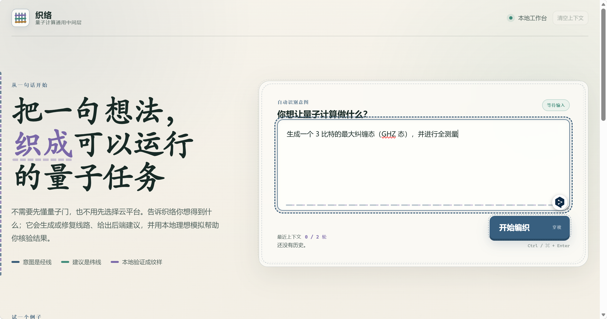
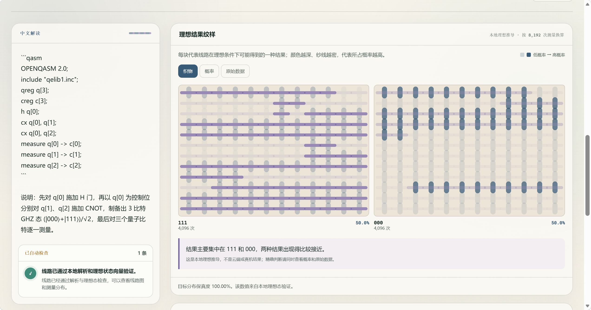
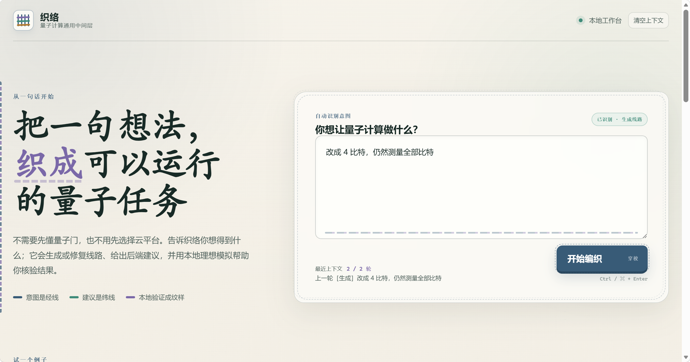
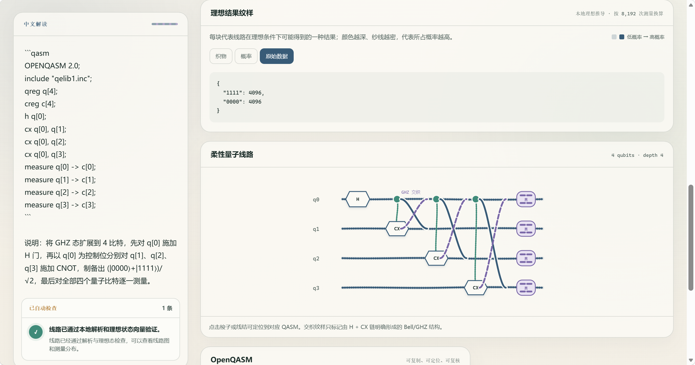
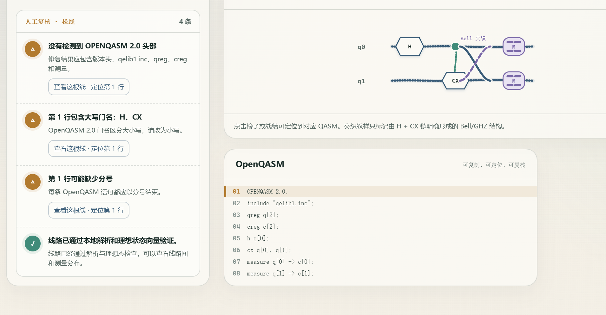
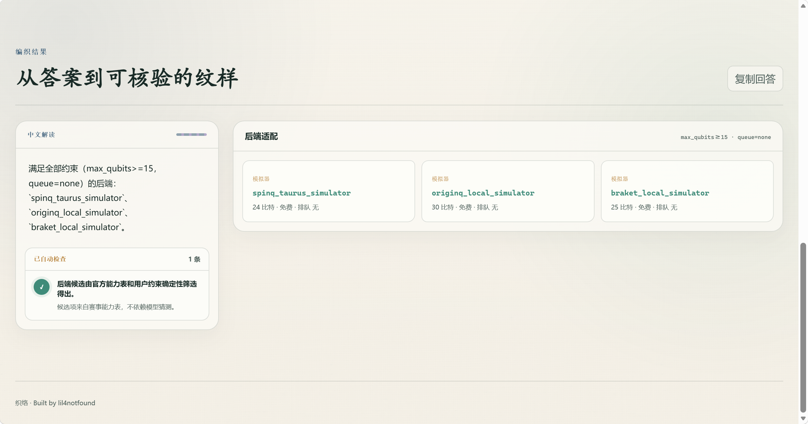

# LoomQ 人工评分证据

本文件是人工评分材料的统一入口。所列内容均可由最终提交中的代码、文档和命令复现。

## 申报项目

- [x] L1 真机
- [x] L2 交互体验
- [x] 工程与产品化
- [x] 自定义量子 RISC-V Bonus
- [x] 新手引导与视觉叙事 Bonus

## L1 真机

### 量旋云

- 平台名称：量旋云 / `spinq_cloud_qpu`（2Qubit 核磁量子计算机，`Gemini-pro-1`）
- 平台 job ID：`G-260825-0009`
- 运行时间：`2026-08-25 06:17:37.866–06:19:11.111（UTC+8）`
- shots：`16384`
- 实际执行的 QASM：`starter_kit/evidence/files/spinq-circuit.qasm`
- 平台返回的原始结果：`starter_kit/evidence/files/spinq-result.raw.msgpack`
- 统一 Schema 结果：`starter_kit/evidence/files/spinq-result.json`
- 任务页截图：`starter_kit/evidence/files/spinq-task-page.png`
- 任务 API 详情截图：`starter_kit/evidence/files/spinq-task-api-details.png`

平台原始导出为 MessagePack 概率映射，未经修改保存在 `.msgpack` 文件中；`spinq-result.json` 按赛事统一 Schema 将原始概率和任务记录中的 `shots` 规范化为整数 `counts`。任务页截图记录任务编号、运行成功状态、真机平台、实际线路和投影概率；任务 API 详情截图记录同一 `job ID` 对应的 `shots: 16384`、`simulator: false`、机器编号、UTC 时间及平台保存的 QASM。该真机任务接口采用平台的投影概率流程，实际接受并执行的 QASM 不包含显式 `measure`；在该接口中加入 `measure` 会被平台拒绝。`spinq-circuit.qasm` 原样保留平台实际接受的程序，不将其表述为赛事自动评测输入。两张截图均未包含账户信息。

### 本源量子云

- 平台名称：本源量子云 / `originq_wukong_180`（本源悟空 180 真机）
- 平台 job ID：`F60B83B83F602BC514C2E3323FEBB38C`
- 运行时间：`2026-08-25T07:35:40.918+08:00–2026-08-25T07:36:52.148+08:00`
- shots：`1000`
- 转译输入 QASM：`starter_kit/evidence/files/originq-source.qasm`
- 项目转译完整 OriginIR：`starter_kit/evidence/files/originq-transpiled.originir`
- 平台实际执行的 OriginIR：`starter_kit/evidence/files/originq-platform-circuit.originir`
- 平台返回的原始结果：`starter_kit/evidence/files/originq-result.raw.json`
- 统一 Schema 结果：`starter_kit/evidence/files/originq-result.json`
- 任务页截图：`starter_kit/evidence/files/originq-task-page.png`
- 任务 OriginIR 截图：`starter_kit/evidence/files/originq-task-originir.png`

平台原始 JSON 未经修改，包含任务编号、成功状态、起止时间及 `00/01/10/11` 概率；其原始下载文件名末尾的 `1787614904105` 是 Unix 毫秒时间戳，对应 `2026-08-25T07:41:44.105+08:00`，与任务页显示时间一致。`originq-result.json` 结合任务页记录的 `shots: 1000` 将概率精确换算为总和为 1000 的整数 `counts`。本源图形化编辑器由线路配置提供 `QINIT 2` 与 `CREG 2`，平台任务页显示实际执行的四条线路主体；项目生成的完整六行 OriginIR 单独保留以便核验。两张截图均未包含账户信息。

## L2 交互体验

启动界面或 CLI 的命令：

```bash
python3 starter_kit/run_local.py
```

正式归档以 `starter_kit/` 为根目录时，可运行 `python3 run_local.py`。

测试入口或页面地址：`http://127.0.0.1:8765/`

用于交互体验评测的 3 个用户任务：

1. 输入“生成一个 3 比特的最大纠缠态（GHZ 态），并进行全测量”；得到结果后继续输入“改成 4 比特，仍然测量全部比特”，检查多轮上下文是否保留原目标。
2. 输入“我想制备一个贝尔态，但这段代码报错了，帮我修好：`H q[0]; CX q[0] q[1]`”，检查目标语义、完整 QASM、错误定位和恢复提示。
3. 输入“我需要运行一个 15 比特电路，且零排队等待，选哪个平台？”，检查结果是否包含官方能力表中的规范后端标识和筛选理由。

### 截图证据

以下截图记录本地 Web 界面的实际 L2 测试过程。自然语言理解与回答来自按 `LOOMQ_LLM_*` 配置的线上模型服务；线路解析、理想状态验证、结果可视化和后端约束筛选由本地模块完成。

#### 任务 1：生成线路与多轮上下文

第一轮输入 3 比特 GHZ 态生成任务：



第一轮生成完整 OpenQASM，并展示本地理想结果纹样、自动检查和精确数据：



第二轮只输入“改成 4 比特，仍然测量全部比特”，页面保留上一轮生成任务的上下文：



第二轮得到 4 比特 GHZ 线路、原始理想 counts 和可定位的线路图：



#### 任务 2：修复 QASM 与错误定位

输入包含大写门名、缺少程序框架及参数分隔符的 Bell 态片段：


修复结果补全 OpenQASM 框架并保留 Bell 态目标；页面同时显示输入问题定位、修复后的线路图以及通过本地验证的 QASM：



#### 任务 3：按约束选择后端

输入“15 比特、零排队”的后端选择任务：


根据官方能力表，`spinq_taurus_simulator`、`originq_local_simulator` 和 `braket_local_simulator` 均满足 `max_qubits >= 15` 与 `queue = none`。界面返回完整候选集及其比特上限、费用和排队信息：



实现位置：

- Agent 与本地验证：`loomq_agent/service.py`、`loomq_agent/validation.py`
- 本地 Web 服务：`loomq_app/server.py`
- 统一自然语言入口：`loomq_app/web/index.html`、`loomq_app/web/assets/app.js`
- 多轮上下文：`loomq_app/web/assets/session.js`
- 错误恢复：`loomq_app/web/assets/diagnostics.js`、`loomq_app/server.py`
- 结果可视化：`loomq_app/web/assets/visualizers.js`

线上模型与本地模块的职责边界见 [`README.md`](../README.md) 的“项目定位”“用户入口与使用流程”和“L2：说人话的智能体”。

## 工程与产品化

干净环境中的构建和启动命令：[`README.md`](../README.md) 的“30 秒启动”和“构建与验证”。

架构说明：[`README.md`](../README.md) 的“系统架构”。核心模块包括统一 QASM 解析和 Circuit 模型、三种目标 renderer、L2 Agent 与本地验证、Hybrid-QASM 编译器，以及独立的量子 RISC-V Bonus。

目标用户和使用场景：没有量子物理、QASM 或厂商 SDK 背景，希望从自然语言开始理解和尝试量子线路的跨学科创作者。完整说明见 [`README.md`](../README.md) 的“目标用户与使用场景”。

完整使用流程：[`README.md`](../README.md) 的“用户入口与使用流程”。流程覆盖自然语言输入、在线模型调用、本地验证、结构化响应、线路与理想分布可视化及错误恢复。

真实性边界和已知限制：[`README.md`](../README.md) 的“已知限制”。

## 自定义量子 RISC-V Bonus

指令编码规格：[`BONUS_RISCV_ISA.md`](../BONUS_RISCV_ISA.md) 和 `loomq_bonus/isa.py`。

模拟器扩展实现：`loomq_bonus/emulator.py`。该实现继承官方 `riscv_emulator.TinyRISCVEmulator`，量子状态执行位于 `loomq_bonus/statevector.py`；编码、解码和 Hybrid-QASM 入口分别位于 `loomq_bonus/encoder.py`、`loomq_bonus/decoder.py`、`loomq_bonus/compiler.py`。

端到端测试命令（从 fork 根目录运行）：

```bash
python3 -m unittest starter_kit.tests.test_bonus_riscv -v
```

测试覆盖 32 位编码与回读、全部赛事量子门、参数角度、非法机器码和非法执行序列、Bell 线路测量与经典分支，以及基础 L3 与 Bonus 的隔离。

## 新手引导与视觉叙事 Bonus

零基础首次运行指南：[`README.md`](../README.md) 的“30 秒启动”“用户入口与使用流程”，以及页面中的三个可直接填入输入框的示例任务。

量子概念解释：统一自然语言入口支持概念解释任务，实现在 `loomq_agent/service.py`；用户可直接输入“什么是 Bell 态”或“测量结果为什么具有概率”。

结果可视化：`loomq_app/web/assets/visualizers.js`。包含可定位 QASM 行的线路图、理想结果纹样、概率图和原始 counts；来源边界在页面和 [`README.md`](../README.md) 中明确说明。

错误恢复或无障碍引导：

- `loomq_app/server.py` 区分配置、鉴权、限流、网络、超时和线路验证错误；
- `loomq_app/web/assets/diagnostics.js` 提供输入代码预检、错误定位和恢复步骤；
- `loomq_app/web/index.html` 使用语义化区域、状态和 ARIA 标签；
- `loomq_app/web/assets/styles.css` 提供键盘焦点样式、响应式布局和 `prefers-reduced-motion` 支持。
