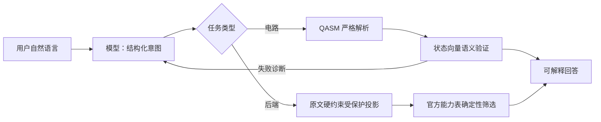
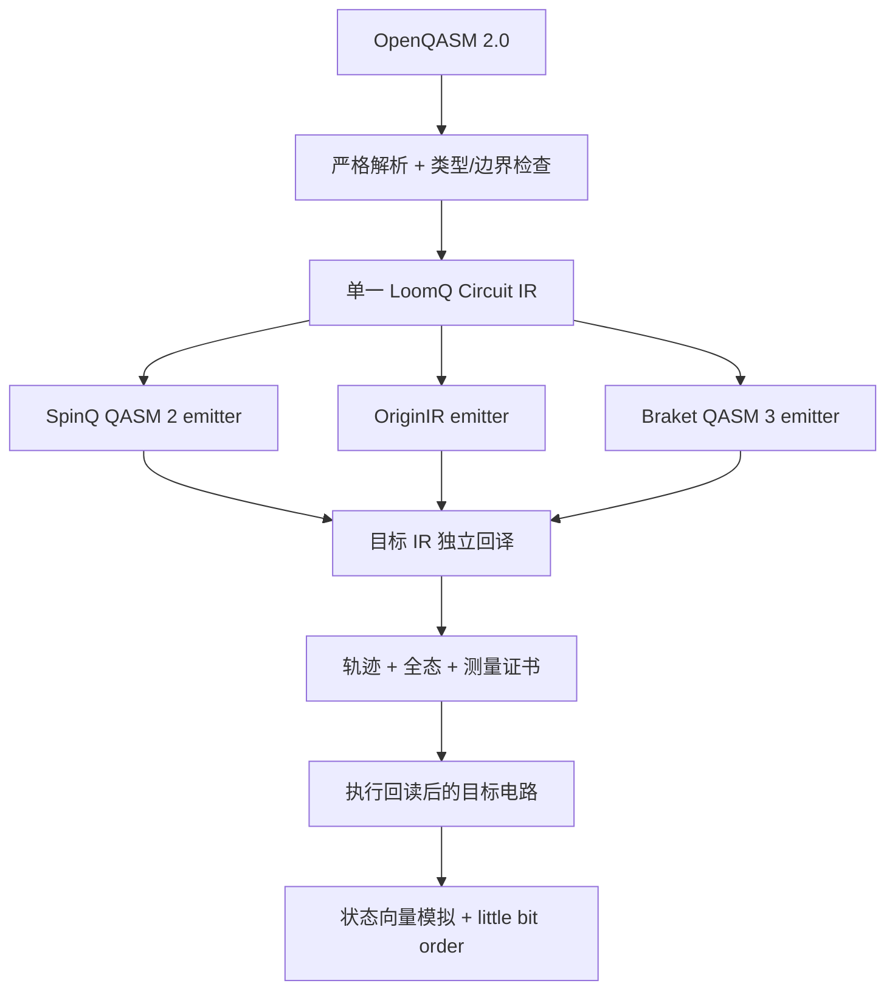

# LoomQ · 证据驱动的量子通用层

> 让跨界创作者、教育者和第一次接触量子计算的人，在 5 分钟内完成一个**能解释、能验证、能迁移**的量子实验。

LoomQ 不是把三个 SDK 包在三个 `if` 里。它先把 OpenQASM 2.0 解析为类型化中间表示，再由同一 IR 生成 SpinQ OpenQASM 2、OriginIR 和 Braket OpenQASM 3。自然语言智能体也不能绕过这条可信路径：模型提出结构化意图后，本地解析器、官方后端能力表和状态向量模拟器会先验证，再回答用户。

## 完成范围

| 模块 | 交付 | 验证状态 |
|---|---|---|
| L1 | 12 门完整解析、三目标 IR、证明携带的目标回读执行、统一 Schema | 公开 6/6；80 组随机电路 × 3 端轨迹/全态/分布证书 |
| L2 | 真实 OpenAI-compatible 调用、结构化计划、语义自检、原文硬约束投影、确定性后端筛选 | 本地兼容端点 + 敌意计划/错任务反例通过 |
| L2 UX | 无依赖 Web UI + CLI、概率图、概念解释、错误恢复、移动端与键盘支持 | 桌面/390px 浏览器实测通过 |
| L3 | 递归下降解析、嵌套 `if/else`、表达式、RISC-V 代码生成 | 80 组程序、320 个测量分支穷举通过 |
| Bonus | 32 位 RISC-V `custom-0` 两 profile、11 指令、测量坍缩、参数门误差证书 | Bell 100 seeds + CCX + `RY/RZ/CU1` 末态对照 |

真机证据必须来自赛程窗口内真实平台 job ID。本仓库**不伪造、不把本地模拟器冒充真机**；申请真机分时按 [`evidence/README.md`](evidence/README.md) 补入可追溯材料。

## 60 秒开始

Python 3.10+，核心运行与测试均只用标准库。

```bash
cd starter_kit

# 无账号、无 API Key：看懂第一个 Bell 纠缠实验
python3 -m loomq demo

# 启动可视化实验台，然后打开 http://127.0.0.1:8765
python3 -m loomq serve

# 完整本地验收（L1 + L3 + 随机/穷举/L2 假服务测试）
python3 verify_submission.py
```

运行自己的电路：

```bash
python3 -m loomq run circuits/ghz3.qasm --target braket --shots 8192
```

## 使用智能体

L2 严格读取组委会规定的环境变量，不硬编码服务、模型或密钥：

```bash
export LOOMQ_LLM_BASE_URL=https://api.deepseek.com
export LOOMQ_LLM_API_KEY=<YOUR_OWN_KEY>
export LOOMQ_LLM_MODEL=deepseek-v4-flash
export LOOMQ_LLM_TIMEOUT_SECONDS=120

python3 -m loomq ask '生成一个 5 比特 GHZ 态并进行全测量'
```

模型不是执行真相源。完整闭环是：



## 架构为什么可信



关键不变量：

- 只接受题面 12 门，参数表达式通过受限 AST 求值，拒绝任意代码执行。
- 多寄存器统一展平，但目标输出和 `c[n-1]…c[0]` 位序保持可追溯。
- 三个 emitter 只读同一个 IR；目标 IR 独立回读后必须通过规范操作轨迹、全局相位不变末态、测量映射和分布证书。
- `run()` 实际执行回读后的目标电路，收据用 SHA-256 绑定源 IR、目标文本和证书。
- L2 中被本地规则检出的用户硬约束不能被模型遗漏或矛盾值覆盖。
- 模拟后检查归一化，使用最大余数法把精确概率转为恰好等于 `shots` 的整数 counts。
- Hybrid-QASM 用真实语法树编译；临时寄存器最终清零，不污染用户 `r1..r9` 结果。

更完整的设计见 [`docs/ARCHITECTURE.md`](docs/ARCHITECTURE.md)，原创命题与证明草图见 [`docs/THEORY.md`](docs/THEORY.md)，缺点修复与真实剩余边界见 [`docs/OPTIMIZATION_AUDIT.md`](docs/OPTIMIZATION_AUDIT.md)，科学与开源依据见 [`docs/RESEARCH.md`](docs/RESEARCH.md)，测试证据见 [`docs/VERIFICATION.md`](docs/VERIFICATION.md)。

## CLI

```text
python3 -m loomq demo
python3 -m loomq run FILE [--target spinq|originq|braket] [--shots N]
python3 -m loomq ask '自然语言任务'
python3 -m loomq serve [--host 127.0.0.1] [--port 8765]
python3 -m loomq riscv FILE
```

## 自定义量子 RISC-V

LoomQ 使用 RISC-V 官方为扩展保留的 `custom-0` 主 opcode `0x0B`。`funct7=0` 定义 `QH/QX/QS/QT/QCX/QSWAP/QCCX/QMEASURE`，`funct7=1` 定义 `QRY/QRZ/QCU1`。参数以经典寄存器中的有符号微弧度传递，角度量化误差不超过 0.5 μrad。`riscv_emulator.py` 会从 `.word 0x????????` 解码、演化量子态，并在测量时按 Born 概率坍缩。

```bash
python3 -m loomq riscv circuits/bell.qasm
python3 -m unittest tests.test_quantum_riscv -v
```

编码规范见 [`docs/QUANTUM_RISCV_SPEC.md`](docs/QUANTUM_RISCV_SPEC.md)。

## 目录

```text
adapter.py                    大赛固定接口
loomq/
  ir.py                       OpenQASM 2 parser + typed IR
  emitters.py                 三目标代码生成
  simulator.py                状态向量与统一结果
  verification.py             独立目标 IR 回译与翻译证书
  pipeline.py                 发证后执行回读目标
  agent.py                    LLM 计划 + 本地工具闭环
  hybrid.py                   Hybrid-QASM parser/compiler
  quantum_riscv.py            custom-0 编解码与 QASM 汇编
  cli.py / web.py             零基础入口
  web_assets/                 本地静态 UI，无 CDN
tests/                        随机、穷举、集成与 UI API 测试
docs/                         规划、架构、研究、验证、指令规范
```

## 明确边界

- L1 本地参考模拟器上限 20 比特，适合本题隐藏电路；后端能力表中的更高上限是平台能力，不代表本地状态向量能无成本扩展到同样规模。
- L1 `run` 要求测量位于电路末端；这是题面直线电路与 Base Profile 的可审计边界。
- L2 正式评分必须由组委会注入模型服务；没有 `LOOMQ_LLM_*` 时立即给出不含密钥的错误。
- Web UI 默认只监听 `127.0.0.1`，不上传 QASM，不读取浏览器存储。
- 本提交没有声称任何真机 job；真机加分取决于外部平台注册、额度、排队与可核验回执。
- 全状态检查使用 binary64，操作轨迹精确相等才是当前无优化 emitter 的主证据；本项目不声称完成了通用量子算子符号判定。
- L2 的已知态族有确定性语义 oracle；任意未知意图只能保证形式可执行，不伪称自然语言意图已被形式化证明。

## 为谁而做

LoomQ 首先服务三类原本会被“SDK 黑话”挡住的人：需要把创意变成实验的跨界创作者；需要用可视化解释概率与纠缠的教师/学习者；以及使用键盘、窄屏或辅助技术的用户。界面用“意图—验证—结果”替代“先装三套 SDK—先学三种方言”，同时保留可展开的原始 IR，让易用性不以牺牲可审计性为代价。
