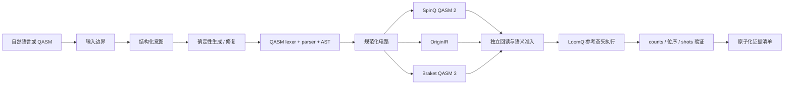

# LoomQ Pegasus

**把自然语言问题变成可验证、可转译、可执行且可追溯的量子电路。**

LoomQ Pegasus 面向能提出科研或计算问题、但还不会 OpenQASM、不了解
各平台方言、也无法独立验证结果的跨学科研究者、学生和工程实践者。
它把意图识别、代码生成或修复、三目标转译、本地执行和结果验证压缩为
一条可审计工作流——用户不必先成为量子软件工程师，也能完成可信的
小规模量子电路原型实验。

> 真实性边界：当前正式离线路径使用 **LoomQ 自研理想态矢参考模拟器**。
> 它会生成 SpinQ QASM 2、OriginIR 和 Braket QASM 3，但不冒充厂商 SDK、
> 云服务或 QPU。真机只有在仓库内存在可核验 job ID、原始响应和时间戳时
> 才会被申报。

## 30 秒启动

要求 Python **3.10**，核心路径没有第三方依赖。

```bash
cd starter_kit
python3 -m loomq.ui.server
```

浏览器打开 `http://127.0.0.1:8765`。命令行完整验收：

```bash
python3 scripts/run_all_checks.py
```

只跑较快、适合容器的检查：

```bash
python3 scripts/run_all_checks.py --quick
```

Windows 若 `python3` 是系统占位符，请直接使用已安装的 Python 3.10
解释器路径运行相同参数。

## 一条有证据的工作流



评测 `adapter.py` 保持无状态；只有产品界面会在请求级工作目录写入证据。
界面不显示模型私有推理，只显示可复核的阶段、输入、IR、结果和验证回执。

## 三个首屏任务

| 用户任务 | LoomQ 的确定性保障 | 预期产物 |
|---|---|---|
| “生成一个 5 比特 GHZ 电路，进行全测量，输出 OriginIR 后在 LoomQ 本地参考模拟器运行。” | 参数化 GHZ 合成、QASM 验证、OriginIR 回读、参考执行 | 一份 QASM、OriginIR、counts、验证报告 |
| “我想制备 Bell 态，请修复 `H q[0]; CX q[0] q[1]`。” | 明确目标优先于不可信候选；补声明、标点和规范门名后执行验证 | 仅一份最终 QASM，不暴露错误中间稿 |
| “15 比特、免费、无需排队，推荐后端。” | 模型只提取约束；代码机械筛选官方能力 JSON | 一个规范 backend ID 与可解释约束 |

## L1：一个 AST，三种目标方言

`loomq/qasm/` 是独立 lexer → 递归下降 parser → 不可变 AST → 语义归一化
链路，不用 `eval`，也不按公开样例做正则翻译。

- 支持题面全部 12 门：`h x s sdg t tdg rz ry cx cu1 swap ccx`。
- 支持多 `qreg`/`creg`、寄存器广播、逐位或整寄存器测量。
- 参数表达式支持 `pi`、科学计数法、括号和 `+ - * /`。
- 严查门参数/操作数 arity、寄存器类型、索引、测量宽度和非有限值。
- 三个 emitter 的输出都会被独立目标子集 parser 回读，并与规范化 IR 精确比对。

| `target` | `transpile()` 输出 | `run()` 的当前执行引擎 |
|---|---|---|
| `spinq` | 完整 OpenQASM 2.0 | LoomQ reference statevector |
| `originq` | 完整 OriginIR | LoomQ reference statevector |
| `braket` | 完整 OpenQASM 3.0 | LoomQ reference statevector |

`run()` 返回固定 schema：`backend`、`job_id`、`shots`、`counts`、
`bit_order=little`、带时区 `timestamp`。counts 的 key 固定宽度且最右位是
`c[0]`，value 总和严格等于 shots；metadata 明确 `native_sdk_used=false`。

## L2：模型理解语言，工具保证正确

每个有效请求至少调用一次组委会注入的 OpenAI-compatible 模型服务；
正常一次，只有本地 QASM 准入失败才允许第二次修复调用。完整 case 预算保留
在正式 120 秒限制内。

```text
untrusted prompt
  → bounded model call
  → bounded JSON extraction
  → generate / repair / recommend router
  → deterministic synthesizer or capability filter
  → L1 parse + local execution admission
  → one final QASM block or one canonical backend ID
```

- Bell、GHZ-n、均匀叠加、纠缠链和计算基态由参数化代码生成。
- 明确 Bell/GHZ 等修复目标不会被错误或注入式模型候选覆盖。
- 后端只从 `backend_capabilities.json` 筛选，不允许模型创造名称。
- URL、Key、模型名和超时只来自 `LOOMQ_LLM_*`；错误不回显 Key。
- 本地测试服务真实接收 HTTP 请求，但只替代模型传输，不提供量子结果。

本地公开 L2 传输测试：

```bash
python3 scripts/run_l2_stub_evaluator.py
```

正式环境变量契约见 [`l2_policy.json`](l2_policy.json) 和
[`submission.yaml`](submission.yaml)。除注入的模型端点外，L2 不访问任意公网。

## L3：Hybrid-QASM 编译到 Tiny RISC-V

`loomq/hybrid/` 为题面迷你经典语言提供 tokens、AST、parser、参考解释器、
寄存器分配和编译器。

- `r1..r9 → x1..x9`，`c[k] → x10+k`。
- 支持嵌套 `if/else`、`==`、`!=`、一元与二元 `+/-`。
- 只生成官方 `li/add/sub/addi/beq/bne/j` 指令。
- label 稳定唯一；临时寄存器不覆盖声明寄存器或测量寄存器。
- 量子操作保持源顺序，并与经典汇编分离返回。

公开检查：

```bash
python3 evaluator.py --level l3
```

## SCI-Pegasus 被如何重新设计

SCI-Pegasus 只作为架构思想参考。本项目没有复制其 TypeScript、React、CSS、
SVG、文案、认证、数据库或长记忆实现；LoomQ 代码是独立 Python 重写。

| 借鉴的思想 | LoomQ 的重写 |
|---|---|
| 有限 Agent loop | Understand → Generate/Repair → Validate → Output，有界一至两次模型调用 |
| Tool input boundary | plain JSON、深度/大小限制、QASM parser 与目标 allowlist |
| Result admission | IR 可回读、counts/shots/bit-order/schema/敏感字段验证 |
| Workspace evidence | 请求级 UUID 目录、原子文件、SHA-256 manifest；正式 adapter 无状态 |
| 窄 UI 状态 | 只展示工作流阶段和证据，不暴露消息全文或 chain-of-thought |

完整矩阵与许可边界见
[`docs/02_SCI_PEGASUS_REUSE_MATRIX.md`](docs/02_SCI_PEGASUS_REUSE_MATRIX.md) 和
[`docs/07_ORIGIN_AND_LICENSE.md`](docs/07_ORIGIN_AND_LICENSE.md)。

## Bonus：量子 RISC-V

`loomq/bonus/` 在官方 TinyRISCV 之外提供隔离的 RISC-V `custom-0`
量子指令编码、解码与扩展模拟器；它不会改变 L3 的官方汇编语义。

- 覆盖 QINIT/QH/QX/QRY/QRZ/QCX/QSWAP/QCCX/QMEASURE，另有 QS/QT。
- 32 位稳定机器码与非法保留位拒绝；旋转角使用 GPR signed Q16.16 radians。
- 扩展模拟器保留经典寄存器、PC、量子态、测量映射与执行日志。
- 报告始终标记 `hardware_execution: false`，不作为 QPU 证据。

规范和复现命令见 [`loomq/bonus/quantum_riscv_spec.md`](loomq/bonus/quantum_riscv_spec.md)
及 [`docs/bonus/README.md`](docs/bonus/README.md)。

## 工作台与新手路径

工作台提供自然语言输入、QASM 编辑、三目标 IR、SVG 电路线与门、counts
柱状图、Top states、运行时间线、错误定位和一键采用修复版本。新手说明覆盖
qubit、gate、measurement、shots、counts、little-endian、模拟器与真机、
转译与执行、以及“验证通过”的含义。界面支持中英文、键盘焦点和窄屏布局。

产品界面与 API 均不依赖 CDN。运行历史仅保存在本机请求级 workspace。

## 可复现验证

```bash
python3 -m compileall .
python3 -m unittest discover -s tests -p "test_*.py"
python3 evaluator.py --level l1 --target spinq,originq,braket \
  --json-out evidence/files/l1-public-report.json
python3 evaluator.py --level l3 --json-out evidence/files/l3-public-report.json
python3 scripts/run_random_differential_tests.py
python3 scripts/run_all_checks.py
```

公开 evaluator 报告只证明公开契约通过，不等同于正式分数或隐藏评测通过。
测试策略与当前真实结果分别见 [`docs/04_TEST_STRATEGY.md`](docs/04_TEST_STRATEGY.md)
和 [`DEVELOPMENT_STATUS.md`](DEVELOPMENT_STATUS.md)。

### Docker

```bash
docker build -t loomq-pegasus .
docker run --rm loomq-pegasus
docker run --rm -p 127.0.0.1:8000:8000 loomq-pegasus \
  python -m loomq.ui.server --host 0.0.0.0 --port 8000 --workspace /tmp/loomq-runs
```

镜像基于 Python 3.10、以非 root 用户运行、不安装不需要的 SDK。若本机没有
Docker，不能把静态 Dockerfile 审阅写成“构建已验证”。

## 真机证据状态

SpinQ 与 OriginQ 运行器/人工 runbook 在 `scripts/hardware/` 和
`docs/hardware/`。它们从环境变量取凭证，且只有真实 QPU 响应才能形成
`evidence/files/hardware/<platform>/` 证据包。

当前仓库**不包含**真机 job ID、原始结果或截图，因此不申报 L1 真机分。
需要账号、审批和运行窗口的动作见
[`docs/06_EXTERNAL_ACTIONS_REQUIRED.md`](docs/06_EXTERNAL_ACTIONS_REQUIRED.md)。

## 评分项与证据入口

| 项目 | 实现入口 | 可复核证据 |
|---|---|---|
| L1 通用中间层 | `loomq/qasm`, `loomq/targets`, `loomq/runtime` | `evidence/files/l1-public-report.json`、随机差分脚本 |
| L2 可验证 Agent | `loomq/agent`, `llm_client.py` | `evidence/files/l2-public-report.json`、真实 HTTP stub 测试 |
| L3 Hybrid 编译 | `loomq/hybrid` | `evidence/files/l3-public-report.json`、随机穷举差分测试 |
| 工程与产品 | `loomq/ui`, Dockerfile, 本 README | `evidence/README.md` 与 UI smoke tests |
| 量子 RISC-V | `loomq/bonus` | ISA 文档、demo 和 `test_bonus_*` |
| 新手与视觉叙事 | 本地工作台 | 新手说明、SVG 电路、counts、结构化恢复 |
| 真机 | `scripts/hardware` | 未完成；不勾选、不伪造 |

人工评分的唯一索引是 [`evidence/README.md`](evidence/README.md)，其中只勾选
已经有代码、命令和真实结果支持的项目。

## 已知边界

- 参考态矢默认最多 20 qubit；中途测量 fallback 最多 12 qubit。
- QASM 前端只实现题面 OpenQASM 2 子集，不支持自定义 gate、barrier、reset 或 `if`。
- L2 正式运行依赖组委会注入模型服务；离线 stub 不是正式模型得分证据。
- 当前 Braket SDK 主线要求 Python 3.11+，所以 Python 3.10 评分路径不引入未验证 SDK pin。
- 模拟器证明逻辑和位序，不代表真实硬件噪声、拓扑、队列或可用性。
- 公开全绿不能证明隐藏评测或正式最高分。

经核验的产品事实与供应商一手来源见
[`docs/08_PRODUCT_FACTS.md`](docs/08_PRODUCT_FACTS.md)。

## 来源与许可

比赛 starter、题面和规则来自 `QAIDAO/LoomQ-2026`。SCI-Pegasus 附件没有
可核验的根许可证，因此只参考抽象架构并 clean-room 重写，未宣称其为 MIT、
Apache 或其他许可证。任何厂商名称只用于描述目标方言或可选外部平台，不表示
厂商背书。

## 最终提交

截止时间为 **2026-08-25 12:00 UTC+8**。在标准 Git 工作树、所有修改已提交
并推送后，从 fork 根目录运行：

```bash
python3 starter_kit/prepare_submission.py --team-id xinruliuresearch-maker
```

随后由 `xinruliuresearch-maker` 在上游“LoomQ 最终提交”Issue Form 填写 fork
URL 与完整 40 位 commit SHA。只有 Issue 获得 `submission:accepted` 标签并出现
归档 SHA-256 / Artifact ID 回执，才算最终提交成功。代码更新后必须创建新的
提交 Issue，截止前最后一个 accepted 版本生效。
