# LoomQ 2026 优秀选手推荐

# 推荐选手 1：lil4notfound

代码目录：[archive/generated/snapshots/lil4notfound/starter_kit](archive/generated/snapshots/lil4notfound/starter_kit)

## 实现完整性

lil4notfound 完成了从量子程序转换、Agent 生成与修复，到 Hybrid 编译和量子 RISC-V 执行的整套流程。输入的 OpenQASM 会先解析成统一 Circuit，再分别生成 SpinQ、OriginQ 和 Braket 的目标程序。

实际运行由项目自己的模拟器完成。`adapter.run` 调用 `loomq_core/service.py::execute`，再由 `simulate_counts` 计算量子态并完成测量采样。`target` 参数只决定生成 SpinQ、OriginQ 还是 Braket 的目标程序，这些生成物不会继续交给对应厂商 SDK。仓库提供了单独的 SDK 示例脚本，但没有把三套 SDK 接入统一运行入口。Agent 生成或修复电路时，使用的也是这套自建模拟器。L3 和 Bonus 则继续处理测量结果进入经典分支，以及量子指令的编码、解码和执行。

在这条自建模拟执行路径上，系统又做了两次验证。第一次发生在多平台转换以后：生成的目标程序会被重新解析成 Circuit，再与转换前的 Circuit 比较，检查门、参数和操作数有没有改变。这里验证的是目标程序有没有保持原始语义，不是验证厂商 SDK 能否执行。第二次发生在 Agent 返回候选电路以后：`simulate_counts` 实际模拟候选电路，再检查结果分布是不是用户要求的目标。前一次防止转换器生成“语法正确但含义已经变化”的目标程序，后一次防止 Agent 返回“能够被解析但做错任务”的电路。只有通过检查的 QASM、目标表示和自建模拟结果，才会保存为后续可以继续修改的 `CircuitArtifact`。

## 整体架构

`loomq_core` 是共享语义层。`loomq_agent` 只负责自然语言任务和候选管理，`loomq_hybrid`、`loomq_bonus` 分别处理经典控制和机器执行，`loomq_app` 负责把结构化结果显示给用户。

这使聊天消息和可执行事实分开。用户可以说很多话，但系统后续真正继续修改的是最近一份通过验证的 `CircuitArtifact`。

## 实现亮点

lil4notfound 会在生成目标程序以后重新解析回来，再和原来的 Circuit 比较。它还专门构造了一个很小但很有效的反例。原电路是：

```text
cx q[0], q[1]
```

目标程序被故意改成：

```text
cx q[1], q[0]
```

两段文本都合法，门的数量也一样，但控制位和目标位已经交换。验证器必须报告 qubits 不同。通过“生成目标 -> 回读目标 -> 比较规范化 Circuit”的方式，避免只检查字符串格式而漏掉操作数顺序错误。

在 Agent 准备提交结果以前，`loomq_agent/validation.py` 会真正模拟候选电路。它根据用户目标建立期望分布，再把候选的测量分布与期望值比较。这样，一段缺少 CX 的 Bell 程序即使能解析，也不能因为“包含 H 和 measure”就被当成正确答案。

修复也有最大次数。具体解析错误和分布偏差可以交给模型再试一次，但系统不会一直把失败输出喂回模型。通过有限修复，避免 Agent 无限重试，同时保留最后一次可以解释的失败原因。

`CircuitArtifact` 解决了多轮状态的另一个问题。聊天历史可能包含旧代码、失败代码和用户随口提出的设想，已验证电路则单独保存。后续的“把它改成五比特”从有效产物开始，而不是从最近出现的任意代码块开始。

## 相比其他选手的特点

很多选手有 parser，也有测试。lil4notfound 更进一步，会主动制造“语法正确但语义错误”的目标程序，再检查自己的验证器是否能抓住它。和 qianqiu0926 相比，它更侧重开放候选的运行后验证；和 WilderNoTrack 相比，它更强调目标回读以及 Agent 产物的语义门槛。

## 推荐理由

它值得推荐，因为它没有把“代码生成成功”当作完成。它一直追到生成物能否回到同一语义、能否产生用户真正要求的结果。

# 推荐选手 2：PHTPSN

代码目录：[archive/generated/snapshots/PHTPSN/starter_kit](archive/generated/snapshots/PHTPSN/starter_kit)

## 实现完整性

PHTPSN 把一份 OpenQASM 转成三个平台的目标程序后，会继续交给各自的 SDK 执行，并把同一份 Circuit 延伸到真机提交前检查。项目同时覆盖 L2 Agent、Hybrid 编译和量子 RISC-V：底层以不可变 `LoomQCircuit` 保存程序语义，三套 SDK 在隔离进程中执行，Agent 候选经过本地验证，Hybrid 部分使用递归语法树和寄存器分配，Bonus 则定义 custom-0 指令的编码、解码和执行。

生成三种目标程序以后，PHTPSN 会用各平台对应的 Python 解释器启动 `sdk_worker.py`。三个 worker 分别调用 SpinQit simulator、pyQPanda CPUQVM 和 Braket LocalSimulator，再把 counts 通过统一 JSON 结构交还主程序。这样三套 SDK 不需要导入同一个进程，也不必共用依赖环境；某个 worker 执行失败时，系统会直接报告失败，不会自动换成自建模拟器。

这份实现的完整之处在于，各层并非各自演示。Agent 产生的电路会进入同一套 parser 和 runner，真机适配又继续读取同一个 Circuit 检查设备约束。用户从自然语言开始，最后面对的是可运行、可编译或可提交的同一份程序。

## 整体架构

`loomq_l1` 管理规范 IR、parser、emitter 和隔离 runner，`loomq_l2` 负责任务文档、语义验证和有限纠错，`loomq_l3` 把 classical block 编译为 RISC-V，`bonus` 处理量子指令字。`hardware` 不参与生成电路，只在提交以前读取平台状态和拓扑。

官方目标文本和本地 SDK 输入被刻意分开。同一 Circuit 可以生成符合赛题契约的目标 IR，也可以生成某个锁定版本 SDK 真正能接受的本地文本。通过把“提交格式”和“兼容格式”设为两个 emitter，避免为了迁就某个 SDK 改坏官方输出。

## 实现亮点

### 界面流程

页面把基础教学、后端模拟、混合编译和执行证据放在同一条侧栏中。用户先理解向量、振幅和测量，再从右侧 Agent 直接提出生成或修复任务。

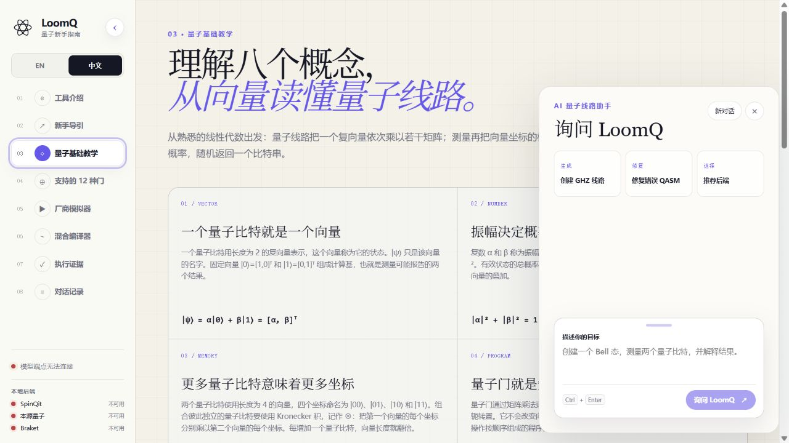

进入混合编译器后，页面保留 Hybrid-QASM 原文和经典控制结构，用户看到的是从测量结果到 RISC-V 决策的连续过程，而不是另开一个互不相关的编译演示。

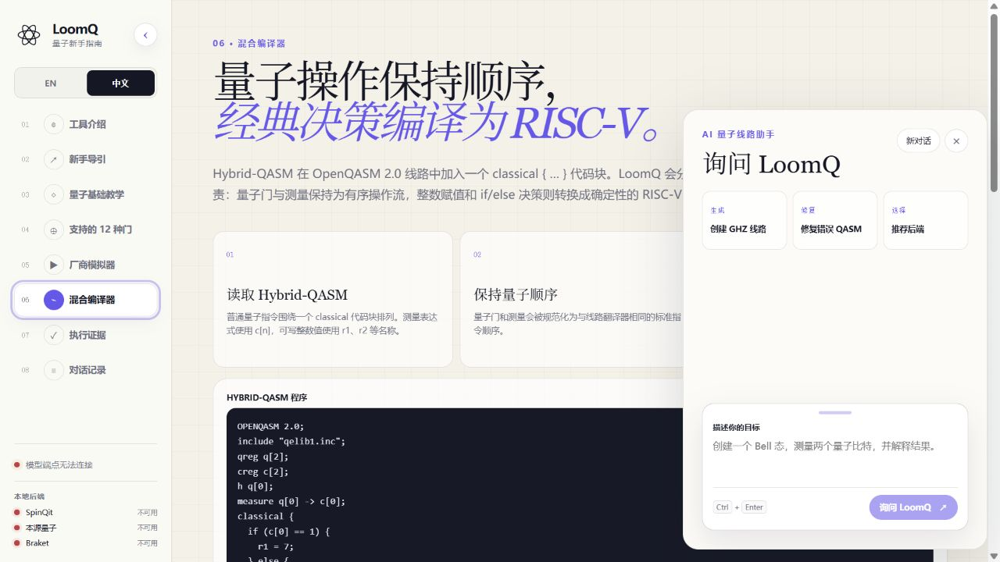

底层 runner 为 pyQPanda、SpinQit 和 Braket 选择各自解释器，通过 JSON 标准输入输出交换结果。子进程有 180 秒上限，并会检查 `counts` 总数是否等于 shots。它还从最后一行读取 JSON，容忍 SDK 在前面打印日志。通过进程隔离和结果契约，避免三套依赖互相污染，也避免“进程退出码为零但只返回半份结果”被当成成功。

真机提交前的检查尤其具体。`hardware/spinq_cloud.py::prepare_spinq_cloud_qasm` 会确认平台是 `ACTIVE`、设备在线、活动量子位连续、宽度足够、门在设备门集中，并逐个检查有向耦合。它还要求活动量子位最终按 `q[i] -> c[i]` 测量，测量后不得再加门。通过在创建任务前校验当前设备能力，避免把模拟器里合法的 CX 方向或稀疏布局直接提交给不支持它的芯片。

Agent 不是无限修到“看起来像成功”。模型文档先经过本地解释，纯态目标要求 fidelity 不低于 0.97，分布目标要求总变差距离不高于 0.08；第一次失败以后只再给一次纠错机会，然后进入确定性合成或净化后的 fallback。通过“本地裁决、一次纠错、确定性退路”，避免模型在超时边缘反复改写电路，也避免最后一次失败覆盖前面仍可用的候选。

L3 的表达式 lowering 会跟踪临时寄存器的存活范围。没有空闲寄存器时直接报错，不会为了完成编译而覆盖仍在使用的值。这一点把 Hybrid 从简单字符串替换推进到了真正需要管理资源的小型编译器。

## 相比其他选手的特点

Duanice 同样重视依赖隔离和硬件任务，PHTPSN 更进一步把设备当下的活动位、方向耦合和终端测量规则纳入提交前验证。WilderNoTrack 擅长在执行后核验统一结果，PHTPSN 的突出之处是把很多本来要到云端才暴露的问题提前挡在任务创建之前。

## 推荐理由

它值得推荐，因为它把“多平台可运行”继续追到了“在当前设备上具备可提交条件”。这是一套从规范语义、Agent 约束、编译资源到硬件现实都接得上的完整方案。

# 推荐选手 3：WilderNoTrack

代码目录：[archive/generated/snapshots/WilderNoTrack/starter_kit](archive/generated/snapshots/WilderNoTrack/starter_kit)

## 实现完整性

WilderNoTrack 把 OpenQASM 解析、公共门分解、三平台代码生成、SDK 执行和结果核验接在同一条路径上。目标程序执行以后，系统不会直接接受 SDK 返回的 counts，而是继续与本地参考分布比较；必要时校准位序或明确回退。L3 也沿用这种“生成后再执行核对”的思路，分别提供 Hybrid-QASM AST、源解释器、RISC-V 生成器和维护量子态的自定义指令执行器。

三种目标程序会优先交给对应 SDK。OriginQ 和 Braket 在当前进程中分别调用 pyQPanda CPUQVM 和 Braket LocalSimulator；SpinQit 可以在当前进程执行，也可以交给配置好的 sidecar Python。SDK 不可用、执行报错或返回分布未通过参考结果核验时，系统改用自建参考模拟器，并在 `meta.fallback_reason` 中说明为什么发生了回退。

这套实现完整的地方在于，前一个阶段的输出确实会进入后一个阶段。门分解不是单独展示，结果校验也不是离线脚本，二者都在 `loomq/execution.py::run_circuit` 的执行路径中。

## 整体架构

主线是：

```text
OpenQASM
  -> qasm parser
  -> Circuit / GateOp / MeasureOp
  -> decomposition passes
  -> SpinQ / OriginQ / Braket emitter
  -> backend execution
  -> result normalization and verification
```

Hybrid 部分单独放在 `loomq/hybrid`，机器指令放在 `loomq/qisa`。这样，厂商格式不会进入源解析器，量子指令编码也不会和经典语法分析混在一起。

## 实现亮点

受控相位门很容易被“翻译对了名字，改错了语义”。WilderNoTrack 在 `loomq/passes/decompose.py::_rule_cu1` 中整体展开 CU1，保留控制位和目标位的顺序，也保留相对相位。通过整门恒等分解，避免在受控结构里机械地把 `u1` 换成 `rz` 所造成的相位错误。

它也不把 SDK 返回成功当作结束。`run_circuit` 会先得到本地参考分布，再计算厂商 counts 与参考分布的 Hellinger fidelity。如果分布不符，代码会尝试反转 bit key，判断是不是位序约定相反。仍然不符时才回退，并把回退原因写进 `meta`。通过“参考分布核对 + 位序校准 + 显式回退”的方式，避免把格式正确但经典位顺序错误的结果直接交给用户。

L3 里还有一个细节很值得推荐。面对：

```text
r1 = r2 + r1;
```

生成器不能先覆盖 `r1`，否则右边原来的值已经丢了。`loomq/hybrid/riscv.py` 会先把仍需读取的操作数放进临时寄存器，并让临时寄存器避开变量区和测量区。通过显式的寄存器分配，避免赋值目标和输入发生别名时算错。

Bonus 中，量子机器字进入和经典指令相同的执行循环。测量结果写入 `x10` 等寄存器，后面的 `beq`、`bne` 直接读取。这里的分支值来自刚刚发生的量子测量，不是测试提前塞进去的一组位。

## 相比其他选手的特点

不少选手做到了三目标转换，WilderNoTrack 继续处理了结果可信度。xinruliuresearch-maker 的阶段划分更细，lil4notfound 的回读验证更强，而 WilderNoTrack 的优势是把门分解、SDK 优先执行、分布验收、位序修正和显式回退接在一条主线上。

## 推荐理由

它值得作为底层工程完整性的代表。用户得到的不只是目标代码，还有一条能说明结果来自哪里、出现问题时为何回退的执行链。

# 推荐选手 4：xinruliuresearch-maker

代码目录：[archive/generated/snapshots/xinruliuresearch-maker/starter_kit](archive/generated/snapshots/xinruliuresearch-maker/starter_kit)

## 实现完整性

xinruliuresearch-maker 把量子程序转换组织成一套分层编译器。OpenQASM 先经过词法和语法分析形成规范化模型，再进入三种目标格式生成、运行结果整理和目标回读；Hybrid-QASM 则经过独立 AST、寄存器分配和 RISC-V 编译，Bonus 再处理量子指令和量子态。三个平台 provider 共用 `BaseProvider.run`，counts 由自建的 `reference_simulator.simulate_counts` 产生，因此三种平台在这里对应三种目标程序，执行参考来自同一套本地模拟器。

运行时，`adapter.run` 虽然会根据 target 选择 provider，但三个 provider 最终都会调用自建的 `reference_simulator.simulate_counts`。项目没有在这一入口中导入 SpinQit、pyQPanda 或 Braket SDK，也没有为它们启动 worker。因此三个平台的差异体现在目标程序生成和回读，最终 counts 则由同一套本地模拟器产生。

模块按编译阶段划分：`loomq/qasm` 只处理源语言，`loomq/targets` 只处理目标表示，`loomq/runtime` 负责执行和结果，`loomq/hybrid` 处理经典控制，`loomq/bonus` 处理机器字和量子态。

## 整体架构

OpenQASM 先变成规范化 AST。所有寄存器偏移、参数表达式、操作数顺序和测量关系都在这里确定。SpinQ、OriginQ 和 Braket emitter 只读取这份模型。生成后的目标程序还能通过 `loomq/targets/roundtrip.py` 回到同一种规范化表示。

L3 使用另一条清晰的链路：

```text
Hybrid-QASM tokens
  -> AST
  -> source interpreter
  -> register allocator
  -> RISC-V compiler
  -> target execution
```

源解释器和目标执行器彼此独立，因此可以给它们相同的测量输入，再比较变量结果。

## 实现亮点

它明确区分末尾测量和中途测量。末尾测量可以从最终状态统一采样，但下面这种程序不能这样做：

```text
H q[0]
measure q[0] -> c[0]
if c[0] == 1: X q[1]
```

第一次测量必须立即坍缩，并影响后续操作。通过为两类测量保留不同执行路径，避免把中途测量错误地拖到电路末尾。

`loomq/hybrid/register_allocator.py` 也没有固定拿 `x30`、`x31` 当万能临时寄存器。它维护 reserved、active 和 free 集合，临时值用完后释放。通过记录寄存器生命周期，避免嵌套表达式、用户变量和测量位互相覆盖。

Bonus 的编码和解码进入实际执行器，而且日志会记录 pc、机器字、测量结果和写回位置。出现错误时，可以判断是 encoder 打错字段、decoder 解释错误，还是量子态计算本身出了问题。

## 相比其他选手的特点

WilderNoTrack 更像一条完整的产品执行管线，xinruliuresearch-maker 更像一套可以继续维护的编译器。它特别重视阶段边界、中途测量和寄存器生命周期，这些问题在只演示 Bell 或 GHZ 的项目里不容易暴露。

## 推荐理由

它值得作为架构设计的代表。新后端、新语法或新量子指令加入以后，可以清楚地找到应该修改哪一层。

# 推荐选手 5：jessicaruan6688-byte

代码目录：[archive/generated/snapshots/jessicaruan6688-byte/starter_kit](archive/generated/snapshots/jessicaruan6688-byte/starter_kit)

## 实现完整性

jessicaruan6688-byte 从 OpenQASM 解析开始就同时保存量子位、经典位和测量映射，三套 runner 返回结果后，再根据各 SDK 的位序规则分别整理 bitstring。这条测量语义主线继续贯穿 Hybrid 编译和量子 RISC-V：测量位进入受保护的经典寄存器，机器执行中的 `QMEASURE` 也会把结果写回通用寄存器。项目还包含 L2 Agent、Web 展示和纯 Python statevector 模拟器。

生成物会在当前 Python 进程中直接交给对应 SDK：SpinQ 进入 SpinQit simulator，Braket 进入 LocalSimulator，OriginQ 进入 pyQPanda CPUQVM。项目另外提供 `reference_sim.py` 作为对照验证，但厂商 SDK 执行失败时不会静默切换到这个模拟器。三套 SDK 也没有拆到独立 worker 环境中。

## 整体架构

`loomq` 中的 parser 和 IR 是中心层，三套 emitter 只负责目标语法，runner 返回原始 counts 后交给 `result.py` 做后端相关归一化。`hybrid.py` 把 classical block 解析为递归 AST，测量位保存在固定寄存器窗口，表达式使用其上的 scratch registers。根目录 `riscv_emulator.py` 则负责 custom-0 指令和量子态执行。

## 实现亮点

### 界面流程

首页先展示真实任务归档、无噪声理想分布和真实分布，再把三项 Agent 任务与后端能力放在下面。用户先知道“实验事实是什么”，再让 Agent 生成、修复或推荐后端。

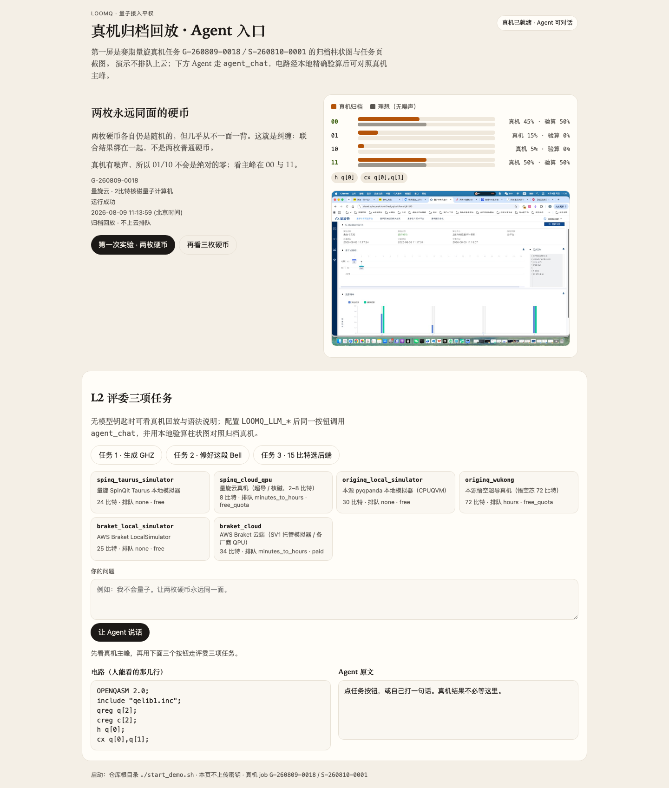

修复任务会先把大写门名、缺少寄存器声明和 CX 逗号缺失逐项说清楚，修复后的电路与 Agent 原文并列，仍保留上方真机分布作为参照。

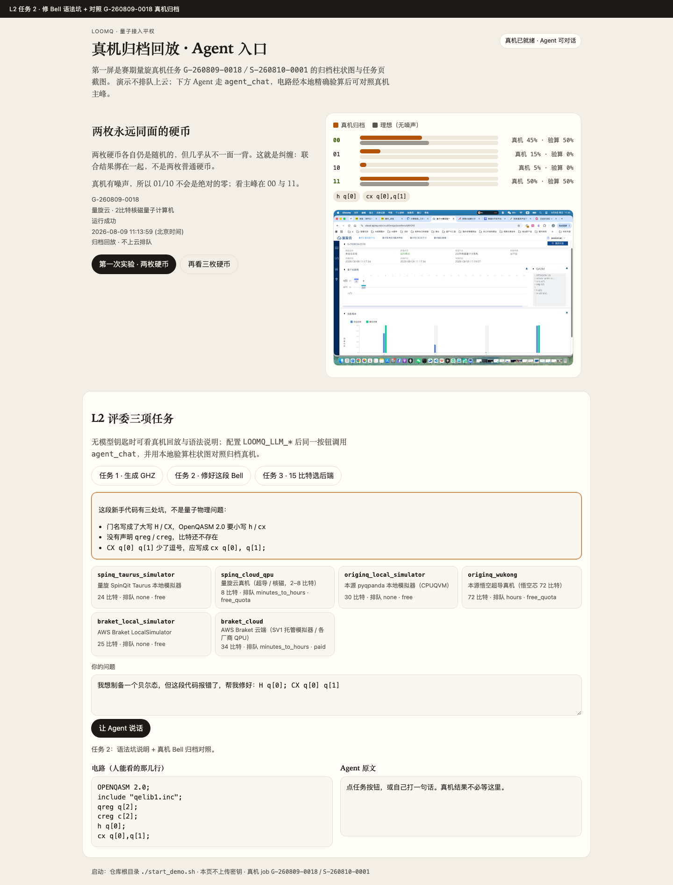

`result.py` 把 SDK 分成两类。SpinQ 和 Braket 的 key 按量子位编号给出且不理会 measure map，因此进入 `remap_counts`；pyQPanda 已经按经典寄存器小端位序返回，并且尊重 measure map，因此只做 `normalize_classical_counts`。如果对 pyQPanda 再映射一次，本来正确的结果反而会被改坏。通过按返回语义选择归一化路径，避免“一套位序修复应用所有 SDK”的二次错误。

这个问题用 Bell 或 GHZ 很难发现，因为 `00/11` 在反转以后仍是 `00/11`。代码专门考虑稀疏和换位测量。例如量子位 `q[0]` 写入 `c[2]`、`q[3]` 写入 `c[0]` 时，输入 `1000` 的 8 次计数应落到经典结果 `0100`，不能只把字符串倒过来。通过按 `MeasureOp` 逐位落槽，避免对称样例给位序实现制造假阳性。

Hybrid 编译器把 `c[k]` 对应的测量寄存器视为只读窗口，scratch 从窗口上方开始分配。表达式先在临时寄存器中求值，最后才写变量；嵌套 `if` 使用递归 AST 和独立标签。通过隔离测量寄存器和计算临时值，避免编译复杂表达式时覆盖刚从量子侧写回的分支依据。

Bonus 模拟器会把 32 位 word 交给 `decode_quantum_word`，再放进同一个 PC 循环执行；`QMEASURE` 对 statevector 做 Z 测量和坍缩，把 0/1 写入通用寄存器，后续 BEQ/BNE 可以立即读取。纯机器码接口负责量子 word，混合经典程序使用另一条文本加载路径，两种输入目前尚未合并成统一的混合二进制装载器。

## 相比其他选手的特点

WilderNoTrack 强调跨后端统一结果后的统计核验，jessicaruan6688-byte 更早一步追问“每个后端的原始 key 究竟处于哪个坐标系”。xinruliuresearch-maker 处理 Hybrid 的控制流语义，这位选手还把测量寄存器当成受保护资源，防止经典编译阶段把量子结果覆盖。

## 推荐理由

它值得推荐，因为它抓住了跨 SDK 中最隐蔽的一类错误：代码都能运行、shots 也能对上，但 bitstring 已经被错误地解释。它给出的不是经验性的反转，而是由测量映射和后端契约共同决定的归一化规则。

# 推荐选手 6：AphrixZjr

代码目录：[archive/generated/snapshots/AphrixZjr/starter_kit](archive/generated/snapshots/AphrixZjr/starter_kit)

## 实现完整性

AphrixZjr 把 Agent 生成的电路放进一个有版本的实验工作台，而不是让模型直接覆盖当前代码。Agent 先提出候选和 diff，用户确认后才形成新 revision；新电路进入 L1 验证和运行，返回结果继续绑定这一版本。底层三个 runner 分别调用 SpinQit、pyQPanda CPUQVM 和 Braket LocalSimulator，`l1_reference.py` 独立检查语义；L3 和 Bonus 又把这条流程延伸到 Hybrid 编译与 `qsubmit/qread` 量子反馈。

标准 `adapter.run` 会在当前 Python 进程中调用 SpinQit、pyQPanda CPUQVM 和 Braket LocalSimulator。Web 工作台默认使用的则是内置 `loomq_reference_simulator`，它根据 `l1_reference.py` 算出的理想概率生成教学计数；只有注册并选择可用的本地 backend 后，页面运行才会进入厂商 runner。这样，命令行适配入口可以直接验证三套 SDK，Web 初始体验又不依赖用户预先安装厂商环境。

## 整体架构

`loomq_l1.py` 保存门序、参数、操作数和测量映射。`loomq_l2.py` 管理目标、候选、验证和实验状态。`loomq_l3.py` 生成经典控制；量子指令的实际汇编、解码和执行在 `riscv_emulator.py`，`quantum_riscv.py` 只是兼容导入层。Web 层为每份电路分配 revision。

## 实现亮点

### 界面流程

用户先进入带有版本、验证状态和证据标签的工作台。此时页面显示的是当前实验，而不是一段孤立的聊天回复。

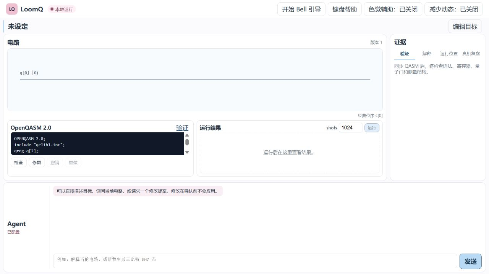

接着，用户在同一页面请求三比特 GHZ。Agent 返回的内容不会立即覆盖电路，而是先形成一份修改提案。

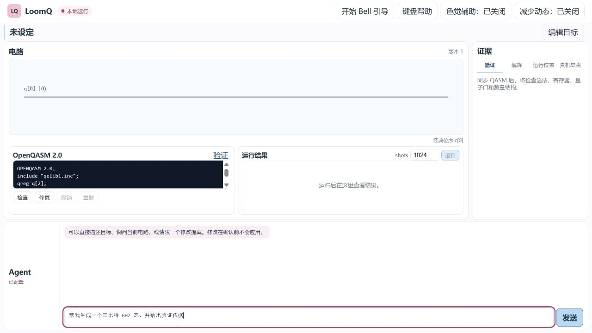

提案以 diff 形式出现，用户可以看到准备增加或删除哪些门，再决定是否应用。

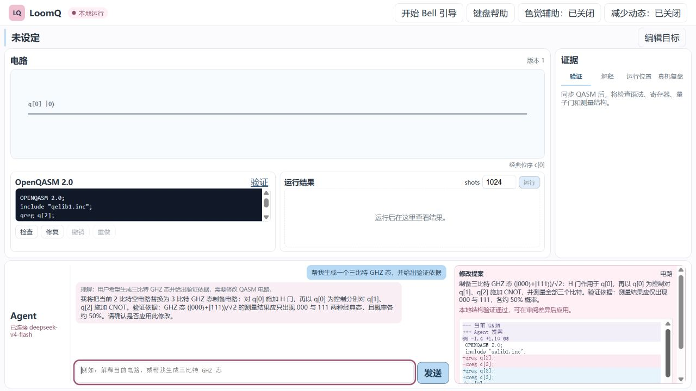

应用以后，新版本先通过本地结构检查，然后才能进入运行。最终结果仍绑定这一版电路，页面显示 GHZ 的 `000/111` 分布。

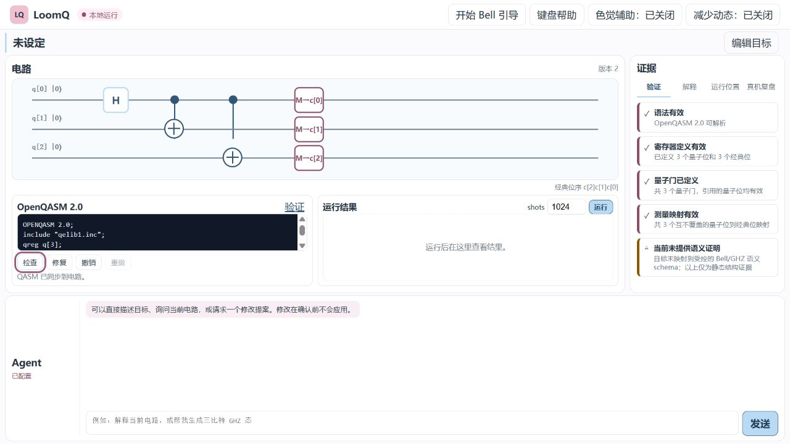

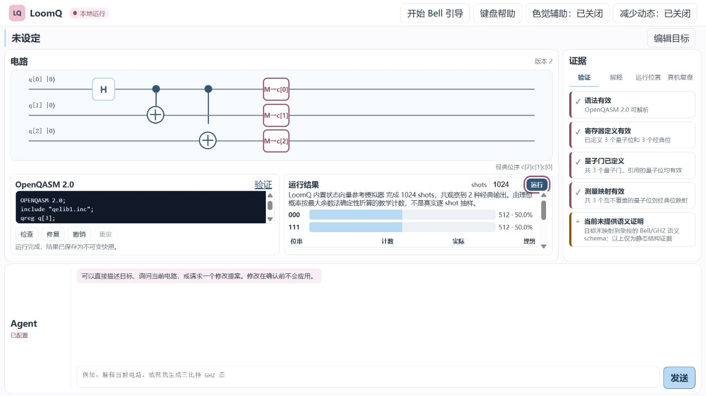

用户要求修改当前电路时，Agent 不直接覆盖编辑器。它先生成一份提案和 diff，用户确认以后才应用。假设第 7 版电路正在等待模型回复，用户已经手动改出了第 8 版。第 7 版回复回来时，系统会核对 `circuit_revision`，发现基线不一致就不再覆盖。通过条件应用提案，避免异步旧响应破坏用户的新工作。

撤销也不是只换回旧 QASM。快照同时恢复那一版的验证状态和运行结果。通过保存完整实验版本，避免页面上显示第 7 版电路，却继续挂着第 8 版 counts。

Agent 的语义检查把“能运行”和“做对目标”分开。一段 QASM 可以通过 parser，却未必真的制备用户要求的状态。候选 statevector 会和从用户请求独立建立的目标比较，因此遗漏相位关系的电路也有机会被发现。

Bonus 使用 `qsubmit/qread`。经典程序在执行过程中提交量子任务，再把读取结果写入寄存器并继续分支。通过明确的提交和读取接口，避免把量子结果当成程序开始前就已经知道的外部常量。

## 相比其他选手的特点

qianqiu0926 的优势是模型和确定性工具如何分工，AphrixZjr 的优势是模型结果怎样安全地进入一个正在被用户编辑的工作区。它处理了确认权、并发响应和实验级撤销，这些问题在单轮评测里不会出现，却会直接影响真实产品。

## 推荐理由

它值得作为跨层工作台的代表。底层验证很扎实，用户又能决定模型修改何时进入当前实验。

# 推荐选手 7：Duanice

代码目录：[archive/generated/snapshots/Duanice/starter_kit](archive/generated/snapshots/Duanice/starter_kit)

## 实现完整性

Duanice 在生成三平台目标程序以后，继续处理厂商 SDK 的依赖冲突、进程超时、错误输出和真机任务状态。项目覆盖 L1、L2、L3 和 Bonus，既有 parser、emitter、simulator 和 Agent，也有真机 preflight、提交、查询、证据保存和厂商 worker。它的完整性主要体现在：平台执行失败时，系统仍能说明失败发生在哪个阶段，而不是只返回一个模糊异常。

Duanice 对三个平台采用混合部署。SpinQit 放进独立的 `spinqit_worker.py`，OriginQ 和 Braket 则在当前进程中分别调用 pyQPanda CPUQVM 与 Braket LocalSimulator。`originq_cloud_worker.py` 单独负责云端任务，不参与本地 OriginQ 模拟。任何一条厂商执行路径失败时，`adapter.run` 都会保留错误，而不是自动返回自建模拟结果。

## 整体架构

纯转换由 `qasm_parser.py` 和 `emitters.py` 完成，`platform_runners.py` 负责统一平台入口。本地执行时，SpinQit 进入 `spinqit_worker.py`，OriginQ 和 Braket 留在当前进程；进入真实硬件流程后，`hardware_runner.py` 再通过 `originq_cloud_worker.py` 管理 OriginQ 云端任务。Agent 另行拆成 core、verifier、backend selector、presenter 和 explainer。

## 实现亮点

厂商 SDK 经常要求不同版本的 Python 和依赖。Duanice 没有把所有平台机械地放进 worker，而是把依赖冲突更明显的 SpinQit 和 OriginQ 云端流程隔离出来，通过 stdin/stdout 传递电路、shots、任务状态和结果；本地 pyQPanda CPUQVM 与 Braket LocalSimulator 仍直接运行。通过有选择的进程隔离，避免特定 SDK 的版本或崩溃拖垮主服务，又不为所有平台增加同样的通信层。

超时和错误也经过处理。`hardware_runner.py::_redact` 会递归清理返回对象，stderr 中出现的 secret 也会被替换。通过窄 JSON 协议和输出脱敏，避免为了排查真机失败把 token 一起写入日志或证据目录。

真机运行被分成 preflight、submit、query 和终态提取。用户可以知道任务是排队、失败还是完成，而不是等一个同步函数最终超时。通过显式任务生命周期，避免把“还在排队”误报成执行失败。

## 相比其他选手的特点

WilderNoTrack 更重视厂商结果的统计可信度，Duanice 更重视厂商环境本身是否可控。其他方案往往用一个 `try/except` 包住 SDK 调用，这个项目继续处理依赖、超时、stderr、凭据和异步状态。

## 推荐理由

它值得推荐，因为它考虑到了代码离开本地模拟器以后会遇到什么。真机支持不是一个函数名，而是一套可失败、可查询、不会泄密的运行流程。

# 推荐选手 8：mayloveless

代码目录：[archive/generated/snapshots/mayloveless/starter_kit](archive/generated/snapshots/mayloveless/starter_kit)

## 实现完整性

mayloveless 把候选生成、目标判定和调试记录拆成相互独立的部分。Agent 负责生成或修复电路，`semantic_verifier.py` 只接收目标态并独立判断候选是否达到目标，`debug_trace.py` 和 `circuit_trace.py` 再把执行证据安全地交给 Web、CLI 和教学解释。底层还实现了统一 IR、三平台转换与运行、Hybrid 编译，以及 custom-0 编解码和经典控制闭环。

三种目标程序都会进入对应的厂商 SDK。SpinQit 和 pyQPanda 分别放在独立 worker 中，避免它们的依赖进入主进程；Braket 在当前进程调用 LocalSimulator。厂商执行失败时，统一入口不会自动使用自建 statevector 替代结果；页面如果改走另外的模拟入口，也会明确显示结果来源。

Bonus 实现了指令与控制闭环，但没有实现完整量子态模拟。`QuantumRISCVEmulator` 在同一取指循环中解码 `.word`、把测量值写入经典寄存器并参与分支；随仓库提供的 `TraceCoprocessor` 返回预先注入的测量位，不负责量子态演化。这一边界在代码中是明确的。

## 整体架构

`loomq` 是共享语义与观测层：parser 生成 IR，emitters 和 runners 对接后端，`semantic_verifier.py` 独立判定目标，`debug_trace.py` 记录安全事件，`circuit_trace.py` 再把每一步门和测量映射写入同一事件流。L3 和 Bonus 作为单独模块消费这些明确的数据结构。

这套架构的关键不是模块多，而是“生成答案”和“判定答案”不共享同一种输出。目标裁决器只接受目标态描述，不接受候选 QASM。

## 实现亮点

### 界面流程

首页把一次量子实验压缩为意图、程序、执行轨迹和结果四段，随后才让用户进入探索、修复与执行平台。

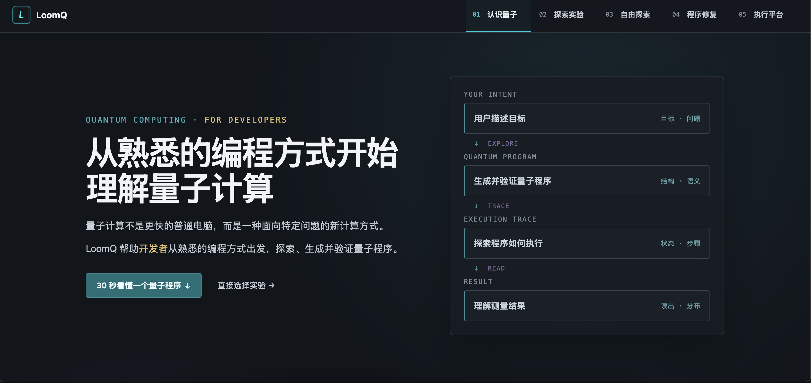

当真实设备不可连接时，页面明确说明原因并保留模拟实验入口，没有把模拟结果伪装成真机返回。

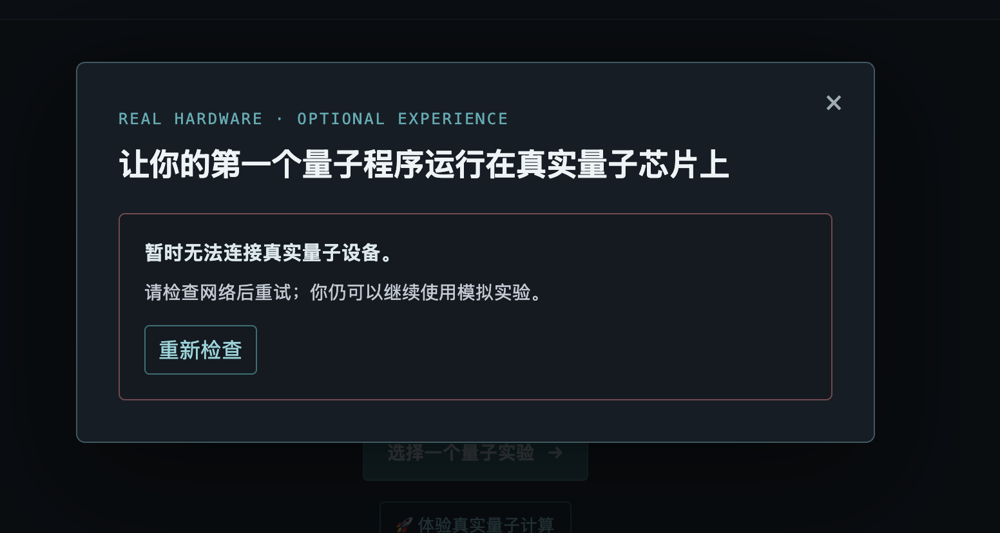

`parse_target_specification` 明确拒绝目标裁决器返回 `qasm` 字段，并检查振幅基底唯一、数值有限、归一化以及量子位数一致。实际判定使用 `|<target|actual>|^2`，自然忽略全局相位。通过让目标只描述“应该到达的状态”而不携带“候选应该怎么写”，避免目标生成器照抄候选错误，也避免物理等价但只差全局相位的电路被误判。

逐门追踪不是把 stdout 搬到网页。`circuit_trace.py` 生成门前后状态、概率和测量映射；遇到中途测量会发出 `trace_stopped_after_measurement`，明确说明纯态轨迹为何不能继续。通过在语义边界停止，而不是编造后续确定性状态，避免教学图把坍缩后的混合分支画成一条错误轨迹。

调试事件写入前会经过 `_safe_text`。实际 API key、Bearer token、环境文件名、环境变量名和绝对路径都会被替换或清除。通过先脱敏再留存 trace，避免“为了可观测性”把凭据和本机目录带进网页、日志或评审证据。

## 相比其他选手的特点

lil4notfound 强在候选运行后的语义验证，mayloveless 又隔开了目标说明和候选实现，防止裁判与选手共享同一个错误前提。AphrixZjr 和 zmath01 关注交互状态的一致性，mayloveless 关注的是调试信息本身能否安全、诚实地跨 CLI 和 Web 复用。

## 推荐理由

它值得推荐，因为它同时守住了两条容易被忽视的边界：验证器不能被候选答案污染，调试工具也不能因追求透明而泄露敏感信息。

# 推荐选手 9：qianqiu0926

代码目录：[archive/generated/snapshots/qianqiu0926/starter_kit](archive/generated/snapshots/qianqiu0926/starter_kit)

## 实现完整性

qianqiu0926 把一次自然语言量子任务拆成“模型理解意图”和“本地程序执行量子工作”两部分。模型先把用户要求整理成结构化计划，本地程序再构造或验证电路、生成目标代码、筛选后端并计算结果。用户可以从一句自然语言一直走到 counts、概率和解释。界面中的 target 决定生成哪种平台代码，主运行接口经 `pipeline.verified_run` 进入自建 `simulator.execute`。

三个 target 共用项目自己的 statevector 模拟器。`adapter.run` 经 `pipeline.verified_run` 调用 `simulator.execute`，不会导入三套厂商 SDK，也不会启动 SDK worker。页面中的 backend 或 target 选择用于生成相应目标代码并展示能力信息，最后看到的 counts 仍来自本地模拟器。

这条路径由 `loomq/agent.py`、`ir.py`、`emitters.py`、`simulator.py`、`pipeline.py` 和 Web 层共同完成。L3 和 Bonus 也有单独的 Hybrid 与量子指令实现。

## 整体架构

模型返回的不是一段随意说明，而是区分 `quantum_program` 和 `backend_selection` 的 JSON 计划。计划进入本地工具以后，标准实验由构造器完成，开放电路由 parser 和模拟器检查，设备选择则读取固定能力表。

```text
自然语言
  -> 结构化计划
  -> 本地构造或候选 QASM
  -> parser
  -> exact probabilities
  -> target emitters
  -> target-labeled local simulation
  -> counts and explanation
```

## 实现亮点

### 界面流程

工作流从一句三比特纠缠请求开始。用户不需要先选择门、后端或目标语言。

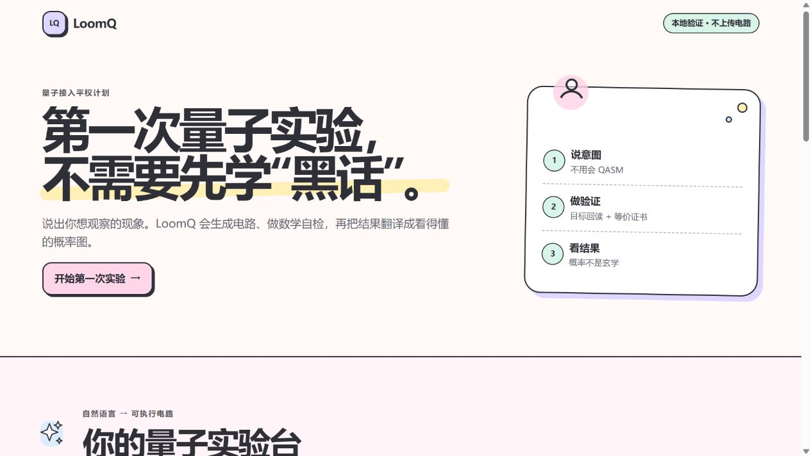

Agent 将请求整理为计划，本地工具生成并验证电路，用户随后在同一实验里选择后端并运行。

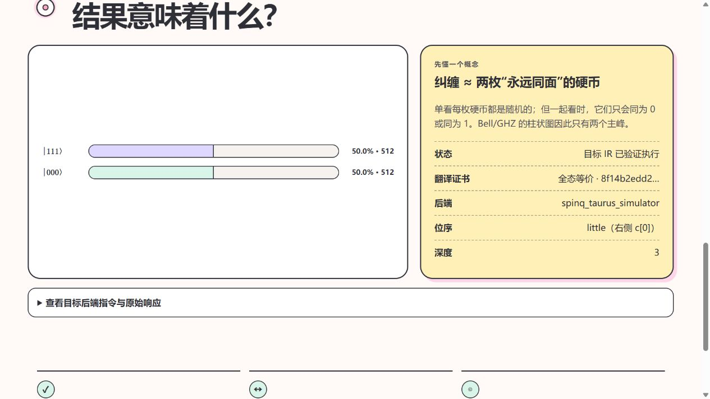

结果出现以后，用户可以继续展开目标 IR、原始返回和验证证据。界面没有把证据放在入口处增加负担，但也没有在结果页把它丢掉。

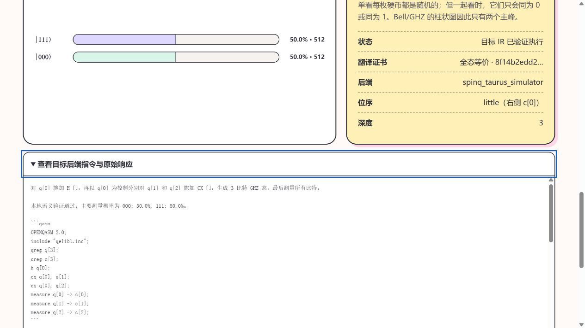

Bell 和 GHZ 这类标准任务不会完全交给模型临场写代码。`_build_known_program` 根据结构化意图确定量子位数，生成 H、CX 链和全测量，再交给公共 parser。通过确定性构造，避免模型把“四粒子 GHZ”理解成三量子位，后面的 validator 又沿用同一个错误目标。

开放候选仍要经过 `exact_probabilities`。`_semantic_delta` 比较实际概率和目标概率，如果合法 QASM 做错了实验，系统可以回到确定性程序。通过运行语义比较，避免“能解析”被误当成“符合用户目标”。

后端选择也不是模型根据名字猜。用户说“至少 26 量子位、免费、不能排队”时，模型只整理条件，本地 selector 再逐项过滤能力表。代码还会从用户原话补回模型漏掉的硬约束。通过原始约束 guard，避免整个工具链准确执行了一份不完整计划。

## 相比其他选手的特点

lil4notfound 擅长验证模型生成的候选，qianqiu0926 则会把已知任务尽量移出生成模型。它不是给 prompt 加更多规则，而是重新划分职责：模型理解语言，本地代码决定量子事实。

## 推荐理由

它值得作为可靠 Agent 的代表。从一句话到实验结果的路径完整，而且每一步都清楚哪些结论可以交给模型，哪些必须由程序计算。

# 推荐选手 10：0Dionysus0

代码目录：[archive/generated/snapshots/0Dionysus0/starter_kit](archive/generated/snapshots/0Dionysus0/starter_kit)

## 实现完整性

0Dionysus0 用一套 Deutsch 黑盒实验把 L1 转换、自建模拟采样、L2 Agent 和 Web 教学串在一起。用户先体验一次经典查询能看见什么，再运行一次量子查询完成判断。为了让这个对照成立，项目不仅生成和执行电路，还把 oracle 秘密留在服务端，并把 Agent 是否真正通过验证显示给用户。

SpinQ、OriginQ 和 Braket adapter 都把规范化 Circuit 交给公共的 `loomq.simulate.sample_counts`。三个 target 会生成不同的目标程序，但 counts 全部由自建模拟器计算，没有继续调用厂商 SDK，也不需要额外的隔离环境。

它不以 L3 或 Bonus 的跨度见长，推荐价值主要来自 L1/L2 的可信度设计：测量语义没有被简化，Agent 的成功状态有来源标签，教学里的秘密也确实留在服务端。

## 整体架构

底层 Circuit 和 adapter 负责转换与自建模拟采样，`loomq_l2/agent.py` 负责意图分类、候选生成和结果比较，`turn.py` 把本轮使用了模型还是本地规则、是否通过验证整理成 provenance。Deutsch 实验由 `deutsch.py` 生成电路，`sessions.py` 保存秘密，Web 层只传递不透明 session id。

因此，页面上“量子只查询一次”的说法不是动画设定。服务端会把隐藏 oracle 插入固定电路，通过共享 L1 adapter 的自建模拟器采样，再把候选判断与理想分布比较。

## 实现亮点

### 界面流程

体验从一个没有术语的入口开始，先邀请用户玩一次简单黑盒游戏。

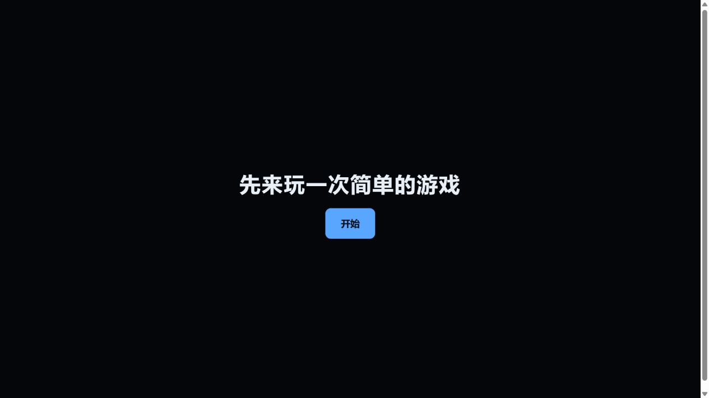

用户拨动输入并查询黑盒，页面只显示这一输入对应的输出，不会提前展示完整函数。

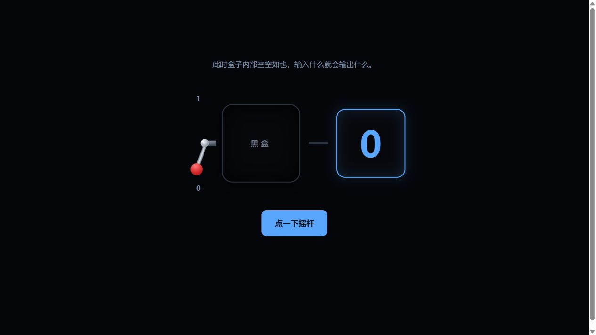

一次交互以后，输出随输入出现。这个具体限制为后面“量子算法为何能少一次查询”建立了可感知的对照。

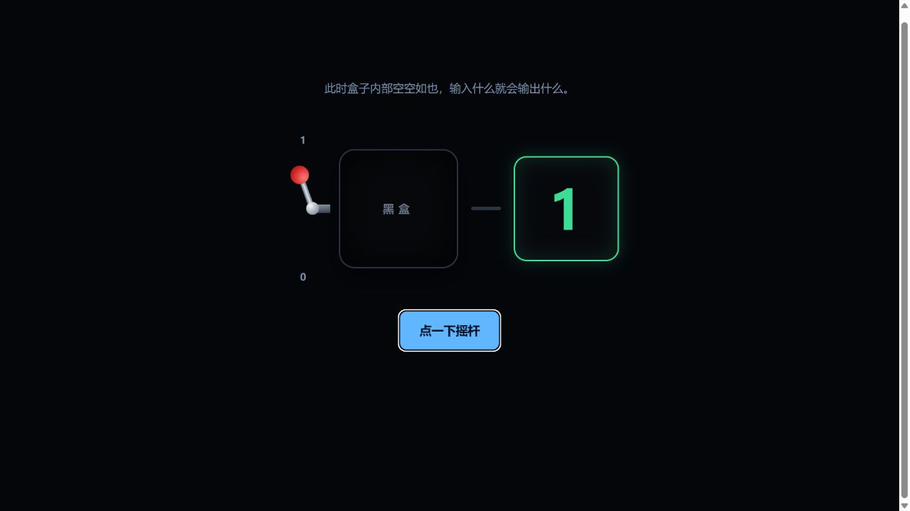

很多所谓隐藏题只是用 CSS 遮住答案，oracle 仍然在浏览器脚本或接口响应里。0Dionysus0 的 `SessionStore` 用有界、线程安全的映射在服务端保存秘密，客户端只得到随机 session id；`masked_qasm` 隐去 oracle 门，`session_quantum_run` 还会主动删除 `secret_kind`、`secret_rule` 和正确答案，只有 `session_reveal` 才公开。通过服务端持有秘密，避免用户在做题前就能从页面源码或网络响应读到答案。

Agent 最多尝试三轮，每轮都会调用 adapter 真正采样，再用 Hellinger fidelity 与理想分布比较。如果仍未达标，`_honest_failure_notice` 会明确写出“这道题我没做对”，`turn.py::provenance` 也标记为“未通过验证”。通过把生成来源和验证状态直接带到答案旁边，避免低保真候选被流畅解释包装成正确结果。

L1 的采样没有假定 `q[0]` 一定写入 `c[0]`。每个 `MeasureOp` 都按 qubit 到 clbit 的实际映射写回，再按经典寄存器顺序形成 bitstring。通过尊重显式测量映射，避免换位测量在 Bell/GHZ 这类对称样例中侥幸通过，到了非对称电路才暴露位序错误。

## 相比其他选手的特点

talk2joan 用关卡连接目标和计算反馈，0Dionysus0 则把教学可信度推进到信息边界：秘密到底存在哪里，什么时候才允许揭示。lil4notfound 和 qianqiu0926 都会验证 Agent 候选，0Dionysus0 额外把“没有做对”设计成正式结果，而不是异常路径里的一句日志。

## 推荐理由

它值得推荐，因为它认真对待了学习体验中的承诺。黑盒确实是隐藏的，量子查询确实经过执行，失败也确实被标成失败。

# 推荐选手 11：JunkaiWang-TheoPhy

代码目录：[archive/generated/snapshots/JunkaiWang-TheoPhy/starter_kit](archive/generated/snapshots/JunkaiWang-TheoPhy/starter_kit)

## 实现完整性

JunkaiWang-TheoPhy 在生成目标代码的同时，记录每一次转换依据以及源操作与目标操作的对应关系。项目有完整的 L1 转换和 L3 Hybrid 路径，并提供 `ProofTrace`、whole-circuit validation 和 Hybrid path certificate，让第三方能够重新计算“为什么认为这次转换保持了语义”。L1 的 `runtime.execute` 使用自建 statevector 与采样器，厂商 SDK 代码作为独立示例提供。

`adapter.run` 最终进入 `loomq/runtime.py::execute`，由自建 statevector 和采样器产生 counts。三平台 emitter、目标 IR 回读和证书负责说明转换前后是什么关系；厂商 SDK 只在独立示例脚本中出现，没有接入统一运行入口，也没有对应的 SDK worker。

## 整体架构

普通编译仍由 `qasm.py`、`emitters.py`、`native_ir.py` 和 `runtime.py` 完成。证据层放在 `prooftrace.py`、`semantic_equivalence.py`、`witness.py` 和 `hybrid_paths.py`。普通 `transpile()` 不必为生成证书承担额外耦合，需要审计时再调用显式证书接口。

## 实现亮点

`ProofTrace` 会记录每次命名重写，以及源操作和优化后操作的对应关系。如果一个 SWAP 被分解成三次 CX，证书保留这些新操作来自哪个源节点。通过保存 lineage，避免最后只剩一份目标代码，却无法解释哪一步改变了电路。

它把三类证据分开。局部门恒等式说明某一步为什么允许改写；有界规模的 whole-circuit 数值重算检查整条线路；目标 IR 回读检查结构是否还对得上。代码同时写明 qubit 上限和误差容差，没有把有限数值验证说成对所有规模的形式化证明。

Hybrid 路径证书也不是只存一个哈希。验证入口会从源程序重新枚举可达路径、测量坍缩和经典结果。通过重新计算证书内容，避免程序已经变化，旧证书却仍然看起来“验证通过”。

## 相比其他选手的特点

lil4notfound 重点检查生成前后的电路是否等价，JunkaiWang-TheoPhy 继续记录等价变换的来源和证据边界。多数实现回答“程序能否工作”，这个项目还回答“第三方怎样复核我们为什么认为它工作”。

## 推荐理由

它适合代表可审计编译。推荐的不是证书这个名词，而是它把每项证据能证明什么、不能证明什么写进了实现。

# 推荐选手 12：BEER7LN

代码目录：[archive/generated/snapshots/BEER7LN/starter_kit](archive/generated/snapshots/BEER7LN/starter_kit)

## 实现完整性

BEER7LN 把量子课程直接建立在底层实验能力上。课程中的 QASM 同时用于计算理论状态和生成有限 shots 的采样结果，用户看到的讲解、理论概率和柱状图不会分别来自三套硬编码数据。项目还实现三后端转换、Agent、自由实验、Hybrid 编译和量子 RISC-V。通用运行接口优先调用目标 SDK；依赖不可用或原生结果低于语义阈值时，回退到自建参考模拟器，并记录回退原因。

`loomq/backends.py` 会在当前 Python 进程中直接调用 SpinQit simulator、pyQPanda CPUQVM 和 Braket LocalSimulator，没有把三套 SDK 拆进独立 worker。厂商 SDK 缺失、执行失败或返回分布低于语义阈值时，系统改用自建 `loomq.reference_statevector`，并在 `meta.fallback` 中保存原目标和回退原因。课程实验则固定使用本地模拟核心，同时计算理论态和采样结果。

## 整体架构

底层执行在 `loomq/qasm.py`、`pipeline.py`、`transpilers`、`backends.py` 和 `simulator.py`。课程目录保存实验 QASM，`learning.py` 调用底层 statevector 和 sampler，`l2_app.py` 把结果交给页面。L3 另有 `hybrid.py`、`hybrid_oracle.py` 和 `hybrid_stress.py`。

## 实现亮点

### 界面流程

用户先从概念地图进入课程，而不是直接面对一整套量子开发工具。


课程目录列出六类实验。用户选择量子随机以后，页面进入对应电路，而不是播放一张预先做好的结果图。

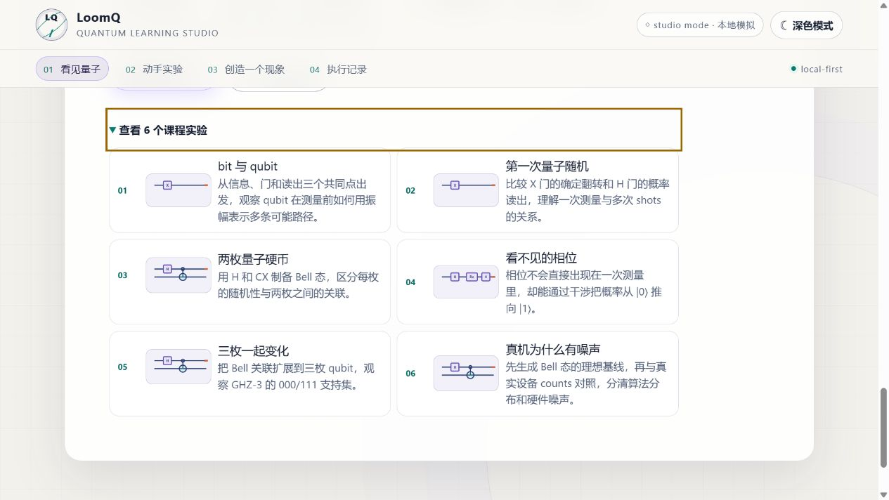

线路按步骤显示，用户可以停在某个量子门观察状态怎样变化。

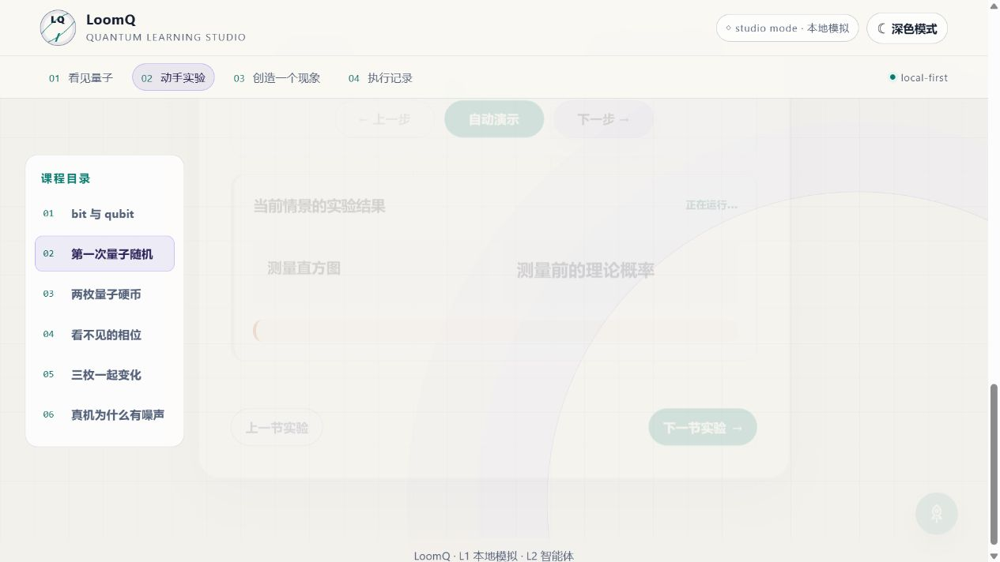

最后，页面运行同一份课程电路并显示 256 shots 的结果。课程接口在 `learning.py` 中从同一份 QASM 计算理论态并调用本地采样核心，讲解中的理论概率和有限采样可以直接对照。

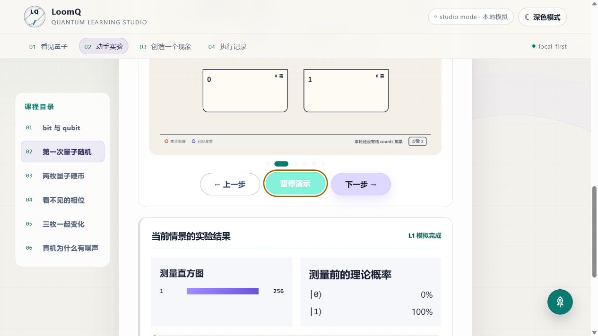

用户在课程里学习 Bell 相关性时，理论概率和 256 次采样都来自同一份 QASM。页面可能显示理论值 50% / 50%，采样结果是 49% / 51%。通过同一执行核心同时生成理论和样本，避免教材写着一种电路，按钮背后却运行另一份硬编码结果。

Agent 验证运行的是候选本身。如果候选失败，修复仍围绕原电路进行，不会偷偷换成参考答案再宣布成功。通过保留候选身份，避免“验证通过”实际证明的是另一份程序。

L3 的 oracle 直接解释 Hybrid AST，不读取编译器生成的 RISC-V。`hybrid_stress.py` 再用固定种子生成嵌套分支、负数和连续赋值。通过独立解释路径，避免编译器和验证器复制同一段错误逻辑后互相证明正确。

课程异步运行时，结果还会核对发起它的实验 id。用户切换到另一个课程实验后，旧请求返回也不能写到新实验下面。

## 相比其他选手的特点

qianqiu0926 更像通用工作台，BEER7LN 更擅长把工作台能力嵌入教学。Pennie514 强调预测以后再观察，BEER7LN 则强调课程文字、理论状态和实际采样必须来自同一电路。

## 推荐理由

它值得作为技术和教学结合的代表。课程不是电路执行器外面包的一层说明，而是直接建立在同一语义和运行核心上。

# 推荐选手 13：2IKK12

代码目录：[archive/generated/snapshots/2IKK12/starter_kit](archive/generated/snapshots/2IKK12/starter_kit)

## 实现完整性

2IKK12 把当前有效电路从普通聊天内容中单独识别出来。用户先生成三比特 GHZ，下一句再说“把它扩展成五比特”时，系统会从历史中找到最近一份仍能解析的 QASM，并在这份电路上继续修改，而不是抓取最近出现的任意代码块。项目同时覆盖 L1、L2、L3 和 Bonus；L1 的 `execute` 使用自建 `_simulate`，执行器标记为 `loomq_statevector_v1`。

三个 target 都进入 `loomq_l1.py::execute`，再调用项目自己的 `_simulate`。target 负责选择 emitter，counts 统一来自 `loomq_statevector_v1`；生成的目标程序不会继续交给 SpinQit、pyQPanda 或 Braket SDK，也没有为这些平台启动隔离 worker。

## 整体架构

`adapter.py` 是外部接口。`loomq_l1.py` 处理电路，`loomq_agent.py` 管理自然语言与多轮状态，`hybrid_compiler.py` 生成经典汇编，`quantum_riscv.py` 执行自定义量子指令。Web 保存当前问题、有效 QASM 和运行结果。

## 实现亮点

### 界面流程

用户提出三比特 GHZ 后，页面保存原问题，展示生成的 QASM，并允许按 H、CX、测量的顺序播放电路。

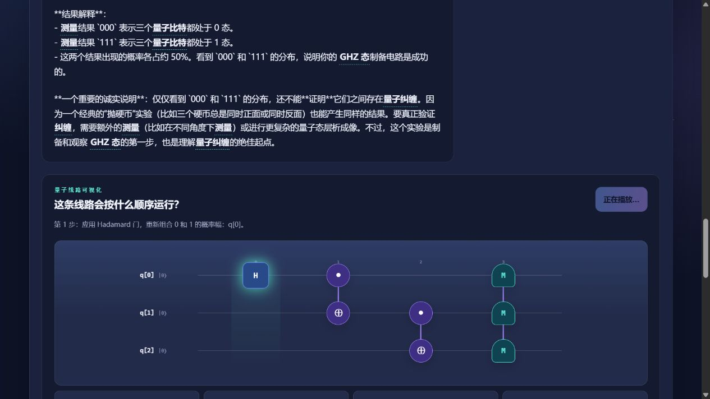

运行以后，结果页标出 shots、执行后端和精确频数，下方解释继续回答最初的问题。第二轮修改仍以这份可解析电路为上下文。

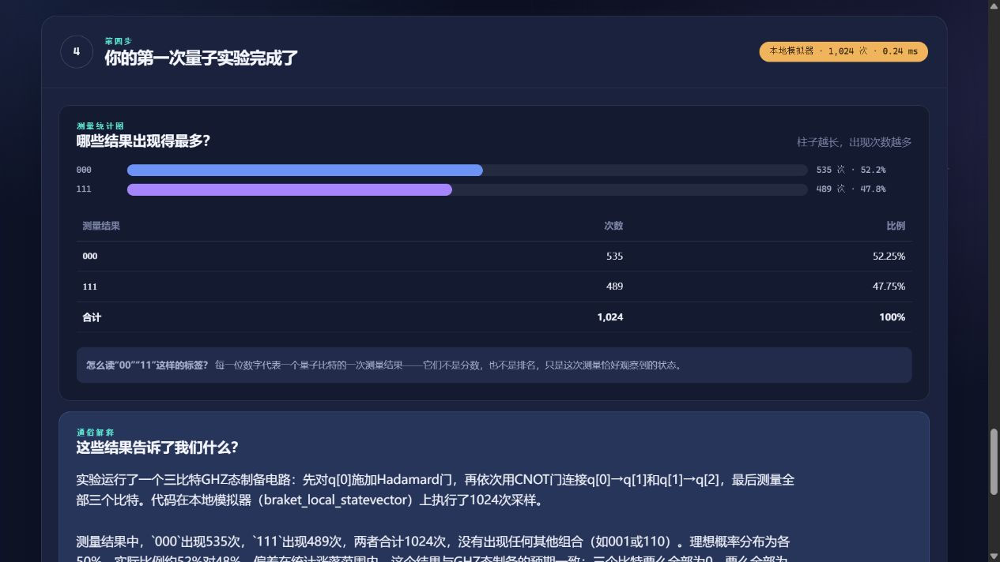

多轮对话中，最后出现的代码不一定是当前有效电路。它可能是模型刚刚生成但解析失败的候选。`_latest_history_qasm` 会从历史中倒序查找，直到找到最近一份能被 parser 接受的 QASM。通过“最近有效电路”而不是“最近代码块”确定上下文，避免下一轮继续修改失败产物。

用户说“把当前实验扩展成五个量子比特”时，代码会识别已有 Bell/GHZ 家族，确定性地调整 H、CX 链和测量，然后再走三目标 emitter。通过对已有结构做受控变换，避免模型重新生成一份主题相近但已经不是同一实验的电路。

GHZ 验证会分别检查量子位数、H、连通所有量子位的 CX 链和全测量。错误信息具体说明缺了哪一项，模型修复也有次数限制。

## 相比其他选手的特点

AphrixZjr 解决异步版本冲突，zmath01 保留历史结果证据，2IKK12 解决对话里的指代和连续修改。三者都在处理状态，但关注的是不同断点。

## 推荐理由

它值得推荐，因为“把它改一下”在这里不是一句模糊 prompt。系统知道“它”是哪一份可运行电路，也知道怎样让修改继续通过原来的验证和执行链。

# 推荐选手 14：talk2joan

代码目录：[archive/generated/snapshots/talk2joan/starter_kit](archive/generated/snapshots/talk2joan/starter_kit)

## 实现完整性

talk2joan 在开放量子工作台之外增加了一组可操作关卡。每一关先给出目标分布和允许使用的量子门，用户搭出门序以后，浏览器内的 `simulate` 用 H、X、CX 计算精确概率，再决定是否通关。开放工作台走另一条执行路径：Agent 生成的 QASM 先经过本地 lint、参考模拟和自检，`/api/run` 再进入三套 SDK runner。

开放工作台生成目标程序后，会通过 `adapter.run` 调用对应 SDK。SpinQit 和 pyQPanda 在当前进程中执行；Braket 优先在当前进程调用 LocalSimulator，当前环境不兼容时再启动 `_braket_worker.py`。厂商执行失败后没有统一的自建模拟回退。关卡判定不走这条路径，而是在浏览器中计算精确概率。

## 整体架构

`adapter.py` 包含 `_l2_lint`、`_l2_refsim_probs` 和 `_l2_self_verify`，负责把模型候选变成可执行实验。`webapp.py` 的 `/api/run` 对接平台执行，`web/app.js` 则用独立的小型浏览器模拟器管理关卡判定、星级、经验、徽章和本地进度。

## 实现亮点

### 界面流程

第二关先给出 50/50 的目标分布。此时用户知道要达到什么结果，但系统没有直接告诉他答案。

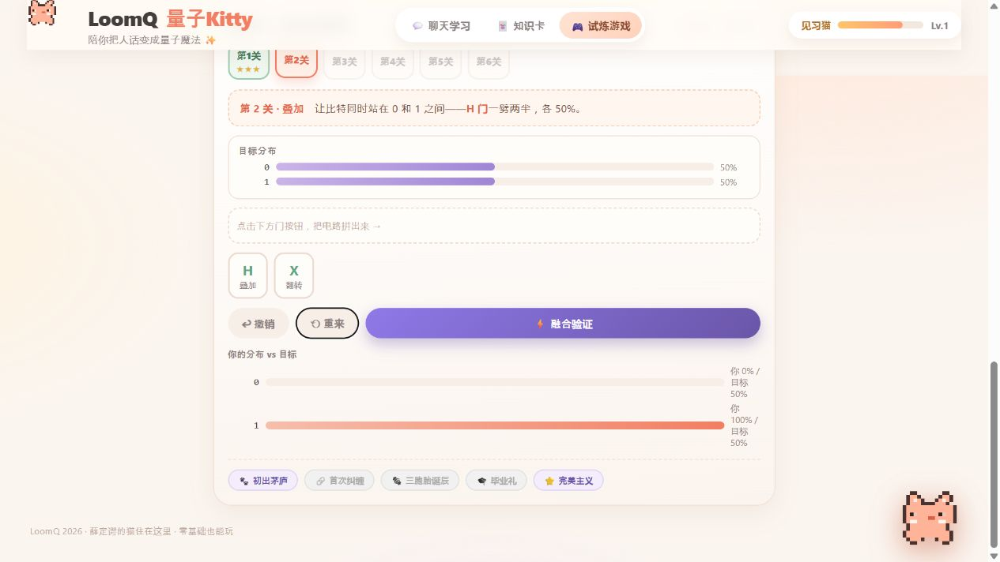

用户选择 H 门构造叠加，然后运行当前电路。

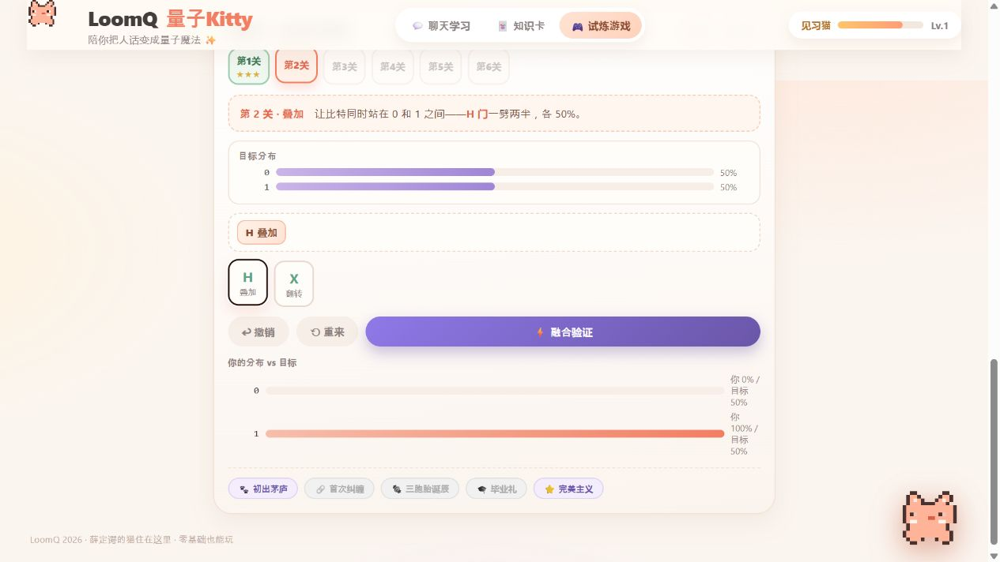

计算出的量子概率达到关卡条件以后，页面才判定成功并给出三星。奖励和用户刚搭出的门序直接对应。

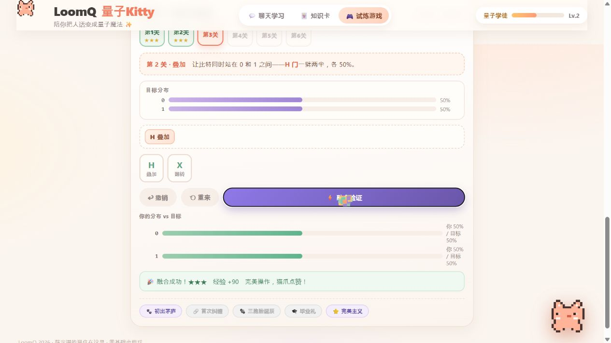

一个关卡可以要求“让最终结果一半是 0、一半是 1”，并只开放少量量子门。用户自己搭电路，浏览器模拟器计算精确分布，再与关卡目标逐项比较；只有误差在 0.02 以内才获得星级。通过用门序产生的量子概率而不是点击次数决定通关，让奖励对应实验目标。关卡反馈是确定性模拟结果，不是 SDK 的有限 shots 采样。

如果用户没有达到目标，当前门序不会被清空。页面会保留计算分布，让用户看见“目标是 50/50，结果却是全 0”，然后继续修改。通过保留失败状态，避免每次错误都把用户送回起点。

关卡和开放 Agent 也没有互相替代。新手可以先在明确目标里理解 H、CX 和测量，之后再用自然语言提出 W 或 GHZ 实验。通过有限任务和自由工作台并存，避免纯聊天没有方向，也避免固定课程无法继续探索。

## 相比其他选手的特点

qianqiu0926 已经把自然语言、电路、target、运行和解释做成完整工作台。talk2joan 在这条链上增加了清楚的目标和完成条件，让新手知道下一步该做什么。BEER7LN 更像实验课程，talk2joan 更像允许不断试错的任务关卡；其关卡反馈速度来自浏览器内的小门集模拟器，而不是厂商执行链。

## 推荐理由

它值得推荐，因为游戏化没有漂浮在量子概念之外。用户为什么通关、为什么失败，都能回到自己搭出的门序及其计算分布；轻量模拟也让用户可以立即修改并再次尝试。

# 推荐选手 15：zmath01

代码目录：[archive/generated/snapshots/zmath01/starter_kit](archive/generated/snapshots/zmath01/starter_kit)

## 实现完整性

zmath01 把当前编辑器和历史结果作为两类状态分别管理。用户修改 QASM 后，下一次运行直接读取这次请求中的文本；此前的 counts、解释和三种目标 IR 则保留在历史列表中供回看。项目还包含 QASM 解析、三目标转换、本地模拟、Agent 和 Hybrid 支撑；目标 IR 生成并回读以后，统一由自建 `simulate_counts` 采样。

`adapter.run` 会先为选定 target 生成目标 IR 并重新解析，随后把得到的 Circuit 交给自建 `simulate_counts`。返回元数据中的 executor 标记为 `loomq-reference-statevector`。三个厂商 SDK 都没有接入这条运行链，也没有同进程或隔离进程的 SDK runner。

## 整体架构

`loomq_core` 管理可执行语义，`loomq_web.py` 接收当前编辑器内容并运行，`webui/index.html` 保存多次实验快照。Agent 回复在进入当前状态以前，会先由 `loomq_core/agent.py::_self_check` 解析和模拟。

## 实现亮点

### 界面流程

用户先加载一份可编辑的 Bell 电路，代码和当前实验状态都在工作台中。

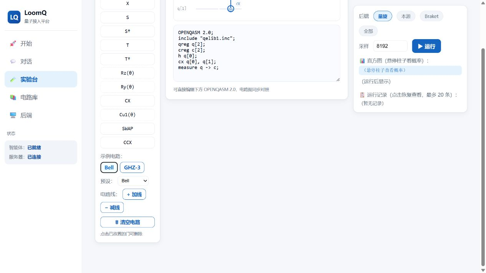

第一次运行以后，Bell 的结果成为第一条实验历史。

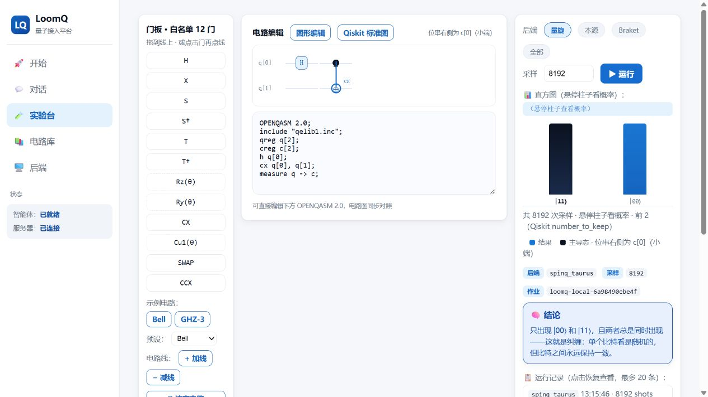

用户把当前电路改成单比特 X。编辑器已经改变，但旧 Bell 记录仍然保留。

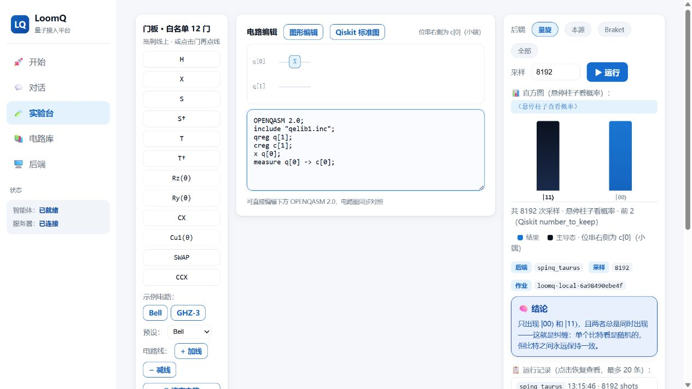

第二次运行产生另一组结果，历史中同时存在两次运行证据。

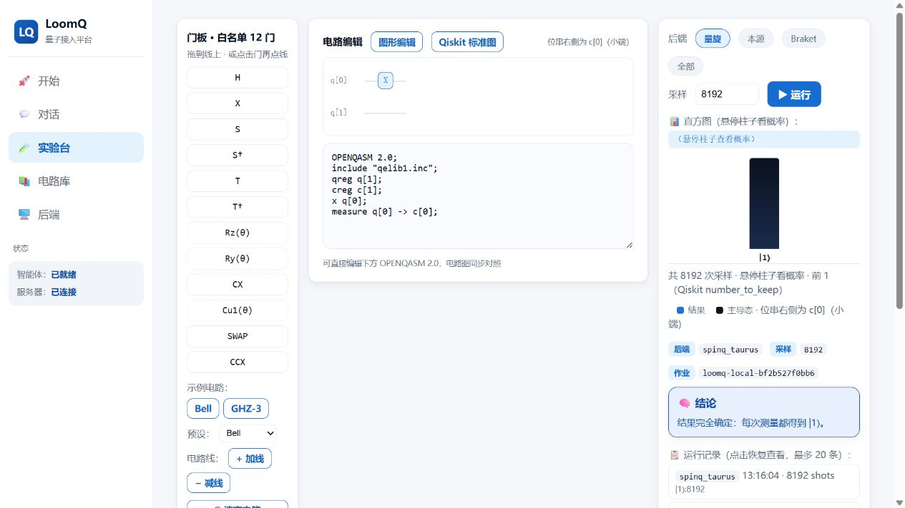

点击第一条历史后，页面恢复当时的 counts、解释和三种目标 IR，便于重新查看旧结果。不过代码显示，`pushHistory` 没有保存 QASM，`restoreRun` 也没有改写编辑器，因此它恢复的是结果上下文，不是完整实验。

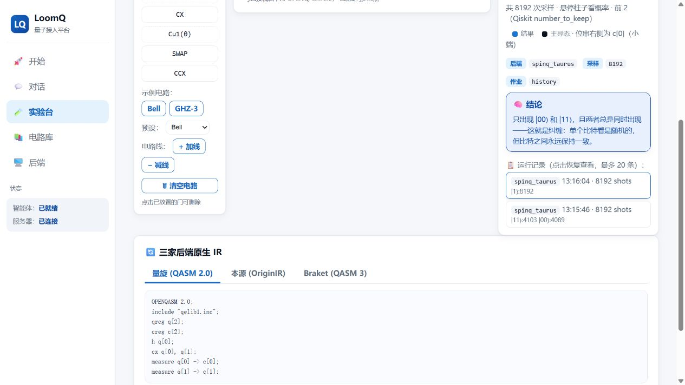

假设用户先运行 Bell 电路，然后在编辑器里删除 CX。此时页面显示的是新文本，后端也必须运行新文本。`loomq_web.py::_api_run` 直接读取本次请求携带的 QASM，而不是读取之前缓存的 Circuit。通过以当前编辑器内容为执行输入，避免界面已经修改，结果却仍来自旧电路。

每次运行会保存 backend/target、shots、counts、三种转换结果和解释。历史条目把这些结果证据绑定在一起，避免只剩一张无法追溯来源的柱状图；但因为没有保存 QASM，不能把它称为实验级快照。

编辑器修改后的文本会直接进入 `loomq_web.py::_api_run`，不会偷偷沿用缓存 Circuit；历史结果则留在旁边供比较。项目还提供工作树与 git history 的密钥扫描，`check_secrets.py --history` 实际调用 `git log --all -p` 检查补丁历史，因为删除当前文件并不能自动清除版本记录中的 token。

## 相比其他选手的特点

AphrixZjr 用 revision 防止并发覆盖，2IKK12 从对话中寻找最近有效电路，zmath01 关注的是当前编辑内容必须决定下一次运行，同时旧 counts、目标 IR 和解释仍可回看。它的历史没有保存 QASM，因此能够回看结果上下文，但不能恢复完整实验。

## 推荐理由

它值得推荐，因为执行输入和结果来源处理得具体：后端始终读取本次编辑器内容，旧运行的 counts、转换结果和解释又不会被下一次运行覆盖。这是一份结果证据历史，而不是完整实验版本库。

# 推荐选手 16：Pennie514

代码目录：[archive/generated/snapshots/Pennie514/starter_kit](archive/generated/snapshots/Pennie514/starter_kit)

## 实现完整性

Pennie514 把 Bell 等实验组织成“先预测、再观察、再解释”的过程。用户必须在结果出现前提交自己对 bitstring 分布的判断，随后运行电路，最后把预测、真实 counts 和解释放在一起。项目还实现了候选检查、Hybrid 编译、量子 RISC-V，以及随机生成 Hybrid 程序的差分检查工具。

`adapter.run` 会在当前 Python 进程中分别调用 SpinQit simulator、Braket LocalSimulator 和 pyQPanda CPUQVM。三套 SDK 没有通过 worker 隔离，SDK 不可用时也不会自动改用自建模拟器；项目中的参考计算用于验证和教学，不会替代 adapter 返回的厂商执行结果。

## 整体架构

`tutor.py` 把课程目标、预测选项和实验电路放在同一项数据中。`loomq_web.py` 与 `web/app.js` 管理用户回答和运行。`adapter.py` 承担电路检查，`test_hybrid_fuzz.py` 生成经典控制用例，`quantum_riscv_emulator.py` 处理量子反馈。

## 实现亮点

### 界面流程

进入课程后，页面先说明五分钟路线和实验规则。用户知道接下来需要作出预测，而不是被动浏览答案。

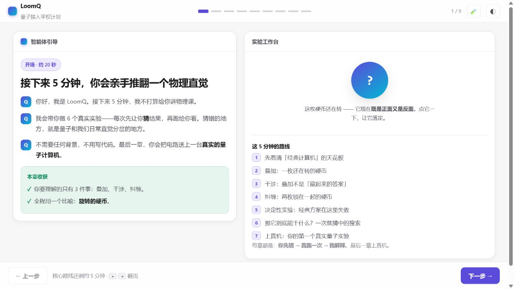

Bell 电路运行以前，用户先选择自己认为可能出现的测量分布。

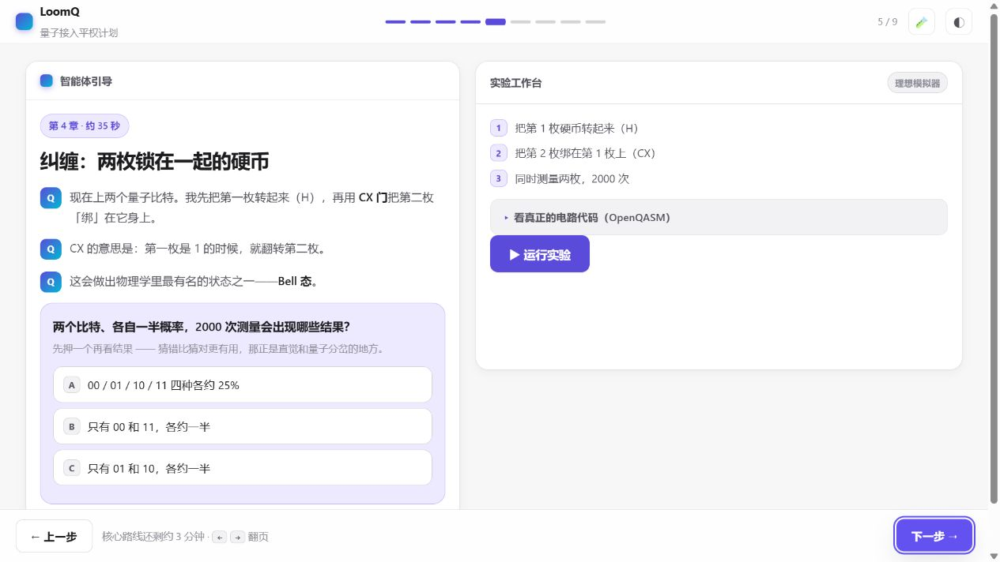

提交后，页面固定这次预测并给出即时判断，防止结果出现以后再修改原答案。

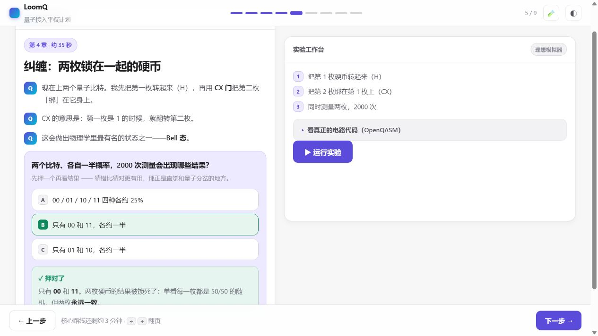

最后才运行 2000 shots，把真实频数、原预测和解释放在一起。

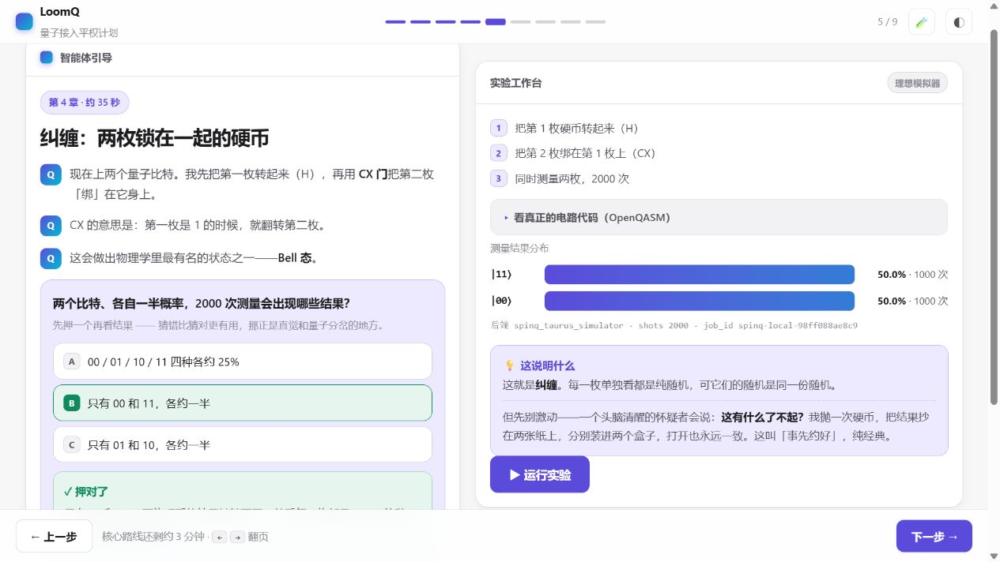

课程不会先把 Bell 结果展示出来再问用户是否理解。用户必须先预测可能出现哪些 bitstring，然后运行同一份电路，最后把自己的预测、真实 counts 和解释放在一起。通过 Predict, Observe, Explain 的顺序，避免用户在看到答案以后产生“我本来就知道”的错觉。

Hybrid 验证也采用相似思路：先有源程序的预期行为，再观察目标汇编。`test_hybrid_fuzz.py` 会生成嵌套 if、负常数和连续赋值，给源解释和 RISC-V 相同的测量输入，再比较最后寄存器。通过随机组合结构，避免固定两个例子恰好绕开标签或寄存器错误。

Bonus 还展示了中路反馈。测量写入 `x10` 后触发经典分支，分支再决定后续量子门。通过这条双向路径，避免把量子和经典仅仅做成前后拼接的两个程序。

## 相比其他选手的特点

BEER7LN 强调讲解和运行共用电路，Pennie514 强调用户的判断必须在结果出现前留下来。它的教学设计和差分测试有同一个思路：先明确预期，再让执行结果纠正判断。

## 推荐理由

它值得推荐，因为它没有把学习理解成多写几段说明。用户先作出判断，实验结果才真正有机会改变他的认识。

# 推荐选手 17：WayneYu1212

代码目录：[archive/generated/snapshots/WayneYu1212/starter_kit](archive/generated/snapshots/WayneYu1212/starter_kit)

## 实现完整性

WayneYu1212 改变了量子实验工作台的信息顺序。用户先看到 Bell 实验主要出现 `00` 和 `11`，再理解两个测量结果为什么相关，最后才按需展开概率、电路、QASM 和验证证据。这套界面建立在完整执行链上：项目有 compiler、IR、三个 emitter、调用 SpinQit、pyQPanda CPUQVM 与 Braket LocalSimulator 的 runner，以及 Agent verifier。

`adapter.run` 经 `loomq.runners.run_circuit` 在当前 Python 进程中直接调用三套厂商 SDK。项目另有 reference simulator 用于生成对照分布和验证，但 runner 不会把 SDK 失败静默替换为参考结果，也没有为三套 SDK 设置独立 worker。

## 整体架构

`loomq/compiler` 处理解析和验证，`loomq/emitters`、`loomq/runners` 处理平台，`loomq/agent` 生成并验证结构化计划，`loomq/web` 决定信息如何逐步呈现。

## 实现亮点

### 界面流程

第一屏先展示 Bell 实验最容易理解的现象，即主要出现 `00` 和 `11`。用户还不需要阅读 QASM。

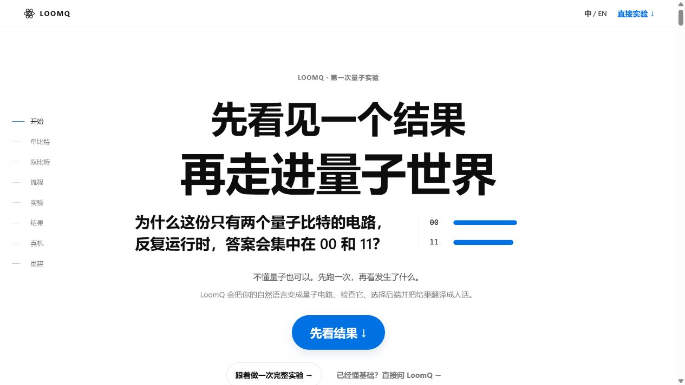

用户准备好以后再选择后端和 1024 shots，开始一次明确的实验。

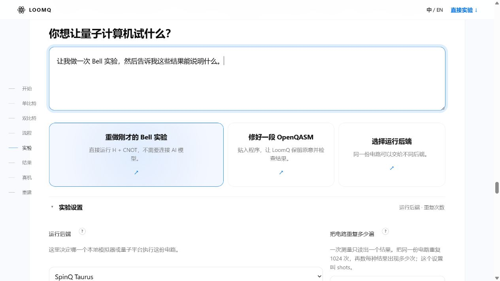

运行结束后，页面先解释这 1024 次采样发生了什么。

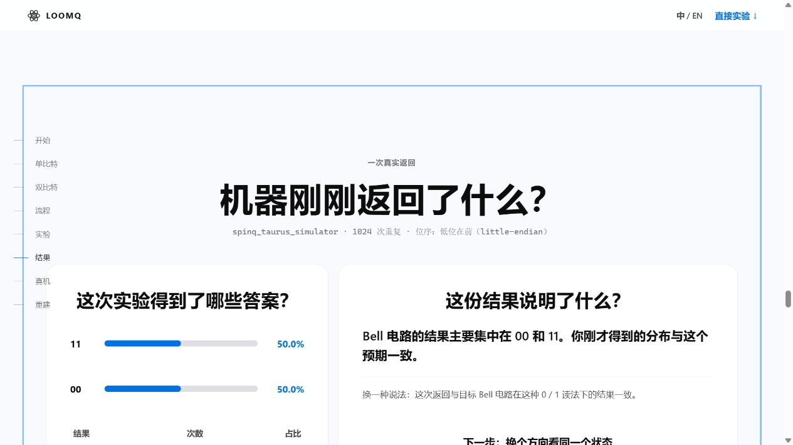

只有需要核对时，用户才展开 PASS 检查、电路和实际执行的 QASM。

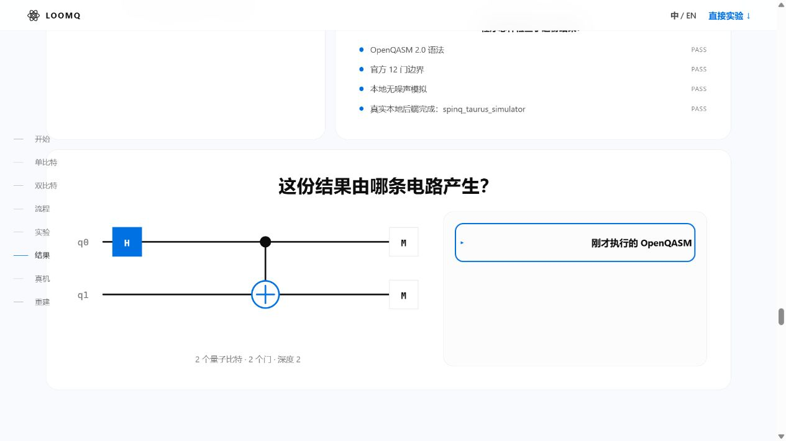

Bell 实验结束后，用户第一眼先看到“主要出现 00 和 11”，然后看到这说明两个测量结果相关。概率、电路、QASM 和目标 IR 放在后面，需要时再展开。通过“现象 -> 原因 -> 代码证据”的顺序，避免零基础用户一进页面就同时面对门、shots、backend 和 IR。

模型输出先成为 `AgentPlan`。本地 verifier 检查 QASM 和后端约束，无效时只允许一次带具体报告的纠正。通过结构化计划和有限纠正，避免页面直接渲染模型随意生成的设备名或不可运行代码。

Web 代码还有 skip link、双语 label、`aria-live` 和 `prefers-reduced-motion`。通过键盘导航、读屏状态播报和减少动画选项，让“面向新手”不只等于把字号调大。

## 相比其他选手的特点

多数工作台默认用户首先想看代码。WayneYu1212 先回答实验发生了什么，而且认真处理了键盘、读屏和动态效果。talk2joan 通过任务目标降低门槛，WayneYu1212 通过信息顺序和访问方式降低门槛。

## 推荐理由

它值得作为可访问产品设计的代表。底层证据仍在，但不会在用户还不知道自己应该观察什么时一次全部压到屏幕上。
